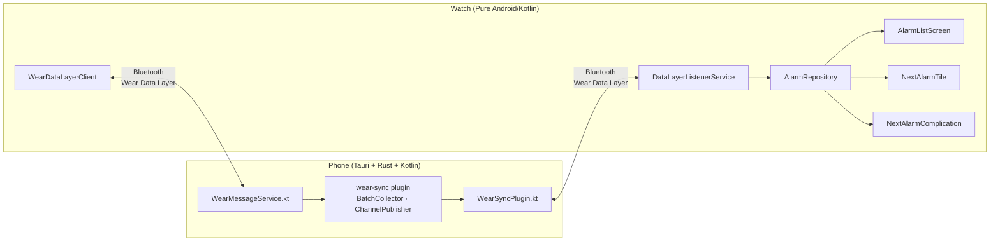
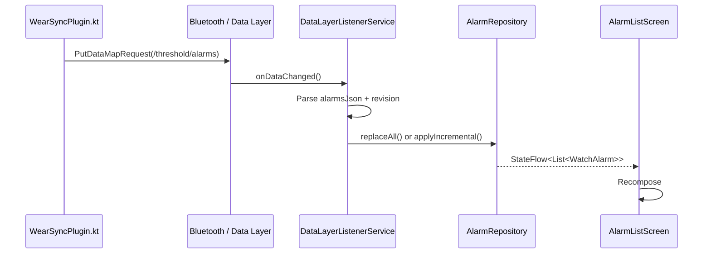
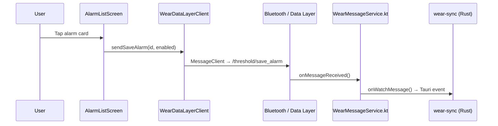

# Threshold Wear OS Companion

A standalone Wear OS app that displays and controls alarms from the Threshold phone app.

## Architecture

Threshold-Wear is a **standalone Android Wear OS application** that runs on watch hardware. It is not a Tauri plugin — Tauri only runs on the phone. The two apps communicate over Bluetooth via the [Wear Data Layer API](https://developer.android.com/training/wearables/data-layer).

```
Phone (Tauri + Rust + Kotlin)          Watch (Pure Android/Kotlin)
┌─────────────────────────┐            ┌─────────────────────────┐
│ wear-sync plugin        │            │ threshold-wear app      │
│  ├─ BatchCollector      │            │  ├─ AlarmRepository     │
│  ├─ ChannelPublisher    │  Bluetooth │  ├─ WearDataLayerClient │
│  ├─ WearSyncPlugin.kt ─┼────────────┼──┤ DataLayerListener    │
│  └─ WearMessageService ─┼────────────┼──┤ AlarmListScreen      │
└─────────────────────────┘            │  ├─ NextAlarmTile       │
                                       │  └─ NextAlarmComplication│
                                       └─────────────────────────┘
```



## Features

- **Alarm list**: View all alarms with time, label, and enabled/disabled status
- **Toggle alarms**: Tap an alarm card to toggle its enabled state on the phone
- **Delete alarms**: Long-press an alarm card for a delete confirmation dialog
- **Sync status**: Header shows connected (green), syncing (spinner), or offline (yellow)
- **Tile**: Shows next upcoming alarm time in the tile carousel
- **Complication**: Provides next alarm time for watch face complications (short and long text)

## Project Structure

```
apps/threshold-wear/
├── build.gradle.kts                    # Wear OS app config
├── settings.gradle.kts                 # Gradle settings
├── proguard-rules.pro                  # ProGuard rules for release builds
└── src/main/
    ├── AndroidManifest.xml             # Wear OS app declaration
    └── java/ca/liminalhq/threshold/wear/
        ├── ThresholdWearApp.kt         # Application class (singletons)
        ├── data/
        │   ├── AlarmRepository.kt      # Local alarm cache (StateFlow + SharedPrefs)
        │   ├── SyncStatus.kt           # Connected / Syncing / Offline enum
        │   ├── WatchAlarm.kt           # Watch-side alarm data class
        │   └── WearDataLayerClient.kt  # MessageClient wrapper for phone comms
        ├── presentation/
        │   ├── MainActivity.kt         # Single-activity Compose host
        │   ├── AlarmListScreen.kt      # Alarm list UI (ScalingLazyColumn)
        │   └── theme/
        │       └── Theme.kt           # Deep black + calm blue palette
        ├── service/
        │   └── DataLayerListenerService.kt  # Receives DataItem changes from phone
        └── tile/
            ├── NextAlarmTileService.kt       # Wear OS tile
            └── NextAlarmComplicationService.kt # Watch face complication
```

## Data Flow

### Receiving Alarm Data (Phone → Watch)



### Sending Commands (Watch → Phone)



### Sync Request

On app launch, the watch sends a sync request with its `lastSyncRevision` to `/threshold/sync_request`. The phone determines whether to send an incremental update or full sync based on the revision gap.

## Design Tokens

| Token | Value | Purpose |
|-------|-------|---------|
| Background | `#0A0A0A` | Deep black for OLED (always static) |
| Surface | `#1A1A1A` | Card backgrounds (always static) |
| Accent | Dynamic / `#4A9EFF` | Material You system accent on API 31+, calm blue fallback |
| On Surface | `#E0E0E0` | Primary text |
| Disabled | `#333333` | Disabled indicators |
| Error | `#CF6679` | Error states |

**Material You support:** On Wear OS 3.5+ (API 31+), the accent colour is pulled from the watch's system colour scheme (`system_accent1_200`). Background and surface remain deep black for OLED regardless of the system theme. On older watches, the static calm blue (`#4A9EFF`) is used.

Touch targets are 48dp minimum. Time is displayed at 24sp bold, labels at 13sp.

## Dependencies

- **Wear OS**: `androidx.wear:wear:1.3.0`, `androidx.wear.compose:compose-material:1.2.1`
- **Compose**: `androidx.activity:activity-compose:1.8.2`, `androidx.compose.ui:ui:1.5.4`
- **Tiles**: `androidx.wear.tiles:tiles:1.2.0`
- **Complications**: `androidx.wear.watchface:watchface-complications-data-source:1.2.0`
- **Data Layer**: `com.google.android.gms:play-services-wearable:18.1.0`
- **Coroutines**: `org.jetbrains.kotlinx:kotlinx-coroutines-android:1.7.3`

## Getting Started

### Prerequisites

- Android SDK (command line tools or Android Studio)
- A Wear OS watch or emulator (API 26+)
- The Threshold phone app installed on a paired phone or emulator
- Google Play Services on both devices
- `adb` available on your PATH

### Devcontainer Setup (Recommended)

The project devcontainer already includes the Android SDK, Java 17, and all required build tools. No additional setup is needed.

```bash
# Open the project in the devcontainer, then:
cd apps/threshold-wear
./gradlew assembleDebug
```

The devcontainer does not include a Wear OS emulator (emulators require KVM/hardware acceleration). To test on a real watch, connect it via USB and use `adb`:

```bash
adb devices                    # Verify watch is connected
./gradlew installDebug         # Deploy to connected watch
```

To test with an emulator, run the emulator on the host machine and forward the ADB connection into the container:

```bash
# On the host (outside devcontainer):
emulator -avd WearOS &

# The devcontainer forwards ADB automatically via the host's adb server.
# Inside the devcontainer:
adb devices                    # Should show the emulator
./gradlew installDebug
```

### Command Line Setup (No Android Studio Required)

You can build and deploy entirely from the command line using Gradle and `adb`.

1. **Install Android SDK command line tools:**
   ```bash
   # Linux (Debian/Ubuntu)
   sudo apt-get install -y openjdk-17-jdk
   wget -q https://dl.google.com/android/repository/commandlinetools-linux-11076708_latest.zip
   unzip commandlinetools-linux-11076708_latest.zip -d $HOME/Android/Sdk/cmdline-tools/latest
   export ANDROID_HOME=$HOME/Android/Sdk
   export PATH=$ANDROID_HOME/platform-tools:$ANDROID_HOME/cmdline-tools/latest/bin:$PATH

   # macOS (via Homebrew)
   brew install --cask android-commandlinetools
   export ANDROID_HOME=$HOME/Library/Android/sdk
   export PATH=$ANDROID_HOME/platform-tools:$ANDROID_HOME/cmdline-tools/latest/bin:$PATH
   ```

2. **Install required SDK packages:**
   ```bash
   sdkmanager "platforms;android-34" "build-tools;34.0.0" \
     "system-images;android-34;google_apis;x86_64" \
     "system-images;android-wear-34;google_apis;x86_64"
   ```

3. **Create a Wear OS emulator:**
   ```bash
   avdmanager create avd -n WearOS \
     -k "system-images;android-wear-34;google_apis;x86_64" \
     -d "wearos_large_round"
   emulator -avd WearOS &
   ```

4. **Pair with a phone** (emulator or real device):
   ```bash
   # If using two emulators, forward the pairing port:
   adb -s emulator-5554 forward tcp:5601 tcp:5601
   # Then pair via the Wear OS companion app on the phone
   ```
   For a real watch paired to a real phone over Bluetooth, no `adb` pairing is needed — they connect automatically via Google Play Services.

5. **Build and deploy the watch app:**
   ```bash
   cd apps/threshold-wear
   ./gradlew installDebug
   ```

6. **Build and deploy the phone app:**
   ```bash
   cd apps/threshold
   pnpm tauri android dev
   ```

7. **Launch the watch app:**
   ```bash
   adb -s <watch-serial> shell am start -n ca.liminalhq.threshold.wear/.presentation.MainActivity
   ```

### Android Studio Setup (Alternative)

If you prefer an IDE:

1. Open `apps/threshold-wear/` as a standalone Android project
2. Create a Wear OS AVD in Device Manager
3. Pair it with a phone emulator via Device Manager
4. Run the app with the Wear OS emulator selected

### First Run

When the watch app launches for the first time:

1. It sends a sync request to the phone with revision `0`
2. The phone responds with a full sync containing all alarms
3. The alarm list populates and the sync status changes from "Offline" to "Connected"

If no alarms appear, check:
- Both devices are paired (Wear OS companion app on phone shows connection)
- The phone app is running (the wear-sync plugin needs to be active)
- Logcat for `WearSyncPlugin` or `DataLayerListener` tags

### User Guide

**Viewing alarms:** Open the app on your watch. Alarms are listed by time with a coloured dot indicating enabled (blue) or disabled (grey) status.

**Toggling an alarm:** Tap an alarm card to toggle its enabled state. The command is sent to the phone, which processes it and syncs the updated state back.

**Deleting an alarm:** Long-press an alarm card to show a delete confirmation dialog. Tap "Delete" to remove it from both watch and phone.

**Syncing:** The watch syncs automatically when the phone publishes alarm changes. To manually request a sync, tap the "Sync" button on the empty state screen, or relaunch the app.

**Tile:** Add the Threshold tile to your tile carousel (swipe left from the watch face → "+" → Threshold). It shows the next upcoming alarm time.

**Complication:** Add the Threshold complication to a compatible watch face. It provides the next alarm time in short or long text format.

### Troubleshooting

| Symptom | Cause | Fix |
|---------|-------|-----|
| "Offline" status permanently | Phone not paired or app not running | Check Wear OS pairing, launch phone app |
| Alarms don't appear | Sync hasn't happened yet | Relaunch watch app to trigger sync request |
| Toggle doesn't work | Phone app not processing messages | Check logcat for `WearMessageService` errors |
| Tile shows "No alarms" | No enabled alarms, or tile not refreshed | Enable an alarm, then swipe away and back to tile |

## Building

This is a standalone Android project. It can be built separately from the main Threshold app:

```bash
cd apps/threshold-wear
./gradlew assembleDebug
```

Before release builds, update shared phone + Wear versions from the repo root:

```bash
pnpm version:release
```

The release TUI supports:

- `h`/`?` for help
- `q` to quit
- `←/→` (or mouse wheel) to cycle version bump options
- `Enter`, left click, or middle click to confirm menu selections
- right click (or a mouse back button) for back actions where supported
- terminal resize redraw while the TUI is running

It also validates release tags before applying updates.

For development with a watch emulator, pair a Wear OS emulator with a phone emulator in Android Studio and deploy to the watch target.

## Distribution

The watch app can be bundled in the same Play Store listing as the phone app so users get both with a single install, or published as a separate listing. Set `com.google.android.wearable.standalone` to `true` in the manifest if publishing independently.

## Licence

Apache-2.0 OR MIT
