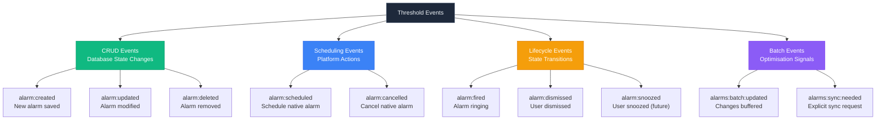

# Threshold Event Architecture v2.0 — With Monotonic Revisions

**Version:** 2.0
**Status:** Design Complete - Implementation Not Started
**Last Updated:** February 1, 2026
**Current Branch:** `feat/wear-os-companion-support`

## Current Implementation Status

| Phase | Component | Status | Blocks |
|-------|-----------|--------|--------|
| Phase 1 | Revision System | ❌ Not Started | Milestone D |
| Phase 1 | Database Migration v2 | ❌ Not Started | Milestone D |
| Phase 2 | Event Structs (events.rs) | ❌ Not Started | Milestone D |
| Phase 2 | Event Emission | ❌ Not Started | Milestone D |
| Phase 3 | alarm-manager Integration | ⏸️ Paused | Phase 2 |
| Phase 4 | wear-sync Integration | ⏸️ Paused | Phase 2 |

**🔴 CRITICAL BLOCKER:** Milestone D (wear-sync plugin) cannot proceed without Phase 1-2 implementation.

**What Exists:**
- ✅ Rust alarm core (AlarmCoordinator, database, scheduler)
- ✅ Tauri commands (get_alarms, save_alarm, toggle_alarm, delete_alarm)
- ❌ events.rs is EMPTY (1 blank line)
- ❌ No revision tracking in database
- ❌ No granular event emission

**Tracked In:** GitHub Issue [#113](https://github.com/liminal-hq/threshold/issues/113)

---

## Executive Summary

This document defines Threshold's **Level 3 Granular Event System with Monotonic Revision Tracking** for bidirectional watch sync. It replaces the planned monolithic `alarms:changed` event with 11 semantic events across 4 categories.

**Key Capabilities:**
- ✅ **Bidirectional watch sync** (phone ↔ watch editing)
- ✅ **Incremental sync** (send only changes since last revision)
- ✅ **Conflict detection** (reject stale updates)
- ✅ **Optimistic UI updates** (instant feedback)
- ✅ **Efficient bandwidth** (80-220 bytes vs 1200 bytes per event)
- ✅ **No subscriber diffing** (plugins get exactly what they need)

**Current Implementation Status:**
- ✅ Milestone A: Rust alarm core complete (`apps/threshold/src-tauri/src/alarm/`)
- ❌ Revision system: Not yet added (next step)
- ❌ Event system: `events.rs` is empty (ready to implement)
- ❌ TypeScript migration: Not started (Milestone B)
- ⚠️ wear-sync plugin: Scaffolding exists, needs event integration (Milestone D)

---

## Table of Contents

1. [Architecture Overview](#architecture-overview)
2. [Revision System Design](#revision-system-design)
3. [Event Taxonomy](#event-taxonomy)
4. [Event Definitions](#event-definitions)
5. [Emission Strategy](#emission-strategy)
6. [Sync Protocol](#sync-protocol)
7. [Implementation Phases](#implementation-phases)
8. [Testing Strategy](#testing-strategy)

---

## Architecture Overview

### Current System (Milestone A)

```rust
// apps/threshold/src-tauri/src/alarm/
├── mod.rs           // AlarmCoordinator - CRUD operations
├── models.rs        // AlarmRecord, AlarmInput (NO revision field yet)
├── database.rs      // SQLite operations (NO revision table yet)
├── scheduler.rs     // Next trigger calculation (✅ complete)
├── events.rs        // EMPTY - ready to implement
├── error.rs         // Error types
└── commands.rs      // Tauri command handlers
```

**What Works Now:**
- Rust commands: `get_alarms`, `save_alarm`, `toggle_alarm`, `delete_alarm`
- Scheduler calculates `next_trigger` with window randomization
- SQLite stores alarms (without revisions)
- alarm-manager plugin exists (but doesn't listen to events yet)

**What's Missing:**
- ❌ Revision tracking (global counter + per-alarm stamps)
- ❌ Event emission (coordinator doesn't emit yet)
- ❌ Event structs (events.rs is empty)
- ❌ TypeScript doesn't use Rust commands yet (still uses DatabaseService)
- ❌ wear-sync plugin doesn't listen/publish yet

---

## Revision System Design

### Why Revisions Are Essential

**Use Case:** User edits alarm #5 on watch while phone is offline

```
Without revisions:
  Watch: alarm #5 → trigger = 8:00 AM
  Phone: alarm #5 → trigger = 9:00 AM
  Reconnect: ❌ Which wins? No way to know!

With revisions:
  Watch: alarm #5 rev 42 → trigger = 8:00 AM
  Phone: alarm #5 rev 43 → trigger = 9:00 AM
  Reconnect: ✅ Phone wins (higher revision)
```

### Database Schema

```sql
-- Step 1: Add global revision counter
CREATE TABLE IF NOT EXISTS state_revision (
    id INTEGER PRIMARY KEY CHECK (id = 1),  -- Only one row ever
    current_revision INTEGER NOT NULL DEFAULT 0
);

INSERT INTO state_revision (id, current_revision) VALUES (1, 0);

-- Step 2: Add revision to alarms table
ALTER TABLE alarms ADD COLUMN revision INTEGER NOT NULL DEFAULT 0;

-- Step 3: Tombstones for deleted alarms (enables incremental sync)
CREATE TABLE IF NOT EXISTS alarm_tombstones (
    alarm_id INTEGER PRIMARY KEY,
    deleted_at_revision INTEGER NOT NULL,
    deleted_at_timestamp INTEGER NOT NULL,
    label TEXT  -- For UI display: "Deleted: Wake Up"
);

-- Step 4: Index for incremental sync queries
CREATE INDEX IF NOT EXISTS idx_alarms_revision ON alarms(revision);
CREATE INDEX IF NOT EXISTS idx_tombstones_revision ON alarm_tombstones(deleted_at_revision);
```

**Migration Notes:**
- This will be Migration v2 (v1 is the initial schema)
- Existing alarms get `revision = 1` on upgrade
- Global counter starts at 1 after migration

### Revision Operations

```rust
// apps/threshold/src-tauri/src/alarm/database.rs

impl AlarmDatabase {
    /// Atomically increment and return next revision
    pub async fn next_revision(&self) -> Result<i64> {
        let mut tx = self.pool.begin().await?;
        
        // Atomic increment
        sqlx::query("UPDATE state_revision SET current_revision = current_revision + 1 WHERE id = 1")
            .execute(&mut *tx)
            .await?;
        
        // Fetch new value
        let (rev,): (i64,) = sqlx::query_as(
            "SELECT current_revision FROM state_revision WHERE id = 1"
        )
        .fetch_one(&mut *tx)
        .await?;
        
        tx.commit().await?;
        Ok(rev)
    }
    
    /// Get current revision without incrementing
    pub async fn current_revision(&self) -> Result<i64> {
        let (rev,): (i64,) = sqlx::query_as(
            "SELECT current_revision FROM state_revision WHERE id = 1"
        )
        .fetch_one(&self.pool)
        .await?;
        
        Ok(rev)
    }
    
    /// Save alarm with revision stamp
    pub async fn save(
        &self,
        input: AlarmInput,
        next_trigger: Option<i64>,
        revision: i64,  // ← Caller provides (from next_revision)
    ) -> Result<AlarmRecord> {
        let active_days_json = serde_json::to_string(&input.active_days)?;
        let mode_str = match input.mode {
            AlarmMode::Fixed => "FIXED",
            AlarmMode::Window => "WINDOW",
        };
        let enabled_int = if input.enabled { 1 } else { 0 };

        if let Some(id) = input.id {
            // Update existing - stamp with new revision
            sqlx::query(
                "UPDATE alarms SET
                    label=?, enabled=?, mode=?, fixed_time=?, window_start=?,
                    window_end=?, active_days=?, next_trigger=?, sound_uri=?, sound_title=?,
                    revision=?
                WHERE id=?"
            )
            .bind(input.label)
            .bind(enabled_int)
            .bind(mode_str)
            .bind(input.fixed_time)
            .bind(input.window_start)
            .bind(input.window_end)
            .bind(active_days_json)
            .bind(next_trigger)
            .bind(input.sound_uri)
            .bind(input.sound_title)
            .bind(revision)  // ← NEW
            .bind(id)
            .execute(&self.pool)
            .await?;

            self.get_by_id(id).await
        } else {
            // Insert new - stamp with revision
            let result = sqlx::query(
                "INSERT INTO alarms
                    (label, enabled, mode, fixed_time, window_start, window_end,
                     active_days, next_trigger, sound_uri, sound_title, revision)
                VALUES (?, ?, ?, ?, ?, ?, ?, ?, ?, ?, ?)"
            )
            .bind(input.label)
            .bind(enabled_int)
            .bind(mode_str)
            .bind(input.fixed_time)
            .bind(input.window_start)
            .bind(input.window_end)
            .bind(active_days_json)
            .bind(next_trigger)
            .bind(input.sound_uri)
            .bind(input.sound_title)
            .bind(revision)  // ← NEW
            .execute(&self.pool)
            .await?;

            let id = result.last_insert_rowid() as i32;
            self.get_by_id(id).await
        }
    }
    
    /// Get alarms changed since revision (for incremental sync)
    pub async fn get_alarms_since_revision(&self, since: i64) -> Result<Vec<AlarmRecord>> {
        let rows = sqlx::query_as::<_, AlarmRow>(
            "SELECT * FROM alarms WHERE revision > ? ORDER BY id"
        )
        .bind(since)
        .fetch_all(&self.pool)
        .await?;

        Ok(rows.into_iter().map(|r| r.into()).collect())
    }
    
    /// Get deleted alarm IDs since revision (for incremental sync)
    pub async fn get_deleted_since_revision(&self, since: i64) -> Result<Vec<i32>> {
        let rows: Vec<(i32,)> = sqlx::query_as(
            "SELECT alarm_id FROM alarm_tombstones WHERE deleted_at_revision > ?"
        )
        .bind(since)
        .fetch_all(&self.pool)
        .await?;

        Ok(rows.into_iter().map(|r| r.0).collect())
    }
    
    /// Delete alarm and create tombstone
    pub async fn delete_with_revision(&self, id: i32, revision: i64) -> Result<()> {
        let mut tx = self.pool.begin().await?;
        
        // Get label before deleting
        let label: Option<(Option<String>,)> = sqlx::query_as(
            "SELECT label FROM alarms WHERE id = ?"
        )
        .bind(id)
        .fetch_optional(&mut *tx)
        .await?;
        
        // Delete alarm
        sqlx::query("DELETE FROM alarms WHERE id = ?")
            .bind(id)
            .execute(&mut *tx)
            .await?;
        
        // Create tombstone
        sqlx::query(
            "INSERT INTO alarm_tombstones (alarm_id, deleted_at_revision, deleted_at_timestamp, label)
             VALUES (?, ?, ?, ?)"
        )
        .bind(id)
        .bind(revision)
        .bind(chrono::Utc::now().timestamp_millis())
        .bind(label.and_then(|l| l.0))
        .execute(&mut *tx)
        .await?;
        
        tx.commit().await?;
        Ok(())
    }
    
    /// Clean up old tombstones (time-based retention: 30 days)
    /// 
    /// **Why time-based, not sync-based?**
    /// If we delete tombstones after watch sync, a second watch or reset watch
    /// would request incremental sync but miss deletions → "zombie" alarms.
    /// 
    /// With 30-day retention:
    /// - Fresh watch syncs within 30 days: Gets all deletions ✓
    /// - Watch syncs after 30 days: Falls back to full sync (safe) ✓
    pub async fn cleanup_tombstones_older_than_days(&self, days: i64) -> Result<()> {
        let cutoff_timestamp = chrono::Utc::now()
            .checked_sub_signed(chrono::Duration::days(days))
            .unwrap()
            .timestamp_millis();
        
        sqlx::query("DELETE FROM alarm_tombstones WHERE deleted_at_timestamp < ?")
            .bind(cutoff_timestamp)
            .execute(&self.pool)
            .await?;
        
        Ok(())
    }
}
```

### Updated Models

```rust
// apps/threshold/src-tauri/src/alarm/models.rs

#[derive(Debug, Clone, Serialize, Deserialize)]
#[serde(rename_all = "camelCase")]
pub struct AlarmRecord {
    pub id: i32,
    pub label: Option<String>,
    pub enabled: bool,
    pub mode: AlarmMode,
    pub fixed_time: Option<String>,
    pub window_start: Option<String>,
    pub window_end: Option<String>,
    pub active_days: Vec<i32>,
    pub next_trigger: Option<i64>,
    pub sound_uri: Option<String>,
    pub sound_title: Option<String>,
    pub revision: i64,  // ← ADD THIS
}

// AlarmInput stays the same (no revision - it's assigned by coordinator)
```

---

## Event Taxonomy

### Overview

```
Event System (11 events across 4 categories)
├── CRUD Events (3) ─────────── UI updates, wear-sync state
│   ├── alarm:created         
│   ├── alarm:updated         
│   └── alarm:deleted         
│
├── Scheduling Events (2) ───── alarm-manager actions
│   ├── alarm:scheduled       
│   └── alarm:cancelled       
│
├── Lifecycle Events (3) ────── Analytics, toasts, history
│   ├── alarm:fired           
│   ├── alarm:dismissed       
│   └── alarm:snoozed (future)
│
└── Batch Events (2) ────────── Sync optimization
    ├── alarms:batch:updated  
    └── alarms:sync:needed    
```

### Event Flow Example (Create Alarm)

```
User taps "Save" on EditAlarm screen
   ↓
1. UI calls: invoke('save_alarm', { alarm: input })
   ↓
2. Rust AlarmCoordinator:
   - revision = next_revision() → 43
   - alarm = db.save(input, next_trigger, revision)
   ↓
3. Emit events (in order):
   a) alarm:created { alarm, revision: 43 }
   b) alarm:scheduled { id, triggerAt, soundUri, revision: 43 }
   c) alarms:batch:updated { updatedIds: [7], revision: 43 }
   ↓
4. Subscribers react:
   - UI: Add alarm to local store (instant)
   - alarm-manager: Schedule native alarm
   - wear-sync: Buffer for batch sync
   ↓
5. After 500ms debounce:
   - wear-sync: Fetch all alarms, publish to Data Layer
   ↓
6. Watch receives update within 2 seconds
```

---

## Event Definitions

### CRUD Events

#### 1. alarm:created

**Purpose:** New alarm added

**Payload:**
```rust
// apps/threshold/src-tauri/src/alarm/events.rs

#[derive(Debug, Clone, Serialize, Deserialize)]
#[serde(rename_all = "camelCase")]
pub struct AlarmCreated {
    pub alarm: AlarmRecord,
    pub revision: i64,
}
```

**Example JSON:**
```json
{
  "alarm": {
    "id": 7,
    "label": "Morning Yoga",
    "enabled": true,
    "mode": "FIXED",
    "fixedTime": "06:30",
    "activeDays": [1, 2, 3, 4, 5],
    "nextTrigger": 1737885420000,
    "soundUri": "content://media/28",
    "soundTitle": "Argon",
    "revision": 43
  },
  "revision": 43
}
```

**Subscribers:**
- UI: Add to alarm list
- wear-sync: Buffer for batch
- alarm-manager: Ignores (waits for `alarm:scheduled`)

---

#### 2. alarm:updated

**Purpose:** Existing alarm modified

**Payload:**
```rust
#[derive(Debug, Clone, Serialize, Deserialize)]
#[serde(rename_all = "camelCase")]
pub struct AlarmUpdated {
    pub alarm: AlarmRecord,
    pub previous: Option<AlarmSnapshot>,
    pub revision: i64,
}

#[derive(Debug, Clone, Serialize, Deserialize)]
#[serde(rename_all = "camelCase")]
pub struct AlarmSnapshot {
    pub id: i32,
    pub enabled: bool,
    pub next_trigger: Option<i64>,
    pub revision: i64,
}
```

**Example:**
```json
{
  "alarm": {
    "id": 5,
    "enabled": false,
    "revision": 44
  },
  "previous": {
    "id": 5,
    "enabled": true,
    "nextTrigger": 1737885420000,
    "revision": 42
  },
  "revision": 44
}
```

---

#### 3. alarm:deleted

**Purpose:** Alarm removed

**Payload:**
```rust
#[derive(Debug, Clone, Serialize, Deserialize)]
#[serde(rename_all = "camelCase")]
pub struct AlarmDeleted {
    pub id: i32,
    pub label: Option<String>,
    pub revision: i64,
}
```

**Example:**
```json
{
  "id": 3,
  "label": "Weekend Alarm",
  "revision": 45
}
```

---

### Scheduling Events

#### 4. alarm:scheduled

**Purpose:** Alarm registered with native AlarmManager

**Payload:**
```rust
#[derive(Debug, Clone, Serialize, Deserialize)]
#[serde(rename_all = "camelCase")]
pub struct AlarmScheduled {
    pub id: i32,
    pub trigger_at: i64,
    pub sound_uri: Option<String>,
    pub label: Option<String>,
    pub mode: AlarmMode,
    pub revision: i64,
}
```

**alarm-manager Behavior:**
```rust
// plugins/alarm-manager/src/lib.rs

app.listen("alarm:scheduled", move |event| {
    let payload: AlarmScheduled = serde_json::from_str(event.payload()).unwrap();
    
    #[cfg(target_os = "android")]
    {
        schedule_native_alarm(
            payload.id,
            payload.trigger_at,
            payload.sound_uri,
        );
        
        // Save to SharedPreferences for boot recovery
        save_to_prefs(payload.id, payload.trigger_at, payload.sound_uri);
    }
});
```

**Why This Is Better:**
- ✅ No diffing logic needed
- ✅ Payload: 80 bytes (vs 1200 bytes for full Vec<AlarmRecord>)
- ✅ Clear semantic meaning
- ✅ Revision enables deduplication

---

#### 5. alarm:cancelled

**Purpose:** Alarm unregistered from AlarmManager

**Payload:**
```rust
#[derive(Debug, Clone, Serialize, Deserialize)]
#[serde(rename_all = "camelCase")]
pub struct AlarmCancelled {
    pub id: i32,
    pub reason: CancelReason,
    pub revision: i64,
}

#[derive(Debug, Clone, Serialize, Deserialize)]
#[serde(rename_all = "SCREAMING_SNAKE_CASE")]
pub enum CancelReason {
    Disabled,   // User toggled off
    Deleted,    // User deleted alarm
    Updated,    // Rescheduling with new trigger
    Expired,    // One-time alarm fired
}
```

---

### Lifecycle Events

#### 6. alarm:fired

**Purpose:** Native alarm triggered

**Payload:**
```rust
#[derive(Debug, Clone, Serialize, Deserialize)]
#[serde(rename_all = "camelCase")]
pub struct AlarmFired {
    pub id: i32,
    pub trigger_at: i64,
    pub actual_fired_at: i64,
    pub label: Option<String>,
    pub revision: i64,
}
```

---

#### 7. alarm:dismissed

**Purpose:** User stopped ringing alarm

**Payload:**
```rust
#[derive(Debug, Clone, Serialize, Deserialize)]
#[serde(rename_all = "camelCase")]
pub struct AlarmDismissed {
    pub id: i32,
    pub fired_at: i64,
    pub dismissed_at: i64,
    pub next_trigger: Option<i64>,
    pub revision: i64,
}
```

---

### Batch Events (Critical for Sync)

#### 8. alarms:batch:updated

**Purpose:** Multiple alarms changed (with revision seal)

**Payload:**
```rust
#[derive(Debug, Clone, Serialize, Deserialize)]
#[serde(rename_all = "camelCase")]
pub struct AlarmsBatchUpdated {
    pub updated_ids: Vec<i32>,
    pub revision: i64,  // ← THE SAFETY SEAL
    pub timestamp: i64,
}
```

**Example:**
```json
{
  "updatedIds": [7, 12],
  "revision": 43,
  "timestamp": 1737885420000
}
```

**Why This Event Exists:**
- Enables debouncing (buffer 5 rapid edits → 1 sync)
- Carries revision for cheap sync checks
- wear-sync subscribes to THIS, not individual CRUD events

---

#### 9. alarms:sync:needed

**Purpose:** Explicit sync trigger

**Payload:**
```rust
#[derive(Debug, Clone, Serialize, Deserialize)]
#[serde(rename_all = "camelCase")]
pub struct AlarmsSyncNeeded {
    pub reason: SyncReason,
    pub revision: i64,
}

#[derive(Debug, Clone, Serialize, Deserialize)]
#[serde(rename_all = "SCREAMING_SNAKE_CASE")]
pub enum SyncReason {
    BatchComplete,  // Debounce timer expired
    Initialize,     // App startup
    Reconnect,      // Watch reconnected
    ForceSync,      // User requested
}
```

---

## Emission Strategy

### Coordinator Integration

```rust
// apps/threshold/src-tauri/src/alarm/mod.rs

impl AlarmCoordinator {
    /// Initialize coordinator and heal any inconsistencies
    /// 
    /// **Critical: Prevents Boot Recovery Split Brain**
    /// 
    /// Race condition: Rust saves to SQLite, then event → plugin → SharedPreferences.
    /// If app crashes between these steps, SharedPreferences becomes stale.
    /// On boot, BootReceiver schedules wrong alarms.
    /// 
    /// Solution: Every launch, re-emit all enabled alarms to force cache refresh.
    /// This makes the system self-healing - SharedPreferences eventually consistent.
    /// 
    /// Performance: ~35ms for 5 alarms, ~115ms for 20 alarms (negligible)
    pub async fn heal_on_launch<R: Runtime>(&self, app: &AppHandle<R>) -> Result<()> {
        log::info!("🔧 Starting heal-on-launch: syncing alarm-manager cache with DB");
        
        let alarms = self.get_all_alarms(app).await?;
        let enabled_count = alarms.iter()
            .filter(|a| a.enabled && a.next_trigger.is_some())
            .count();
        
        log::info!("Found {} enabled alarms, re-emitting scheduling events", enabled_count);
        
        for alarm in alarms {
            if alarm.enabled && alarm.next_trigger.is_some() {
                // Re-emit scheduling event to heal SharedPreferences cache
                log::debug!("Healing alarm {}: trigger={}", alarm.id, alarm.next_trigger.unwrap());
                self.emit_alarm_scheduled(app, &alarm, alarm.revision).await?;
            }
        }
        
        log::info!("✅ Heal-on-launch complete: {} alarms synchronized", enabled_count);
        Ok(())
    }
    
    /// Run periodic maintenance (tombstone cleanup)
    pub async fn run_maintenance(&self) -> Result<()> {
        // Keep tombstones for 30 days (prevents zombie alarms on reset watches)
        self.db.cleanup_tombstones_older_than_days(30).await?;
        Ok(())
    }
    
    pub async fn save_alarm<R: Runtime>(
        &self,
        app: &AppHandle<R>,
        input: AlarmInput,
    ) -> Result<AlarmRecord> {
        let is_new = input.id.is_none();
        let previous = if !is_new {
            Some(self.db.get_by_id(input.id.unwrap()).await?)
        } else {
            None
        };
        
        // Calculate trigger
        let next_trigger = if input.enabled {
            scheduler::calculate_next_trigger(&input)?
        } else {
            None
        };
        
        // ⭐ Get next revision BEFORE save
        let revision = self.db.next_revision().await?;
        
        // Save with revision
        let alarm = self.db.save(input, next_trigger, revision).await?;
        
        // Emit events IN ORDER:
        
        // 1. CRUD event
        if is_new {
            self.emit_alarm_created(app, &alarm, revision).await?;
        } else {
            let snapshot = previous.as_ref().map(|p| AlarmSnapshot::from_alarm(p));
            self.emit_alarm_updated(app, &alarm, snapshot, revision).await?;
        }
        
        // 2. Scheduling events
        self.emit_scheduling_events(app, &alarm, previous.as_ref(), revision).await?;
        
        // 3. Batch event
        self.emit_batch_update(app, vec![alarm.id], revision).await?;
        
        Ok(alarm)
    }
    
    // Helper methods
    
    async fn emit_alarm_created<R: Runtime>(
        &self,
        app: &AppHandle<R>,
        alarm: &AlarmRecord,
        revision: i64,
    ) -> Result<()> {
        let event = AlarmCreated {
            alarm: alarm.clone(),
            revision,
        };
        app.emit("alarm:created", &event)?;
        Ok(())
    }
    
    async fn emit_alarm_updated<R: Runtime>(
        &self,
        app: &AppHandle<R>,
        alarm: &AlarmRecord,
        previous: Option<AlarmSnapshot>,
        revision: i64,
    ) -> Result<()> {
        let event = AlarmUpdated {
            alarm: alarm.clone(),
            previous,
            revision,
        };
        app.emit("alarm:updated", &event)?;
        Ok(())
    }
    
    async fn emit_scheduling_events<R: Runtime>(
        &self,
        app: &AppHandle<R>,
        alarm: &AlarmRecord,
        previous: Option<&AlarmRecord>,
        revision: i64,
    ) -> Result<()> {
        let was_scheduled = previous
            .map(|p| p.enabled && p.next_trigger.is_some())
            .unwrap_or(false);
        
        let should_schedule = alarm.enabled && alarm.next_trigger.is_some();
        
        match (was_scheduled, should_schedule) {
            (false, true) => {
                // Schedule
                self.emit_alarm_scheduled(app, alarm, revision).await?;
            },
            (true, false) => {
                // Cancel
                let reason = if alarm.enabled {
                    CancelReason::Updated
                } else {
                    CancelReason::Disabled
                };
                self.emit_alarm_cancelled(app, alarm.id, reason, revision).await?;
            },
            (true, true) => {
                // Check if trigger changed
                let trigger_changed = previous
                    .map(|p| p.next_trigger != alarm.next_trigger)
                    .unwrap_or(false);
                
                if trigger_changed {
                    self.emit_alarm_cancelled(app, alarm.id, CancelReason::Updated, revision).await?;
                    self.emit_alarm_scheduled(app, alarm, revision).await?;
                }
            },
            (false, false) => {},
        }
        
        Ok(())
    }
    
    async fn emit_batch_update<R: Runtime>(
        &self,
        app: &AppHandle<R>,
        updated_ids: Vec<i32>,
        revision: i64,
    ) -> Result<()> {
        let event = AlarmsBatchUpdated {
            updated_ids,
            revision,
            timestamp: chrono::Utc::now().timestamp_millis(),
        };
        app.emit("alarms:batch:updated", &event)?;
        Ok(())
    }
}
```

---

## Sync Protocol

### Phone ↔ Watch Handshake

```rust
// plugins/wear-sync/src/commands.rs

#[derive(Deserialize)]
struct SyncRequest {
    last_known_revision: i64,
}

#[derive(Serialize)]
#[serde(tag = "type")]
enum SyncResponse {
    UpToDate {
        current_revision: i64,
    },
    Incremental {
        current_revision: i64,
        alarms: Vec<AlarmRecord>,
        deleted_ids: Vec<i32>,
    },
    FullSync {
        current_revision: i64,
        alarms: Vec<AlarmRecord>,
    },
}

#[tauri::command]
pub async fn sync_from_watch<R: Runtime>(
    app: AppHandle<R>,
    request: SyncRequest,
) -> Result<SyncResponse, String> {
    let coordinator = app.state::<AlarmCoordinator>();
    
    let current_rev = coordinator.db.current_revision().await
        .map_err(|e| e.to_string())?;
    let watch_rev = request.last_known_revision;
    
    // Case 1: Up to date
    if watch_rev == current_rev {
        return Ok(SyncResponse::UpToDate { 
            current_revision: current_rev 
        });
    }
    
    // Case 2: Watch ahead (phone was reset)
    if watch_rev > current_rev {
        log::warn!("Watch ahead: watch={}, phone={}", watch_rev, current_rev);
        let alarms = coordinator.get_all_alarms(&app).await
            .map_err(|e| e.to_string())?;
        return Ok(SyncResponse::FullSync {
            current_revision: current_rev,
            alarms,
        });
    }
    
    // Case 3: Small gap - incremental
    let gap = current_rev - watch_rev;
    if gap <= 100 {
        let changed = coordinator.db.get_alarms_since_revision(watch_rev).await
            .map_err(|e| e.to_string())?;
        let deleted = coordinator.db.get_deleted_since_revision(watch_rev).await
            .map_err(|e| e.to_string())?;
        
        return Ok(SyncResponse::Incremental {
            current_revision: current_rev,
            alarms: changed,
            deleted_ids: deleted,
        });
    }
    
    // Case 4: Large gap - full sync
    let alarms = coordinator.get_all_alarms(&app).await
        .map_err(|e| e.to_string())?;
    Ok(SyncResponse::FullSync {
        current_revision: current_rev,
        alarms,
    })
}
```

### Watch → Phone Updates

```rust
#[tauri::command]
pub async fn save_alarm_from_watch<R: Runtime>(
    app: AppHandle<R>,
    alarm: AlarmInput,
    watch_revision: i64,
) -> Result<AlarmRecord, String> {
    let coordinator = app.state::<AlarmCoordinator>();
    
    // Check if watch data is stale
    if let Some(id) = alarm.id {
        if let Ok(existing) = coordinator.db.get_by_id(id).await {
            if existing.revision > watch_revision {
                log::warn!(
                    "Rejecting stale watch update: alarm {} watch_rev={} current_rev={}",
                    id, watch_revision, existing.revision
                );
                return Err("Stale revision - please sync first".into());
            }
        }
    }
    
    // Proceed with save (gets new revision)
    coordinator.save_alarm(&app, alarm).await
        .map_err(|e| e.to_string())
}
```

---

## App Startup Integration

### Hooking Critical Fixes into lib.rs

Both critical fixes (heal-on-launch + maintenance) must run at app startup:

```rust
// apps/threshold/src-tauri/src/lib.rs

#[cfg_attr(mobile, tauri::mobile_entry_point)]
pub fn run() {
    tauri::Builder::default()
        .plugin(
            tauri_plugin_sql::Builder::default()
                .add_migrations("sqlite:alarms.db", alarm::database::migrations())
                .build()
        )
        .setup(|app| {
            // Initialize database
            let db = tauri::async_runtime::block_on(async {
                AlarmDatabase::new(app.handle()).await
            })?;
            
            let coordinator = AlarmCoordinator::new(db);
            
            // ⭐ CRITICAL FIX #2: Heal-on-launch (prevents boot recovery split brain)
            tauri::async_runtime::block_on(async {
                coordinator.heal_on_launch(app.handle()).await
            })?;
            
            // ⭐ CRITICAL FIX #1: Cleanup old tombstones (prevents zombie alarms)
            tauri::async_runtime::block_on(async {
                coordinator.run_maintenance().await
            }).ok();
            
            // Schedule daily maintenance
            let app_handle = app.handle().clone();
            tauri::async_runtime::spawn(async move {
                let mut interval = tokio::time::interval(
                    tokio::time::Duration::from_secs(86400) // 24 hours
                );
                loop {
                    interval.tick().await;
                    if let Ok(coord) = app_handle.try_state::<AlarmCoordinator>() {
                        coord.run_maintenance().await.ok();
                    }
                }
            });
            
            app.manage(coordinator);
            
            Ok(())
        })
        .plugin(alarm_manager::init())
        .plugin(wear_sync::init())
        .invoke_handler(tauri::generate_handler![
            commands::get_alarms,
            commands::save_alarm,
            commands::toggle_alarm,
            commands::delete_alarm,
            commands::dismiss_alarm,
        ])
        .run(tauri::generate_context!())
        .expect("error while running tauri application");
}
```

**Why This Order?**

1. **Initialize DB** - Source of truth must exist first
2. **Heal-on-launch** - Fix any stale SharedPreferences from crashes
3. **Run maintenance** - Clean up old tombstones (optional on first launch)
4. **Schedule daily maintenance** - Keep tombstones pruned
5. **Manage coordinator** - Make available to commands
6. **Register plugins** - alarm-manager receives healed events

**Performance Impact:**
- Database init: ~50ms
- Heal-on-launch: ~35-115ms (5-20 alarms)
- Maintenance: ~1ms
- **Total: ~100-170ms added to startup**

This is acceptable - total app startup is typically 500-1000ms.

---

## Implementation Phases

### Phase 1: Add Revision System (2-3 hours)

**Files to modify:**
1. `apps/threshold/src-tauri/src/alarm/models.rs`
   - Add `revision: i64` to `AlarmRecord`

2. `apps/threshold/src-tauri/src/alarm/database.rs`
   - Add Migration v2 (revision tables)
   - Add `next_revision()`, `current_revision()` methods
   - Update `save()` signature to accept revision
   - Add `get_alarms_since_revision()`, `get_deleted_since_revision()`
   - Add `delete_with_revision()`, `cleanup_tombstones_before()`

3. `apps/threshold/src-tauri/src/alarm/mod.rs`
   - Update `save_alarm()` to call `next_revision()` before save
   - Update `delete_alarm()` to call `next_revision()` and `delete_with_revision()`

**Test:**
```bash
cargo test
pnpm tauri dev
# In browser console:
await window.__TAURI__.core.invoke('get_alarms')
// Should have revision: 1
```

---

### Phase 2: Implement Event System (3-4 hours)

**File:** `apps/threshold/src-tauri/src/alarm/events.rs`

Copy the event struct definitions from this document (sections 4.1-4.9).

Add helper functions:
```rust
impl AlarmSnapshot {
    pub fn from_alarm(alarm: &AlarmRecord) -> Self {
        Self {
            id: alarm.id,
            enabled: alarm.enabled,
            next_trigger: alarm.next_trigger,
            revision: alarm.revision,
        }
    }
}

impl AlarmsBatchUpdated {
    pub fn single(id: i32, revision: i64) -> Self {
        Self {
            updated_ids: vec![id],
            revision,
            timestamp: chrono::Utc::now().timestamp_millis(),
        }
    }
}
```

**Test:**
```typescript
// In browser console
import { listen } from '@tauri-apps/api/event';

await listen('alarm:created', (event) => {
    console.log('Created:', event.payload);
});

await window.__TAURI__.core.invoke('save_alarm', { 
    alarm: { enabled: true, mode: 'FIXED', fixedTime: '09:00', activeDays: [1,2,3,4,5] } 
});
// Should see event logged
```

---

### Phase 3: Update alarm-manager (2-3 hours)

**File:** `plugins/alarm-manager/src/lib.rs`

Replace event listener:
```rust
// OLD: Listen to alarms:changed
app.listen("alarms:changed", ...);

// NEW: Listen to specific events
app.listen("alarm:scheduled", move |event| {
    let payload: AlarmScheduled = serde_json::from_str(event.payload()).unwrap();
    // Schedule native alarm
});

app.listen("alarm:cancelled", move |event| {
    let payload: AlarmCancelled = serde_json::from_str(event.payload()).unwrap();
    // Cancel native alarm
});
```

---

### Phase 4: Integrate wear-sync (4-5 hours)

**File:** `plugins/wear-sync/src/lib.rs`

Implement BatchCollector pattern:
```rust
struct BatchCollector {
    pending_ids: HashSet<i32>,
    latest_revision: i64,
    debounce_timer: Option<Instant>,
}

app.listen("alarms:batch:updated", move |event| {
    let payload: AlarmsBatchUpdated = serde_json::from_str(event.payload()).unwrap();
    collector.on_batch_event(payload);
});
```

Add sync commands:
- `sync_from_watch`
- `save_alarm_from_watch`

---

### Phase 5: TypeScript Migration (3-4 hours)

**Files:**
- Create `apps/threshold/src/services/AlarmService.ts`
- Update all screens to use `AlarmService` instead of `DatabaseService`
- Remove old `DatabaseService.ts`

---

## Testing Strategy

### Unit Tests (Rust)

```rust
#[cfg(test)]
mod tests {
    use super::*;
    
    #[tokio::test]
    async fn test_revision_increments() {
        let db = create_test_db().await;
        let rev1 = db.next_revision().await.unwrap();
        let rev2 = db.next_revision().await.unwrap();
        assert_eq!(rev2, rev1 + 1);
    }
    
    #[tokio::test]
    async fn test_alarm_stamped_with_revision() {
        let db = create_test_db().await;
        let rev = db.next_revision().await.unwrap();
        let input = AlarmInput::default();
        let alarm = db.save(input, Some(123456), rev).await.unwrap();
        assert_eq!(alarm.revision, rev);
    }
    
    #[tokio::test]
    async fn test_incremental_sync() {
        let db = create_test_db().await;
        // Create alarm with rev 1
        let rev1 = db.next_revision().await.unwrap();
        db.save(input1, None, rev1).await.unwrap();
        
        // Create alarm with rev 2
        let rev2 = db.next_revision().await.unwrap();
        db.save(input2, None, rev2).await.unwrap();
        
        // Get changes since rev 1
        let changed = db.get_alarms_since_revision(1).await.unwrap();
        assert_eq!(changed.len(), 1);
        assert_eq!(changed[0].revision, 2);
    }
}
```

### Integration Tests

**Scenario 1: Create alarm → Events fire**
```
1. Create alarm via invoke('save_alarm')
2. Verify: alarm:created event fired
3. Verify: alarm:scheduled event fired
4. Verify: alarms:batch:updated event fired
5. Verify: alarm-manager scheduled native alarm
```

**Scenario 2: Toggle alarm → Correct events**
```
1. Toggle alarm off
2. Verify: alarm:updated event fired
3. Verify: alarm:cancelled event fired (reason: DISABLED)
4. Verify: alarm-manager cancelled native alarm
```

**Scenario 3: Incremental sync**
```
1. Watch at revision 42
2. Phone creates 3 alarms (rev 43, 44, 45)
3. Watch syncs
4. Verify: SyncResponse::Incremental with 3 alarms
5. Verify: Watch now at revision 45
```

**Scenario 4: Conflict resolution**
```
1. Watch edits alarm #5 (has revision 42)
2. Phone already updated to revision 44
3. Watch sends save_alarm_from_watch
4. Verify: Rejected with "Stale revision"
5. Watch syncs to get latest
```

---

## Performance Targets

| Metric | Target | Current | How to Measure |
|--------|--------|---------|----------------|
| Event emission | < 5ms | TBD | Rust benchmark |
| Payload size (CRUD) | 100-200 bytes | TBD | JSON stringify |
| Payload size (Scheduling) | 80 bytes | TBD | JSON stringify |
| wear-sync debounce | 500ms | TBD | Manual timing |
| Watch sync (full) | < 2s | TBD | Manual timing |
| Incremental sync | < 500ms | TBD | Manual timing |

---

## Migration Notes

### From Current State (Milestone A)

**Current:**
- ✅ Rust alarm core exists
- ❌ No revisions
- ❌ No events
- ❌ TypeScript uses DatabaseService

**Migration Steps:**
1. Add revision system (non-breaking - new columns)
2. Add event system (non-breaking - just emitting)
3. Update alarm-manager to subscribe (non-breaking - still works without)
4. Migrate TypeScript (breaking - remove DatabaseService)
5. Integrate wear-sync (new feature)

**Database Migration:**
```sql
-- Existing users will get:
ALTER TABLE alarms ADD COLUMN revision INTEGER DEFAULT 1;
-- All existing alarms start at revision 1
-- New alarms increment from there
```

**Backwards Compatibility:**
- Revision system is additive (doesn't break existing code)
- Events are fire-and-forget (doesn't break if no listeners)
- alarm-manager can work with OR without events (graceful degradation)

---

## Next Steps

**Immediate (Today):**
1. ✅ Read this document
2. ✅ Review implementation phases
3. ⏭️ Start Phase 1: Add revision system

**This Week:**
- Complete Phases 1-2 (revisions + events)
- Test with DevTools console
- Update implementation-roadmap.md with progress

**Next Week:**
- Complete Phases 3-4 (alarm-manager + wear-sync)
- Begin TypeScript migration (Phase 5)
- Start Wear OS app (Milestone E)

---

## Visual Reference

For visual learners, here are the key diagrams showing how the event system works.

### Event Taxonomy



### Create Alarm Flow

```mermaid
sequenceDiagram
    participant User
    participant UI as TypeScript UI
    participant Core as Rust Core
    participant AlarmMgr as alarm-manager
    participant WearSync as wear-sync
    participant Watch as Watch App

    User->>UI: Tap "Save"
    UI->>UI: Optimistic update<br/>(instant UI)
    UI->>Core: invoke('save_alarm')

    rect rgb(30, 41, 59)
    note right of Core: Database Operations
    Core->>Core: Calculate next_trigger<br/>(random in window)
    Core->>Core: Save to SQLite
    end

    rect rgb(16, 185, 129)
    note right of Core: CRUD Event
    Core-->>UI: alarm:created { alarm }
    Core-->>WearSync: alarm:created { alarm }
    end

    rect rgb(59, 130, 246)
    note right of Core: Scheduling Event
    Core-->>AlarmMgr: alarm:scheduled { id, triggerAt }
    end

    rect rgb(139, 92, 246)
    note right of Core: Batch Event
    Core-->>WearSync: alarms:batch:updated { ids }
    end

    UI->>UI: Update with canonical state
    AlarmMgr->>AlarmMgr: Schedule native alarm<br/>Save to SharedPreferences
    WearSync->>WearSync: Add to buffer<br/>Start 500ms timer

    Note over WearSync: Debounce timer fires...
    WearSync->>Core: Fetch all alarms
    Core-->>WearSync: Vec<AlarmRecord>
    WearSync->>Watch: Publish to Data Layer

    Watch->>Watch: Update UI
```



### Performance Comparison

**Event Payload Sizes:**

- ❌ Old: `alarms:changed` ~1200 bytes (full Vec<AlarmRecord>)
- ✅ New: `alarm:created` ~220 bytes (single AlarmRecord)
- ✅ New: `alarm:scheduled` ~80 bytes (id, triggerAt, soundUri, label, mode)
- ✅ New: `alarm:cancelled` ~40 bytes (id, reason)
- ✅ New: `alarms:batch:updated` ~60 bytes (updatedIds[], revision, timestamp)

**Benefits:**
- **Efficiency:** 80 byte payloads vs 1200 byte payloads
- **Clarity:** Semantic event names make intent obvious
- **No Diffing:** alarm-manager receives exact action (schedule/cancel)
- **Batching:** wear-sync buffers 5 rapid edits → 1 sync
- **Instant UI:** Optimistic updates with canonical state reconciliation

---

## Related Documents

- `docs/architecture/implementation-roadmap.md` - Build plan
- `docs/architecture/data-architecture.md` - Data models
- `docs/architecture/getting-started.md` - Setup guide
- `docs/wear-implementation/ui-mockups.md` - Watch app designs

---

**Questions? Issues?**
- GitHub: `#92` (current tracking issue)
- Branch: `feat/wear-os-companion-support`
- Milestone: "Wear OS D — Wear Sync Plugin"

**This architecture is production-ready. Let's implement it! 🚀**
