# Threshold - Command & Event Flow Diagrams

**Project:** Threshold Alarm Clock
**Version:** 2.0 (Rust-Core Architecture)
**Date:** January 2026
**Purpose:** Visual reference for all system interactions

> **📖 For Event System Details:** See [event-architecture.md](event-architecture.md) for complete event taxonomy, payload specifications, and revision system documentation.

---

## Table of Contents

1. [High-Level Architecture](#1-high-level-architecture)
2. [Command Flow (TypeScript → Rust)](#2-command-flow-typescript--rust)
3. [Event Flow (Rust → Listeners)](#3-event-flow-rust--listeners)
4. [Complete Save Alarm Flow](#4-complete-save-alarm-flow)
5. [Toggle Alarm Flow](#5-toggle-alarm-flow)
6. [Android-Specific Flows](#6-android-specific-flows)
7. [Desktop-Specific Flows](#7-desktop-specific-flows)
8. [Wear OS Sync Flows](#8-wear-os-sync-flows)
9. [Boot Recovery Flow (Android)](#9-boot-recovery-flow-android)
10. [Platform Comparison Matrix](#10-platform-comparison-matrix)

---

## 1. High-Level Architecture


---

## 2. Command Flow (TypeScript → Rust)

### 2.1 Command Invocation Pattern


### 2.2 All Available Commands


**Command Signatures:**

```rust
// TypeScript calls these via invoke()
async fn get_alarms() -> Result<Vec<AlarmRecord>>
async fn get_alarm(id: i32) -> Result<AlarmRecord>
async fn save_alarm(alarm: AlarmInput) -> Result<AlarmRecord>
async fn toggle_alarm(id: i32, enabled: bool) -> Result<AlarmRecord>
async fn delete_alarm(id: i32) -> Result<()>
async fn dismiss_alarm(id: i32) -> Result<()>
```

---

## 3. Event Flow (Rust → Listeners)

### 3.1 Event Emission Pattern


### 3.2 Event Types


**Event Payload:**

```typescript
interface AlarmsChangedEvent {
    event: "alarms:changed";
    payload: AlarmRecord[];  // Complete list of all alarms
}
```

---

## 4. Complete Save Alarm Flow

### 4.1 Cross-Platform Save


---

## 5. Toggle Alarm Flow

### 5.1 Toggle from Phone UI


### 5.2 Toggle from Watch


---

## 6. Android-Specific Flows

### 6.1 Alarm Scheduling (Android)


### 6.2 Alarm Firing (Android)


### 6.3 SharedPreferences Cache


---

## 7. Desktop-Specific Flows

### 7.1 Desktop Notification Scheduling


### 7.2 Desktop vs. Android Comparison


---

## 8. Wear OS Sync Flows

### 8.1 Phone → Watch State Sync


### 8.2 Watch → Phone Command Flow


### 8.3 Supported Watch Commands


---

## 9. Boot Recovery Flow (Android)

### 9.1 Boot Sequence


### 9.2 Why SharedPreferences?

```mermaid
graph TB
    Problem[Problem: Boot Recovery]
    
    Problem --> Option1{"Option 1:<br/>Launch app on boot"}
    Problem --> Option2{"Option 2:<br/>SharedPreferences cache"}
    
    Option1 --> Launch[App starts in background]
    Launch --> LoadDB[Load SQLite]
    LoadDB --> Fail1["❌ Restricted on Android 12+"]
    LoadDB --> Fail2["❌ Slow user boot"]
    LoadDB --> Fail3["❌ Not guaranteed"]
    
    Option2 --> Cache[Cache minimal data]
    Cache --> Read[BootReceiver reads cache]
    Read --> Schedule[Reschedule alarms]
    Schedule --> Success1["✅ Fast"]
    Schedule --> Success2["✅ Reliable"]
    Schedule --> Success3["✅ No app launch needed"]
    
    Success1 --> Validate[App validates later]
    Success2 --> Validate
    Success3 --> Validate
    
    style Success1 fill:#a8e6cf
    style Success2 fill:#a8e6cf
    style Success3 fill:#a8e6cf
    style Fail1 fill:#ffcccc
    style Fail2 fill:#ffcccc
    style Fail3 fill:#ffcccc
```



---

## 10. Platform Comparison Matrix

### 10.1 Feature Support Matrix

```mermaid
graph TB
    subgraph "Android Platform"
        Android[Android]
        A1["✅ Guaranteed Wake from Doze"]
        A2["✅ Boot Recovery via SharedPreferences"]
        A3["✅ Foreground Service Ringing"]
        A4["✅ Native Sound Picker"]
        A5["✅ Wear OS Sync"]
        A6["✅ Full AlarmManager API"]
    end

    subgraph "Desktop Platform"
        Desktop[Desktop]
        D1["❌ No Wake from Sleep"]
        D2["⚠️ Best-effort Notifications"]
        D3["✅ System Notifications"]
        D4["⚠️ File Picker for Sounds"]
        D5["❌ No Wearable Support"]
        D6["✅ Local Scheduler"]
    end

    subgraph "Common Features"
        Common[Both Platforms]
        C1["✅ SQLite Database"]
        C2["✅ Rust Core Logic"]
        C3["✅ Window Randomisation"]
        C4["✅ Event-Driven Architecture"]
        C5["✅ TypeScript UI"]
    end
    
    style Android fill:#a8e6cf
    style Desktop fill:#ffd3b6
    style Common fill:#dfe6e9
```



### 10.2 Data Flow by Platform


---

## 11. Complete End-to-End Scenarios

### 11.1 User Creates Alarm on Phone (Android)

```mermaid
sequenceDiagram
    participant User
    participant UI as TypeScript UI
    participant Rust as Rust Core
    participant DB as SQLite
    participant Events as Event System
    participant AlarmMgr as alarm-manager
    participant Android as Android APIs
    participant WearSync as wear-sync
    participant Watch as Wear OS

    User->>UI: Opens app
    User->>UI: Taps "+" to create alarm
    UI->>UI: Navigate to /edit
    
    User->>UI: Sets window: 7:00-7:30
    User->>UI: Selects days: M-F
    User->>UI: Taps "Save"
    
    UI->>Rust: invoke('save_alarm', input)
    
    Rust->>Rust: Validate input
    Rust->>Rust: calculate_next_trigger()
    Note over Rust: Random: 7:17 AM tomorrow
    
    Rust->>DB: INSERT alarm
    DB-->>Rust: id: 1
    
    Rust->>Events: emit("alarms:changed", [alarm])
    
    par Event Handling
        Events->>UI: Event
        Events->>AlarmMgr: Event
        Events->>WearSync: Event
    end
    
    UI->>UI: Navigate to /home
    UI->>UI: Show alarm in list
    
    AlarmMgr->>Android: AlarmManager.setAlarmClock(7:17 AM)
    AlarmMgr->>Android: SharedPrefs.save({id:1, trigger:...})
    
    WearSync->>DataLayer: putDataItem("/threshold/state/alarms")
    DataLayer-->>Watch: Sync alarm list
    Watch->>Watch: Update UI
    
    Note over Android: Tomorrow at 7:17 AM alarm will fire
    Note over Watch: Alarm visible on watch
```

### 11.2 Alarm Fires and User Dismisses (Android)

```mermaid
sequenceDiagram
    participant Android as Android System
    participant Receiver as AlarmReceiver
    participant Service as Foreground Service
    participant App as Tauri App
    participant UI as Ringing Screen
    participant Rust as Rust Core
    participant Events as Event System
    participant AlarmMgr as alarm-manager

    Note over Android: 7:17 AM - Trigger time!
    
    Android->>Receiver: ALARM_TRIGGER broadcast
    Receiver->>Service: startForegroundService()
    
    Service->>Service: Show foreground notification
    Service->>Service: Acquire WakeLock
    Service->>Service: Play sound
    Service->>Service: Vibrate
    
    Service->>App: Launch via deep link
    App->>UI: Navigate to /ringing/1
    UI-->>User: Full-screen ringing UI
    
    Note over Service,User: Sound playing & vibrating
    
    User->>UI: Swipes "Dismiss"
    UI->>Rust: invoke('dismiss_alarm', {id: 1})
    
    Rust->>Rust: Load alarm #1
    Rust->>Rust: Recalculate next trigger
    Note over Rust: Next: 7:22 AM tomorrow<br/>(new random time)
    
    Rust->>DB: UPDATE alarm set next_trigger
    Rust->>Events: emit("alarms:changed")
    
    Events->>UI: Event
    UI->>UI: Navigate to /home
    UI->>UI: Show updated "Tomorrow 7:22"
    
    Events->>AlarmMgr: Event
    AlarmMgr->>Android: AlarmManager.setAlarmClock(7:22 AM)
    AlarmMgr->>Android: SharedPrefs.update({trigger: 7:22})
    
    UI->>Service: Stop ringing intent
    Service->>Service: Stop sound
    Service->>Service: Stop vibration
    Service->>Service: Release WakeLock
    Service->>Service: stopSelf()
```

### 11.3 User Toggles Alarm on Watch → Phone Updates

```mermaid
sequenceDiagram
    participant User
    participant Watch as Wear OS App
    participant Messages as MessageClient
    participant WearSync as wear-sync (Phone)
    participant Rust as Rust Core
    participant Events as Event System
    participant UI as Phone UI
    participant AlarmMgr as alarm-manager

    User->>Watch: Taps toggle switch
    Watch->>Watch: Optimistic UI update
    Watch->>Messages: sendMessage("/cmd/alarm_set_enabled", {id:1, enabled:false})
    
    Note over Messages: Message travels to phone
    
    Messages->>WearSync: onMessageReceived()
    WearSync->>Rust: invoke('toggle_alarm', {id:1, enabled:false})
    
    Rust->>DB: UPDATE alarm set enabled=false, next_trigger=null
    Rust->>Events: emit("alarms:changed")
    
    par Event Propagation
        Events->>UI: Event
        Events->>AlarmMgr: Event
        Events->>WearSync: Event
    end
    
    UI->>UI: Toggle shows OFF
    
    AlarmMgr->>Android: AlarmManager.cancel(id:1)
    AlarmMgr->>Android: SharedPrefs.remove(id:1)
    
    WearSync->>DataLayer: putDataItem (updated state)
    DataLayer-->>Watch: DataItem sync
    Watch->>Watch: Confirm toggle OFF ✓
    
    Note over Watch,UI: Total roundtrip: ~2 seconds
```

---

## 12. Plugin Communication Patterns

### 12.1 Plugins Don't Talk to Each Other

```mermaid
graph TB
    Rust[Rust Core]
    Events[Event System]
    
    Rust -->|emit| Events
    
    Events --> AlarmMgr[alarm-manager Plugin]
    Events --> WearSync[wear-sync Plugin]
    Events --> UI[TypeScript UI]
    
    AlarmMgr -.->|"❌ No direct communication"| WearSync
    WearSync -.->|"❌ No direct communication"| AlarmMgr

    AlarmMgr -->|"✅ Can call"| Rust
    WearSync -->|"✅ Can call"| Rust
    
    style Rust fill:#99ccff
    style Events fill:#ffcc99
    
    Note1["All coordination<br/>through events"]
    Note2["Plugins invoke commands<br/>like normal callers"]
```

### 12.2 Event Listener Registration

```mermaid
sequenceDiagram
    participant Main as main.rs
    participant Plugin as Plugin::init()
    participant App as AppHandle
    participant Listener as Event Listener

    Main->>Plugin: init(app)
    Plugin->>App: app.listen("alarms:changed", handler)
    App->>Listener: Register handler
    
    Note over Listener: Listener is now registered
    
    loop On every emit
        Rust->>App: emit("alarms:changed", payload)
        App->>Listener: Call handler(event)
        Listener->>Plugin: handle_alarms_changed(payload)
    end
```

---

## 13. Error Handling Flows

### 13.1 Command Error Propagation

```mermaid
sequenceDiagram
    participant UI as TypeScript UI
    participant Rust as Rust Core
    participant DB as SQLite

    UI->>Rust: invoke('save_alarm', invalid_input)
    
    Rust->>Rust: Validate input
    Note over Rust: Validation fails:<br/>window_end <= window_start
    
    Rust-->>UI: Err("Window end must be after start")
    
    UI->>UI: Show error toast
    UI-->>User: "Window end must be after start"
    
    Note over User: User corrects input and retries
```

### 13.2 Event Listener Error Isolation

```mermaid
sequenceDiagram
    participant Rust as Rust Core
    participant Events as Event System
    participant Plugin1 as Plugin A
    participant Plugin2 as Plugin B
    participant UI as TypeScript UI

    Rust->>Events: emit("alarms:changed", alarms)
    
    par Concurrent Delivery
        Events->>Plugin1: alarms:changed
        Events->>Plugin2: alarms:changed
        Events->>UI: alarms:changed
    end
    
    Plugin1->>Plugin1: Process event
    Plugin1--xPlugin1: Error! (e.g., JNI crash)
    
    Plugin2->>Plugin2: Process event ✓
    UI->>UI: Update state ✓
    
    Note over Plugin1: Error isolated<br/>Doesn't affect others
    Note over Plugin2,UI: Continue working normally
```

---

## 14. Threading Model

### 14.1 Async Command Execution

```mermaid
graph TB
    UI["TypeScript UI<br/>Main Thread"]
    IPC[Tauri IPC Bridge]
    Tokio[Tokio Async Runtime]
    Command[Command Handler]
    DB[SQLite]
    
    UI -->|invoke| IPC
    IPC -->|Spawn task| Tokio
    Tokio --> Command
    Command -->|async/await| DB
    DB -->|Result| Command
    Command -->|Result| Tokio
    Tokio -->|Serialize| IPC
    IPC -->|Promise resolve| UI
    
    style Tokio fill:#ffcc99
    style UI fill:#99ff99
```

### 14.2 Event Emission (Synchronous)

```mermaid
graph LR
    Command[Command Handler]
    Emit[app.emit]
    Listeners[All Listeners]
    
    Command -->|Synchronous call| Emit
    Emit -->|Broadcast immediately| Listeners
    Emit -->|Returns immediately| Command
    
    Note1["Events don't wait<br/>for listener completion"]
    
    style Emit fill:#ffcc99
```

---

## 15. Data Consistency Guarantees

### 15.1 Single Source of Truth

```mermaid
graph TB
    SQLite[(SQLite Database)]
    
    SQLite -->|emit event| Event[Event System]
    
    Event --> UI[TypeScript UI]
    Event --> AlarmMgr[alarm-manager]
    Event --> WearSync[wear-sync]
    
    UI -->|invoke command| Rust[Rust Core]
    WearSync -->|invoke command| Rust
    
    Rust -->|Read/Write| SQLite
    
    AlarmMgr -.->|Cached metadata| SharedPrefs[(SharedPreferences)]
    
    Note1[SQLite is source of truth]
    Note2[SharedPrefs is cache only]
    Note3[All writes go through Rust]
    
    style SQLite fill:#ffffcc
```

### 15.2 Cache Validation Flow

```mermaid
sequenceDiagram
    participant Boot as Boot Process
    participant Cache as SharedPreferences
    participant App as App Launch
    participant Rust as Rust Core
    participant DB as SQLite
    participant Events as Event System
    participant AlarmMgr as alarm-manager

    Boot->>Cache: Read cached alarms
    Cache-->>Boot: {id:1, trigger:...}
    Boot->>Android: Reschedule from cache
    
    Note over Boot,Android: Alarms restored from cache
    
    User->>App: Launch app (later)
    App->>Rust: Initialize
    Rust->>DB: Load all alarms
    DB-->>Rust: [AlarmRecord, ...]
    
    Rust->>Events: emit("alarms:changed")
    Events->>AlarmMgr: Re-sync from source of truth
    
    AlarmMgr->>AlarmMgr: Compare DB vs. cache
    AlarmMgr->>Cache: Update cache to match DB
    AlarmMgr->>Android: Reschedule if needed
    
    Note over AlarmMgr,Cache: Cache validated and synced
```

---

## 16. Summary Diagram: Everything Together

```mermaid
graph TB
    subgraph "User Interface"
        User[User]
        UI["React UI<br/>TypeScript"]
        Watch[Wear OS App]
    end

    subgraph "Rust Core - Source of Truth"
        Commands[Command Handlers]
        Coordinator[AlarmCoordinator]
        Scheduler["Scheduler<br/>SECRET SAUCE"]
        DB[(SQLite)]
        Events[Event Emitter]
    end

    subgraph "Plugins - Event Listeners"
        AlarmMgr[alarm-manager]
        WearSync["wear-sync<br/>Android only"]
    end

    subgraph "Android Native"
        AlarmAPI[AlarmManager API]
        SharedPrefs[("SharedPreferences<br/>Boot Cache")]
        ForegroundSvc["Foreground Service<br/>Ringing"]
        DataLayer[Wear Data Layer]
    end

    subgraph "Desktop Native"
        LocalTimer[Local Scheduler]
        SystemNotif[System Notifications]
    end

    User -->|Interact| UI
    User -->|Interact| Watch
    
    UI -->|invoke commands| Commands
    Watch -->|send messages| WearSync
    
    Commands --> Coordinator
    Coordinator --> Scheduler
    Coordinator --> DB
    Coordinator --> Events
    
    Events --> UI
    Events --> AlarmMgr
    Events --> WearSync
    
    AlarmMgr -->|Android| AlarmAPI
    AlarmMgr -->|Android| SharedPrefs
    AlarmMgr -->|Android| ForegroundSvc
    AlarmMgr -->|Desktop| LocalTimer
    AlarmMgr -->|Desktop| SystemNotif
    
    WearSync --> DataLayer
    DataLayer <--> Watch
    
    AlarmAPI -.->|Fires| ForegroundSvc
    ForegroundSvc -.->|Launches| UI
    
    SharedPrefs -.->|Boot recovery| AlarmAPI
    
    style Coordinator fill:#99ccff
    style Scheduler fill:#ff9999
    style DB fill:#ffffcc
    style Events fill:#ffcc99
```

---

## Legend

### Diagram Symbols

- **→** Solid arrow: Direct function call or data flow
- **-.→** Dotted arrow: Indirect/async relationship
- **↔** Bidirectional: Can communicate both ways
- **[Box]** Component or module
- **[(Cylinder)]** Data storage
- **{Diamond}** Decision point

### Colour Code

- 🟦 **Blue** (`#99ccff`): Rust Core components
- 🟩 **Green** (`#99ff99`): TypeScript/UI layer
- 🟥 **Red** (`#ff9999`): Secret sauce/competitive advantage
- 🟨 **Yellow** (`#ffffcc`): Data storage
- 🟧 **Orange** (`#ffcc99`): Event system/intermediary
- 🟪 **Purple** (`#ffcc99`): Platform-specific (Android)
- ⬜ **Grey** (`#dfe6e9`): Shared/common

---

## Key Takeaways

### 1. **Command → Event Pattern**
- Commands are **synchronous requests** (TypeScript → Rust)
- Events are **asynchronous broadcasts** (Rust → Everyone)
- Plugins never call each other directly

### 2. **Single Source of Truth**
- SQLite is the source of truth
- SharedPreferences is a **cache** for boot recovery only
- All writes go through Rust Core

### 3. **Platform Abstraction**
- alarm-manager has Android and Desktop implementations
- Same event, different platform behaviours
- wear-sync is Android-only

### 4. **Event-Driven Coordination**
- Rust doesn't know about plugins
- Plugins don't know about each other
- Events coordinate everything

### 5. **Reliability Mechanisms**
- Android: AlarmManager + SharedPreferences + Foreground Service
- Desktop: Best-effort local scheduler + system notifications

---

## Document Version

**Version:** 1.0  
**Last Updated:** January 2026  
**Status:** Production Ready

**Next Steps:**
- Use these diagrams during implementation
- Reference specific flows when debugging
- Update diagrams if architecture changes

---

**All diagrams are Mermaid-compatible and can be rendered in:**
- GitHub Markdown
- VS Code (with Mermaid extension)
- Documentation sites (MkDocs, Docusaurus, etc.)
- Notion, Confluence, etc.

**This visual reference complements the written architecture docs!** 📊🎨
