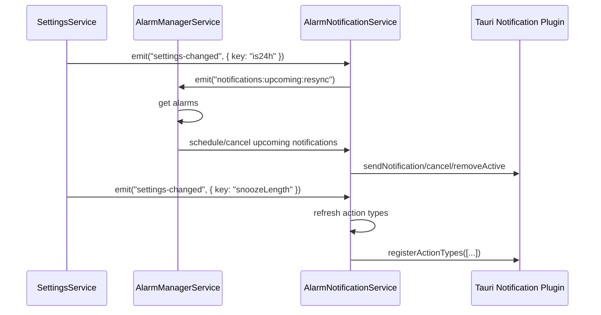
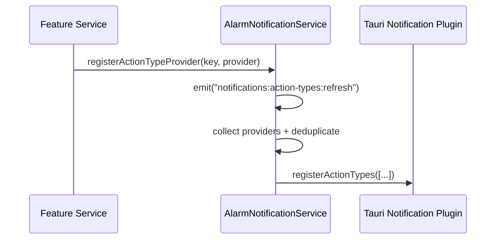

# Notification Architecture

**Status:** Implemented on `main` (event-driven integration)  
**Last Updated:** February 19, 2026

## Purpose

This document describes how Threshold notification behaviour is coordinated across services, which parts are event-driven, and how state-changing actions remain command-driven.

The goal is to keep alarm state authoritative and deterministic while allowing notification UX to react quickly to lifecycle and settings changes.

## Architectural Overview

The notification system is intentionally split into three layers:

1. Domain state and scheduling intent
    - `AlarmManagerService` responds to core alarm events (`alarms:batch:updated`, `alarm-ring`), keeps native scheduling in sync, and emits notification refresh intents.
    - It does not own notification rendering primitives directly.

2. Notification orchestration
    - `AlarmNotificationService` is the hub for notification action type registration, action dispatch, and upcoming notification schedule/cancel operations.
    - It provides a stable API to feature services and hides plugin-level details.

3. UI feedback and presentation adapters
    - `NotificationToastService` consumes toast intent events and performs platform-specific presentation.
    - This keeps transient UI feedback separate from alarm domain logic.

## Responsibility Boundaries

### `AlarmManagerService`

- **Owns**
    - Listening to core alarm lifecycle events.
    - Native alarm scheduling and cancellation.
    - Emitting `notifications:upcoming:resync` intents.
    - Mapping alarm business operations to commands (`dismiss`, `snooze`, `reportFired`).
    - Consuming `notifications:upcoming:resync` and executing upcoming notification refresh using current alarm state.
- **Does not own**
    - Notification action type composition internals.
    - Direct toast UI invocation.

### `AlarmNotificationService`

- **Owns**
    - Action type provider registry and deduplication.
    - Action callback routing by `actionTypeId` and `actionId`.
    - Upcoming notification ID translation and schedule/cancel logic.
    - Notification-domain event API (`notifications:*`).
    - Consuming `settings-changed` for notification-facing concerns (`snoozeLength`, `is24h`) and emitting refresh intents.
- **Does not own**
    - Alarm state mutation authority.
    - Navigation or app window routing.

### `NotificationToastService`

- **Owns**
    - Listening to `notifications:toast`.
    - Platform filtering and toast rendering.
- **Does not own**
    - Alarm state, scheduling, or action routing decisions.

### `SettingsService`

- **Owns**
    - Emitting settings-change events.
    - Registering settings-owned test notification action types.
    - Sending test notifications.

## Event-Driven Flows

### Event Contract Summary

| Event | Producer | Primary Consumer | Intent |
|---|---|---|---|
| `alarms:batch:updated` | Alarm domain | `AlarmManagerService` | Alarm state changed; refresh scheduling |
| `alarm-ring` | Native/plugin layer | `AlarmManagerService` | Alarm has fired; transition to ringing flow |
| `settings-changed` (`snoozeLength`) | `SettingsService` | `AlarmNotificationService` | Rebuild action labels |
| `settings-changed` (`is24h`) | `SettingsService` | `AlarmNotificationService` | Emit resync intent for upcoming-notification text refresh |
| `notifications:action-types:refresh` | `AlarmNotificationService` | `AlarmNotificationService` | Recompute and register action types |
| `notifications:upcoming:resync` | `AlarmManagerService`, `AlarmNotificationService` | `AlarmManagerService` | Refresh upcoming notifications (all or targeted) |
| `notifications:toast` | Notification/domain services | `NotificationToastService` | Present transient confirmation UI |

### Alarm Batch Update Path

1. Core alarm changes emit `alarms:batch:updated`.
2. `AlarmManagerService` loads current alarms and syncs native scheduling.
3. `AlarmManagerService` emits `notifications:upcoming:resync` with reason `alarm-batch-updated`.
4. `AlarmManagerService` receives that event and refreshes upcoming notifications on mobile.

This two-step fan-out keeps notification refresh explicit and reusable without coupling every caller to refresh internals.

### Ringing Path

1. `alarm-ring` is emitted by native/plugin flow.
2. `AlarmManagerService` cancels stale upcoming notification for the firing alarm.
3. Ringing notification and routing logic execute for platform-specific UX.
4. Alarm fire is reported through command flow (`reportFired`) for domain consistency.

### Settings-Driven Paths

- `snoozeLength` change:
    - `AlarmNotificationService` refreshes action types so labels like `Snooze (15m)` stay accurate.
- `is24h` change:
    - `AlarmNotificationService` emits `notifications:upcoming:resync`.
    - `AlarmManagerService` consumes the resync event and regenerates upcoming notification body text in the new time format.

### Toast Intent Path

1. Domain service emits `notifications:toast` with semantic `kind` and resolved `message`.
2. `NotificationToastService` filters by platform if requested.
3. Toast adapter renders on supported platforms.

This prevents domain services from depending directly on UI presentation APIs.

## Mobile Notification Sequence



## Action Registration Sequence



## Commands vs Events

Threshold follows a strict split:

- Commands mutate durable alarm state.
- Events coordinate fan-out, refresh, and UI feedback.

Examples:

- Command-driven:
    - `AlarmService.dismiss`
    - `AlarmService.snooze`
    - `AlarmService.reportFired`
- Event-driven:
    - action type refresh
    - upcoming notification refresh
    - toast intent presentation

This avoids ambiguous dual-write logic and keeps source-of-truth behaviour predictable.

## Data Contracts

`notifications:upcoming:resync` payload:

```ts
type NotificationUpcomingResyncEvent = {
  reason: 'alarm-batch-updated' | 'settings-24h-changed' | 'manual';
  alarmIds?: number[];
};
```

`notifications:toast` payload:

```ts
type NotificationToastEvent = {
  kind: 'upcoming-snoozed' | 'alarm-dismissed' | 'generic';
  message: string;
  platform?: 'android' | 'ios' | 'desktop';
};
```

## Extension Guidance

When adding a new notification feature:

1. Decide ownership first
    - Add action registration where the feature context lives (settings, alarms, future modules), not in a central monolith.

2. Preserve the split
    - Use commands for state mutation and events for fan-out.

3. Prefer semantic event names
    - Event names should describe intent (`notifications:toast`), not implementation details.

4. Document new contracts
    - Update this document with producer, consumer, payload, and lifecycle impact.

## Desktop Behaviour

Desktop notification support is intentionally lighter:

- Desktop can still send notification payloads through plugin APIs where supported.
- Mobile action type registration and action callbacks are not initialised on desktop.
- Upcoming notification schedule/cancel operations are mobile-gated in `AlarmNotificationService`.
- Toast events still flow through `NotificationToastService`, with optional payload-level platform filtering.
