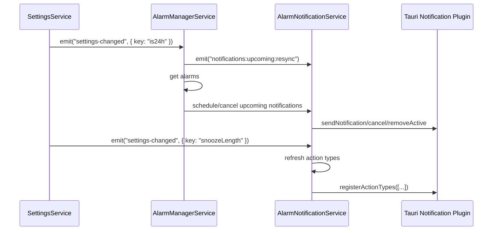

# Notification Architecture

**Status:** Implemented on `main` (event-driven integration)  
**Last Updated:** February 19, 2026

## Purpose

This document defines the current notification architecture for Threshold, including ownership boundaries, event flows, and platform behaviour.

## Design Summary

- `AlarmNotificationService` is the notification hub for mobile action types and upcoming alarm notifications.
- Feature areas register their own notification action types through providers.
- Alarm lifecycle remains event-driven from `AlarmManagerService`.
- Settings owns test notifications and settings-specific action registration.
- Desktop does not use mobile notification action types.

## Components

- `apps/threshold/src/services/AlarmNotificationService.ts`
  - Registers and refreshes mobile notification action types.
  - Routes action callbacks by `actionTypeId`.
  - Schedules/cancels upcoming notifications on mobile.
- `apps/threshold/src/services/AlarmManagerService.ts`
  - Listens to alarm lifecycle events.
  - Syncs native alarms and upcoming notifications.
  - Registers alarm-related action providers.
- `apps/threshold/src/services/SettingsService.ts`
  - Emits settings events.
  - Sends test notification.
  - Registers settings-owned test action provider.

## Event-Driven Flows

### 1. Alarm state changes

- Event: `alarms:batch:updated`
- Listener: `AlarmManagerService`
- Effect: load alarms, call `syncNativeAlarms`, then emit `notifications:upcoming:resync`.

### 2. Alarm starts ringing

- Event: `alarm-ring`
- Listener: `AlarmManagerService`
- Effect: cancel any upcoming notification for that alarm, then navigate/show ringing UI flow.

### 3. Snooze length changes

- Event: `settings-changed` with `key: "snoozeLength"`
- Listener: `AlarmNotificationService`
- Effect: refresh registered action types so snooze button labels update dynamically.

### 4. Time format changes

- Event: `settings-changed` with `key: "is24h"`
- Listener: `AlarmManagerService` (mobile only)
- Effect: emit `notifications:upcoming:resync` so upcoming notification text re-renders with updated time format.

### 5. Action provider changes

- Event: `notifications:action-types:refresh`
- Emitter: `AlarmNotificationService.registerActionTypeProvider/removeActionTypeProvider`
- Listener: `AlarmNotificationService`
- Effect: recompute and register deduplicated action types.

### 6. Upcoming notification refresh

- Event: `notifications:upcoming:resync`
- Listener: `AlarmManagerService` (mobile only)
- Effect: refresh upcoming notifications for all alarms or targeted `alarmIds`.

### 7. Toast presentation

- Event: `notifications:toast`
- Listener: `NotificationToastService`
- Effect: show toast on supported platform for notification-related UX confirmation.

## Mobile Notification Sequence

## Action Registration Sequence

## Desktop Behaviour

- Desktop notifications may still be sent via plugin APIs where supported.
- Mobile-specific action type registration and action callbacks are not initialised on desktop.
- Upcoming-notification scheduling in `AlarmNotificationService` is guarded by `PlatformUtils.isMobile()`.
- Toast presentation via `NotificationToastService` is event-driven and can be platform-filtered by payload.
