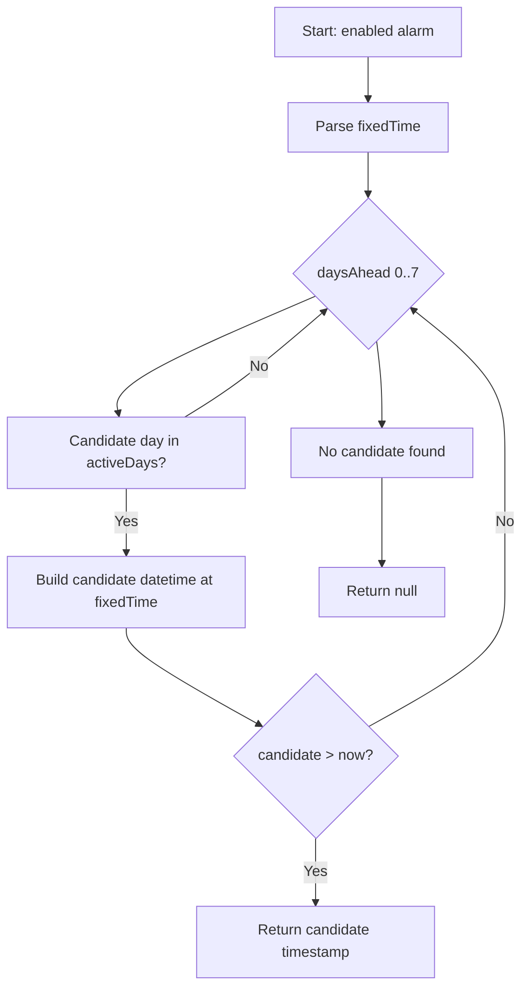
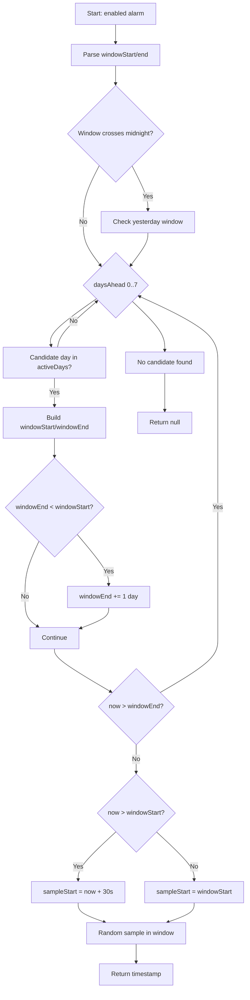

> **⚠️ DEPRECATED - January 2026**  
> This document describes the old TypeScript scheduler that has been replaced.  
> Scheduler logic is now in Rust. See [event-architecture.md](../architecture/event-architecture.md) for current architecture.

---

# Alarm Ringing Logic (Main Branch)

This document describes how alarm ringing and rescheduling work **today** on the `main` branch, where the logic lives, and the specific algorithms for **Fixed** and **Window** modes. It includes flow diagrams and notes about edge cases and behavioural risks.

## Scope

- **Ringing flow**: how a scheduled trigger becomes an in-app ringing state.
- **Scheduling logic**: how the next trigger is computed for Fixed and Window alarms.
- **Rescheduling**: what happens immediately after a ring fires.
- **Platforms**: Desktop (Tauri) and Android (AlarmManager).

## Primary Locations

- **Scheduler (authoritative next-trigger logic):** `packages/core/src/scheduler.ts`
- **Alarm orchestration + persistence:** `apps/threshold/src/services/AlarmManagerService.ts`
- **SQLite storage:** `apps/threshold/src/services/DatabaseService.ts`
- **Desktop scheduling + ring emission:** `plugins/alarm-manager/src/desktop.rs`
- **Android scheduling + ring pipeline:**
  - `plugins/alarm-manager/android/src/main/java/com/plugin/alarmmanager/AlarmManagerPlugin.kt`
  - `plugins/alarm-manager/android/src/main/java/com/plugin/alarmmanager/AlarmUtils.kt`
  - `plugins/alarm-manager/android/src/main/java/com/plugin/alarmmanager/AlarmReceiver.kt`
  - `plugins/alarm-manager/android/src/main/java/com/plugin/alarmmanager/AlarmRingingService.kt`
  - `plugins/alarm-manager/android/src/main/java/com/plugin/alarmmanager/BootReceiver.kt`

## High-Level Ringing Flow (Main Branch)

1. **Alarm saved in the frontend** via `AlarmManagerService.saveAndSchedule`.
2. **Next trigger calculated** with `calculateNextTrigger` from `@threshold/core`.
3. **Alarm persisted** in SQLite via `DatabaseService` (including `nextTrigger`).
4. **Native schedule** created by invoking the alarm-manager plugin `schedule` command.
5. When an alarm fires, the platform emits a ring signal:
   - Desktop: the plugin emits `alarm-ring`.
   - Android: BroadcastReceiver starts the ringing service and deep-links `threshold://ringing/<id>`.
6. The frontend **opens the ringing UI** and **auto-reschedules** by calling `saveAndSchedule` again.
7. **Cross-window sync** uses `global-alarms-changed` events (frontend only).

## Fixed Mode Algorithm (TypeScript, authoritative)

Source: `packages/core/src/scheduler.ts` (`calculateNextTrigger` → `getFixedTrigger`).

**Inputs**
- `fixedTime` (`HH:MM`)
- `activeDays` (`0..6`, Sunday = 0)
- current local time

**Steps**
1. Parse `fixedTime`.
2. For `daysAhead` from **0 to 7**:
   - Build `candidate = now + daysAhead`.
   - If `candidate.weekday` is in `activeDays`, construct a datetime at `fixedTime`.
   - If the candidate time is **strictly in the future**, return its timestamp.
3. If no valid candidate found, return `null`.

### Fixed Mode Mermaid

## Window Mode Algorithm (TypeScript, authoritative)

Source: `packages/core/src/scheduler.ts` (`calculateNextTrigger` → `getRandomWindowTrigger`).

**Inputs**
- `windowStart` (`HH:MM`)
- `windowEnd` (`HH:MM`)
- `activeDays` (`0..6`, Sunday = 0)
- current local time

**Steps**
1. Parse `windowStart` and `windowEnd`.
2. If the window crosses midnight, check **yesterday's window** first:
   - If `now` is still inside yesterday’s window and yesterday is active, schedule within that window.
3. For `daysAhead` from **0 to 7**:
   - Build `candidate = now + daysAhead`.
   - If `candidate.weekday` is active, build `windowStart` and `windowEnd` datetimes.
   - If the window crosses midnight, move `windowEnd` to the next day.
   - If the window is fully in the past, skip it.
   - If we are **inside** the window, sample from `max(now + 30s, windowStart)`.
   - Otherwise, sample from `windowStart`.
   - Return a random timestamp within `[sampleStart, windowEnd]`.
4. If no valid candidate found, return `null`.

### Window Mode Mermaid

## Ringing + Reschedule Behaviour

### Desktop

- **Scheduling**: `AlarmManagerService` invokes the plugin `schedule` command after calculating `nextTrigger`.
- **Trigger**: `plugins/alarm-manager/src/desktop.rs` uses a tokio task; if `triggerAt` is in the past, it fires immediately.
- **Ringing UI**: `AlarmManagerService.handleAlarmRing` opens or focuses the ringing window.
- **Reschedule**: `handleAlarmRing` calls `saveAndSchedule`, which recalculates the next trigger via the TypeScript scheduler.

### Android

- **Scheduling**: `AlarmManagerService` calls the Android plugin `schedule` command; `AlarmUtils` uses `AlarmManager.setAlarmClock`.
- **Trigger**: `AlarmReceiver` starts `AlarmRingingService` (foreground service) and deep-links `threshold://ringing/<id>`.
- **Boot recovery**: `BootReceiver` re-schedules future alarms from shared prefs on device restart.
- **Reschedule**: same as desktop; the frontend recalculates with the TypeScript scheduler.

## Notable Algorithm Details and Risks

- **Window mode can re-ring shortly after firing**:
  - When a window alarm fires, `handleAlarmRing` immediately calls `saveAndSchedule`.
  - If the time is still inside the same window, `getRandomWindowTrigger` samples from `now + 30s` up to `windowEnd`.
  - This can legitimately schedule another ring within the same window, minutes after the last ring.

- **Overnight windows are supported in this branch**:
  - The scheduler explicitly handles windows that cross midnight and includes a “yesterday window” check.

- **Immediate fire when `triggerAt` is in the past**:
  - The desktop plugin fires immediately if a past timestamp is scheduled.
  - `rescheduleAll` attempts to avoid this by recalculating missed triggers, but any stale timestamp passed to `schedule` will ring right away.

## Related Tests

- `packages/core/src/scheduler.test.ts`

## Suggested Follow-Ups (Optional)

These are informational, not changes:

- Decide whether **window alarms should avoid same-window rescheduling** after a ring.
- Add an explicit **minimum gap** between rings (beyond the 30-second lead) if needed.
- Consider logging when a ring schedules within the current window to aid debugging.
