> **⚠️ DEPRECATED - February 2026**  
> Visual diagrams have been merged into [event-architecture.md](../architecture/event-architecture.md).  
> See the "Visual Reference" section in that document.

---

# Level 3 Event Architecture - Visual Overview

**Version:** 3.0  
**Last Updated:** January 28, 2026  
**Purpose:** High-level visual guide to Threshold's granular event system

---

## 📊 Event Taxonomy

```mermaid
graph TB
    Events[Threshold Events]
    
    Events --> CRUD[CRUD Events<br/>Database State Changes]
    Events --> Sched[Scheduling Events<br/>Platform Actions]
    Events --> Life[Lifecycle Events<br/>State Transitions]
    Events --> Batch[Batch Events<br/>Optimisation Signals]
    
    CRUD --> Created["alarm:created<br/>New alarm saved"]
    CRUD --> Updated["alarm:updated<br/>Alarm modified"]
    CRUD --> Deleted["alarm:deleted<br/>Alarm removed"]
    
    Sched --> Scheduled["alarm:scheduled<br/>Schedule native alarm"]
    Sched --> Cancelled["alarm:cancelled<br/>Cancel native alarm"]
    
    Life --> Fired["alarm:fired<br/>Alarm ringing"]
    Life --> Dismissed["alarm:dismissed<br/>User dismissed"]
    Life --> Snoozed["alarm:snoozed<br/>User snoozed (future)"]
    
    Batch --> BatchUpdate["alarms:batch:updated<br/>Changes buffered"]
    Batch --> SyncNeeded["alarms:sync:needed<br/>Explicit sync request"]
    
    style Events fill:#1e293b,stroke:#64748b,color:#f1f5f9
    style CRUD fill:#10b981,stroke:#059669,color:#ffffff
    style Sched fill:#3b82f6,stroke:#2563eb,color:#ffffff
    style Life fill:#f59e0b,stroke:#d97706,color:#ffffff
    style Batch fill:#8b5cf6,stroke:#7c3aed,color:#ffffff
    
    style Created fill:#34d399,stroke:#10b981,color:#064e3b
    style Updated fill:#34d399,stroke:#10b981,color:#064e3b
    style Deleted fill:#34d399,stroke:#10b981,color:#064e3b
    
    style Scheduled fill:#60a5fa,stroke:#3b82f6,color:#1e3a8a
    style Cancelled fill:#60a5fa,stroke:#3b82f6,color:#1e3a8a
    
    style Fired fill:#fbbf24,stroke:#f59e0b,color:#78350f
    style Dismissed fill:#fbbf24,stroke:#f59e0b,color:#78350f
    style Snoozed fill:#fbbf24,stroke:#f59e0b,color:#78350f
    
    style BatchUpdate fill:#a78bfa,stroke:#8b5cf6,color:#4c1d95
    style SyncNeeded fill:#a78bfa,stroke:#8b5cf6,color:#4c1d95
```

---

## 🎯 Event Flow: Create Alarm

```mermaid
sequenceDiagram
    participant User
    participant UI as TypeScript UI
    participant Core as Rust Core
    participant AlarmMgr as alarm-manager
    participant WearSync as wear-sync
    participant Watch as Watch App
    
    User->>UI: Tap "Save"
    UI->>UI: Optimistic update<br/>(instant UI)
    UI->>Core: invoke('save_alarm')
    
    rect rgb(30, 41, 59)
    note right of Core: Database Operations
    Core->>Core: Calculate next_trigger<br/>(random in window)
    Core->>Core: Save to SQLite
    end
    
    rect rgb(16, 185, 129)
    note right of Core: CRUD Event
    Core-->>UI: alarm:created { alarm }
    Core-->>WearSync: alarm:created { alarm }
    end
    
    rect rgb(59, 130, 246)
    note right of Core: Scheduling Event
    Core-->>AlarmMgr: alarm:scheduled { id, triggerAt }
    end
    
    rect rgb(139, 92, 246)
    note right of Core: Batch Event
    Core-->>WearSync: alarms:batch:updated { ids }
    end
    
    UI->>UI: Update with canonical state
    AlarmMgr->>AlarmMgr: Schedule native alarm<br/>Save to SharedPreferences
    WearSync->>WearSync: Add to buffer<br/>Start 500ms timer
    
    Note over WearSync: Debounce timer fires...
    WearSync->>Core: Fetch all alarms
    Core-->>WearSync: Vec<AlarmRecord>
    WearSync->>Watch: Publish to Data Layer
    
    Watch->>Watch: Update UI
```

---

## 🔄 Event Flow: Toggle Alarm Off

```mermaid
sequenceDiagram
    participant User
    participant UI as TypeScript UI
    participant Core as Rust Core
    participant AlarmMgr as alarm-manager
    participant WearSync as wear-sync
    
    User->>UI: Toggle switch off
    UI->>UI: Optimistic update<br/>(grey out instantly)
    UI->>Core: invoke('toggle_alarm', enabled: false)
    
    rect rgb(30, 41, 59)
    note right of Core: Database Operations
    Core->>Core: Load alarm
    Core->>Core: Set enabled=false<br/>Set next_trigger=null
    Core->>Core: Save to SQLite
    end
    
    rect rgb(16, 185, 129)
    note right of Core: CRUD Event
    Core-->>UI: alarm:updated { alarm, previous }
    Core-->>WearSync: alarm:updated { alarm }
    end
    
    rect rgb(59, 130, 246)
    note right of Core: Scheduling Event
    Core-->>AlarmMgr: alarm:cancelled { id, reason: "DISABLED" }
    end
    
    rect rgb(139, 92, 246)
    note right of Core: Batch Event
    Core-->>WearSync: alarms:batch:updated { ids }
    end
    
    UI->>UI: Apply canonical state
    AlarmMgr->>AlarmMgr: Cancel native alarm<br/>Remove from SharedPreferences
    WearSync->>WearSync: Buffer change<br/>(debounce)
```

---

## 🔔 Event Flow: Alarm Fires & Dismissed

```mermaid
sequenceDiagram
    participant Android as Android OS
    participant AlarmMgr as alarm-manager
    participant Core as Rust Core
    participant UI as TypeScript UI
    participant WearSync as wear-sync
    
    Android->>AlarmMgr: AlarmManager triggers<br/>(07:12 AM)
    
    rect rgb(245, 158, 11)
    note right of AlarmMgr: Lifecycle Event
    AlarmMgr-->>UI: alarm:fired { id, triggerAt, actualFiredAt }
    end
    
    AlarmMgr->>AlarmMgr: Start foreground service<br/>(play sound, vibrate)
    AlarmMgr->>UI: Launch app: threshold://alarm/1/ring
    UI->>UI: Navigate to /ringing/1
    
    Note over UI: User sees ringing screen...
    
    UI->>Core: invoke('dismiss_alarm', { id: 1 })
    
    rect rgb(30, 41, 59)
    note right of Core: Database Operations
    Core->>Core: Recalculate next_trigger<br/>(tomorrow's random time)
    Core->>Core: Save to SQLite
    end
    
    rect rgb(245, 158, 11)
    note right of Core: Lifecycle Event
    Core-->>UI: alarm:dismissed { id, nextTrigger }
    end
    
    rect rgb(16, 185, 129)
    note right of Core: CRUD Event
    Core-->>UI: alarm:updated { alarm }
    Core-->>WearSync: alarm:updated { alarm }
    end
    
    rect rgb(59, 130, 246)
    note right of Core: Scheduling Events
    Core-->>AlarmMgr: alarm:cancelled { id, reason: "UPDATED" }
    Core-->>AlarmMgr: alarm:scheduled { id, triggerAt: tomorrow }
    end
    
    rect rgb(139, 92, 246)
    note right of Core: Batch Event
    Core-->>WearSync: alarms:batch:updated { ids }
    end
    
    AlarmMgr->>AlarmMgr: Stop ringing service
    AlarmMgr->>AlarmMgr: Schedule for tomorrow
    UI->>UI: Navigate to home<br/>Show updated next_trigger
    WearSync->>WearSync: Buffer & sync to watch
```

---

## 🏗️ System Architecture

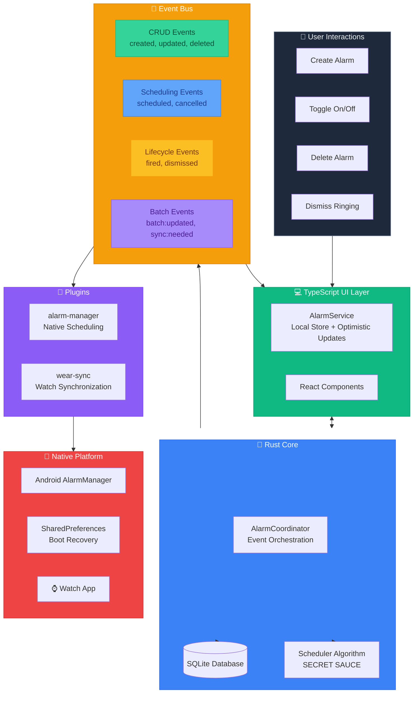

---

## 🎭 Subscriber Patterns

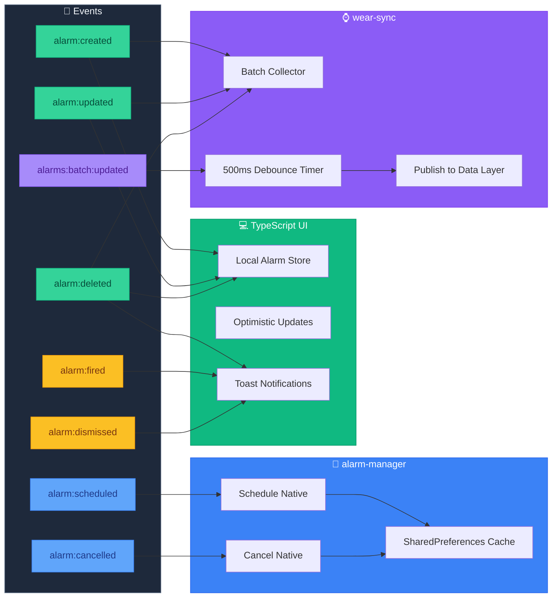

---

## 🧠 Smart Scheduling Logic

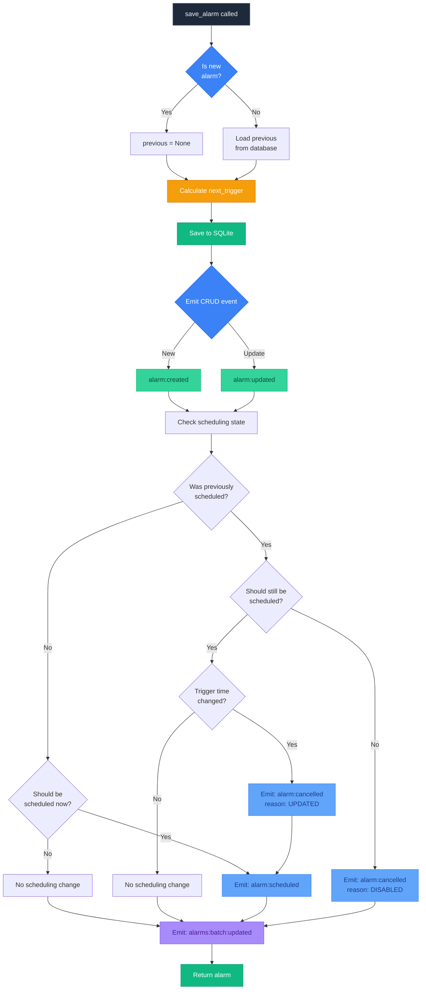

---

## ⚡ Performance Optimisations

```mermaid
graph TB
    subgraph Before["❌ Before (Level 0)"]
        B1[User edits 5 alarms rapidly]
        B1 --> B2[5x emit alarms:changed<br/>Full Vec<AlarmRecord>]
        B2 --> B3[5x wear-sync receives full list]
        B3 --> B4[5x Data Layer publish]
        B4 --> B5[Watch receives 5 updates]
        
        B6[alarm-manager receives<br/>full list 5 times]
        B2 --> B6
        B6 --> B7[Must diff each time<br/>to find changes]
        B7 --> B8[Schedule/cancel based on diff]
    end
    
    subgraph After["✅ After (Level 3)"]
        A1[User edits 5 alarms rapidly]
        A1 --> A2[5x emit granular events<br/>Minimal payloads]
        A2 --> A3[wear-sync buffers 5 changes]
        A3 --> A4[500ms debounce timer]
        A4 --> A5[1x Data Layer publish]
        A5 --> A6[Watch receives 1 update]
        
        A7[alarm-manager receives<br/>5x scheduling events]
        A2 --> A7
        A7 --> A8[Direct schedule/cancel<br/>No diffing needed]
        
        A9[TypeScript UI]
        A2 --> A9
        A9 --> A10[Optimistic updates<br/>Instant feedback]
    end
    
    style Before fill:#ef4444,stroke:#dc2626,color:#ffffff
    style After fill:#10b981,stroke:#059669,color:#ffffff
    
    style B2 fill:#fca5a5,stroke:#ef4444,color:#7f1d1d
    style B3 fill:#fca5a5,stroke:#ef4444,color:#7f1d1d
    style B4 fill:#fca5a5,stroke:#ef4444,color:#7f1d1d
    style B7 fill:#fca5a5,stroke:#ef4444,color:#7f1d1d
    
    style A3 fill:#86efac,stroke:#10b981,color:#14532d
    style A4 fill:#86efac,stroke:#10b981,color:#14532d
    style A5 fill:#86efac,stroke:#10b981,color:#14532d
    style A8 fill:#86efac,stroke:#10b981,color:#14532d
    style A10 fill:#86efac,stroke:#10b981,color:#14532d
```

---

## 📊 Event Payload Sizes

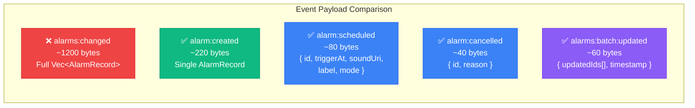

---

## 🎯 Key Benefits

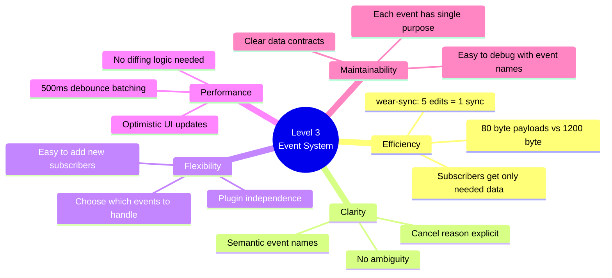

---

## 🚀 Implementation Timeline

```mermaid
gantt
    title Level 3 Event System Implementation
    dateFormat HH:mm
    axisFormat %H:%M
    
    section Phase 1
    Integrate events module    :p1, 00:00, 10m
    
    section Phase 2
    Add emitter methods       :p2, after p1, 30m
    
    section Phase 3
    Update CRUD methods       :p3, after p2, 20m
    
    section Phase 4
    Test emission            :p4, after p3, 30m
    
    section Phase 5
    Update alarm-manager     :p5a, after p4, 20m
    Update wear-sync         :p5b, after p5a, 20m
    Update TypeScript UI     :p5c, after p5b, 20m
    
    section Phase 6
    End-to-end testing       :p6, after p5c, 30m
```

---

## 🎨 Event Colour Legend

**Event Categories:**

- 🟢 **Green** - CRUD Events (Database state changes)
- 🔵 **Blue** - Scheduling Events (Platform actions)
- 🟡 **Yellow** - Lifecycle Events (State transitions)
- 🟣 **Purple** - Batch Events (Optimisation signals)

**System Components:**

- ⚫ **Dark Grey** - User interactions
- 🟢 **Green** - TypeScript UI
- 🔵 **Blue** - Rust Core
- 🟡 **Yellow** - Event Bus
- 🟣 **Purple** - Plugins
- 🔴 **Red** - Native Platform

---

## 📚 Quick Reference

### Event Names
```
CRUD:       alarm:created, alarm:updated, alarm:deleted
Scheduling: alarm:scheduled, alarm:cancelled
Lifecycle:  alarm:fired, alarm:dismissed, alarm:snoozed
Batch:      alarms:batch:updated, alarms:sync:needed
```

### Subscribers
```
TypeScript UI:    CRUD events → Local store, optimistic updates
alarm-manager:    Scheduling events → Native platform actions
wear-sync:        CRUD + Batch events → Debounced watch sync
```

### Performance Targets
```
Event emission:   < 5ms per operation
UI responsiveness: < 100ms perceived latency
wear-sync batching: < 2 syncs per 5 seconds
Watch sync latency: < 2 seconds total
```

---

## ✅ Success Criteria

1. **All unit tests pass** ✅
2. **DevTools shows correct events** ✅
3. **UI updates feel instant** ✅
4. **wear-sync batches rapid changes** ✅
5. **alarm-manager has no diffing logic** ✅
6. **Boot recovery still works** ✅
7. **Watch sync < 2 seconds** ✅

---

**Ready to implement! See `LEVEL3_EVENT_IMPLEMENTATION_GUIDE.md` for step-by-step instructions.** 🚀
