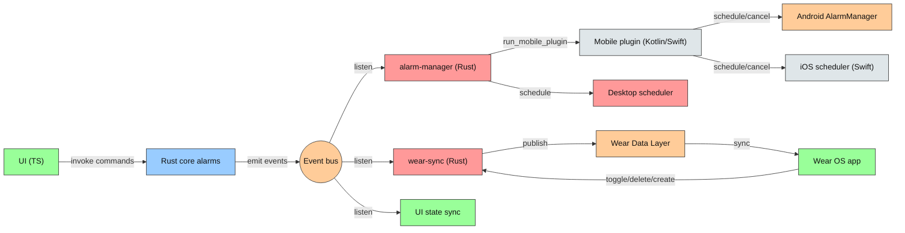
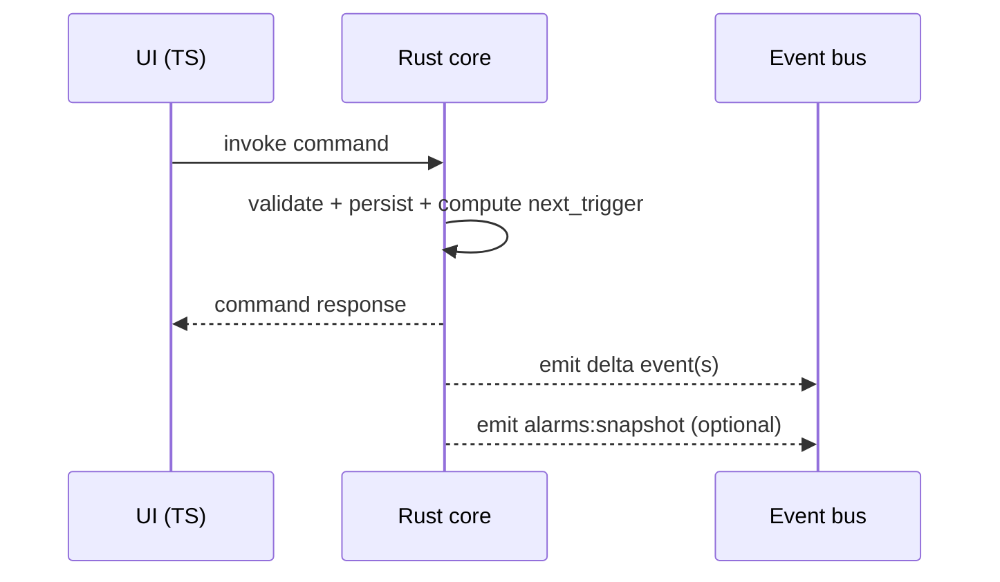
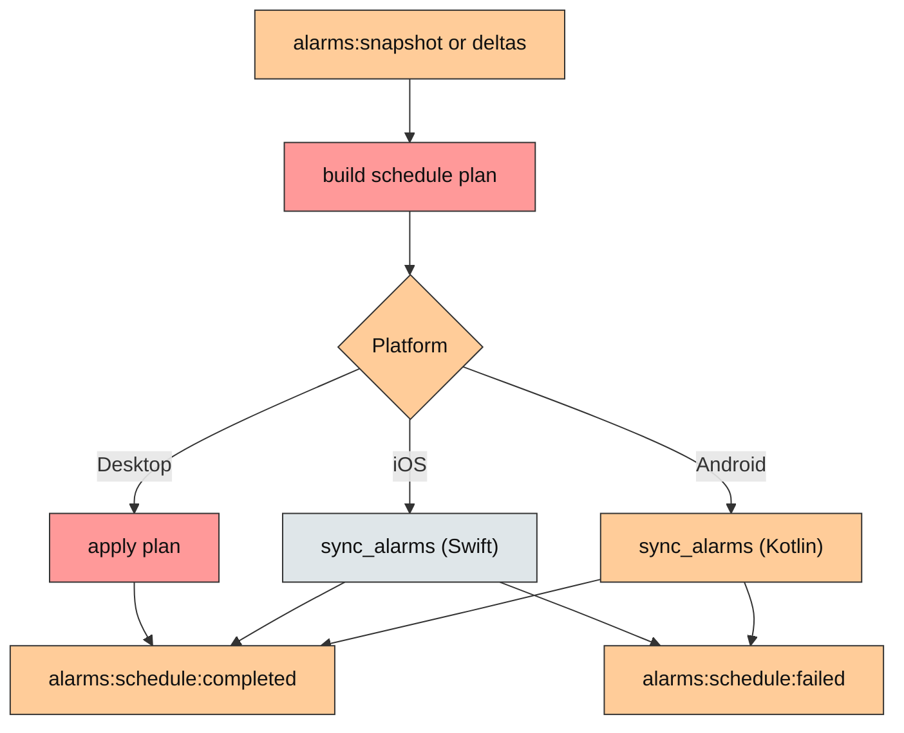
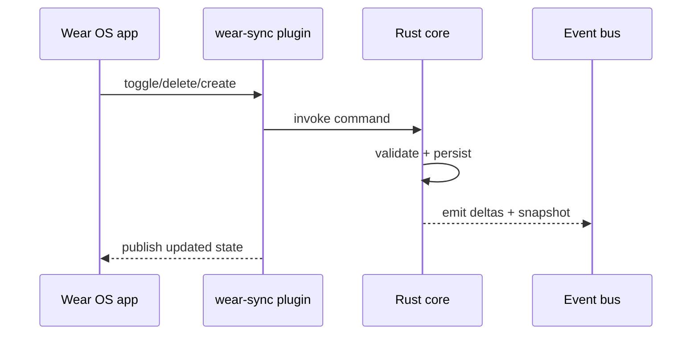
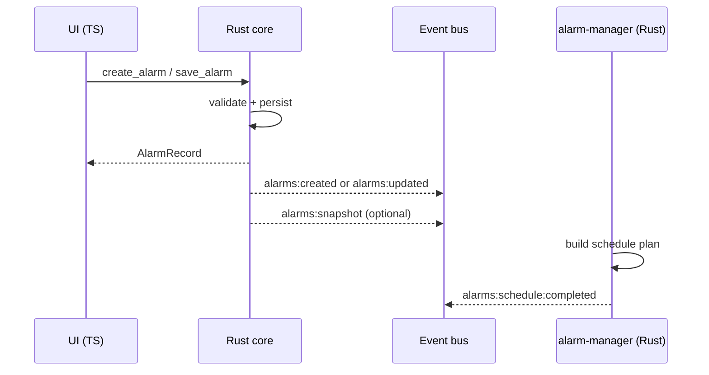
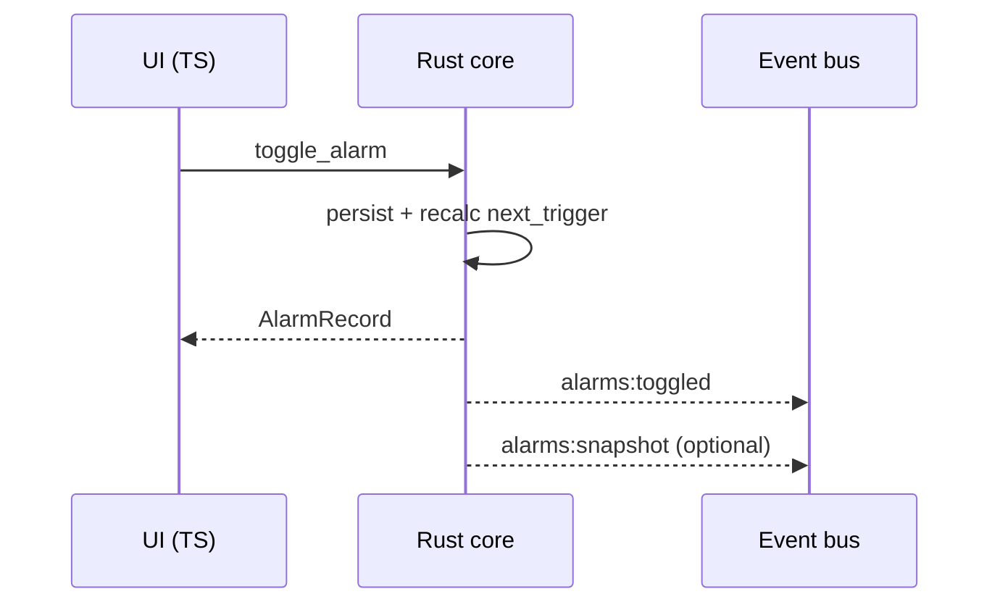
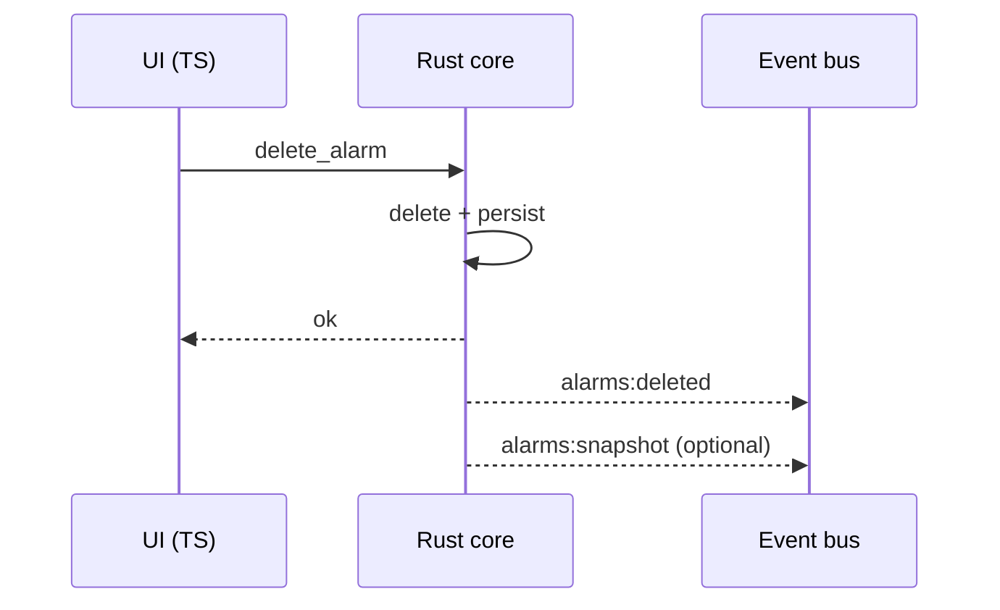
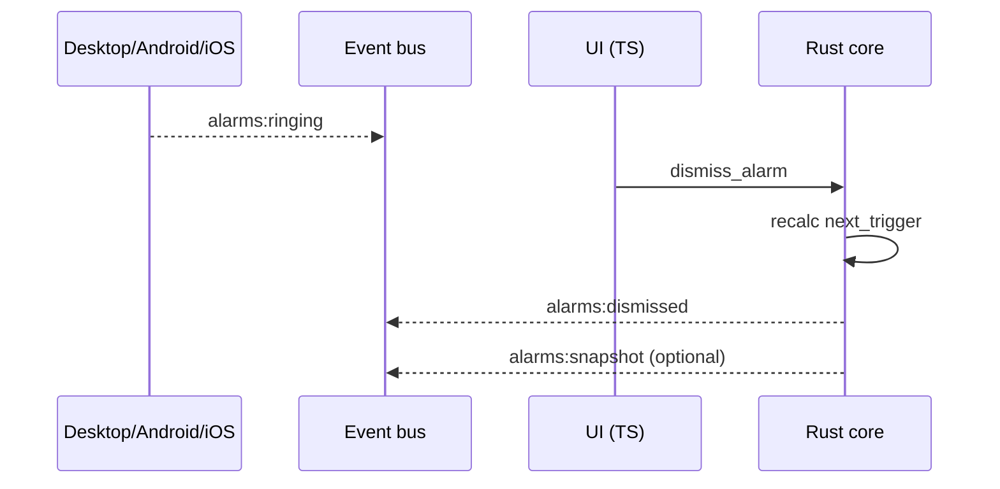

> **⚠️ DEPRECATED - January 2026**  
> This document describes an older design that has been superseded.  
> See [event-architecture.md](../architecture/event-architecture.md) for current architecture.

---

# Event-driven alarm system (ideal design)

Date: 2026-01-28

## Intent
Define a clean, event-driven alarm architecture that:
- Keeps Rust as the single co-ordinator and source of truth.
- Uses Tauri commands for all writes and Tauri events for all reads.
- Uses the standard JS <> Rust <> Kotlin/Swift command bridge (no manual JNI).
- Supports desktop scheduling, Android scheduling, and iOS scheduling.
- Makes Wear OS integration first-class via a dedicated plugin.

## Principles
1. **Commands for writes, events for reads**: UI and plugins call commands; Rust mutates; Rust emits events.
2. **Single source of truth**: Rust core owns persistence and next-trigger calculation.
3. **Event-driven co-ordination**: Plugins react to events; they do not orchestrate state.
4. **Granular events + snapshot**: Deltas for normal flow, snapshot for resync.
5. **Platform parity**: Desktop, Android, iOS, and Wear OS follow the same lifecycle.

## Colour legend
- 🟦 Blue (`#99ccff`): Rust core components
- 🟩 Green (`#99ff99`): TypeScript/UI layer
- 🟥 Red (`#ff9999`): Rust layer (plugins, schedulers)
- 🟨 Yellow (`#ffffcc`): Data storage
- 🟧 Orange (`#ffcc99`): Event system/intermediary
- 🟪 Purple (`#ffcc99`): Platform-specific (Android)
- ⬜ Grey (`#dfe6e9`): Shared/common

## High-level architecture

### Mermaid: system overview


## Write flow (authoritative)
UI should never emit mutation events directly. The canonical flow is:

- UI calls command -> Rust mutates -> Rust emits events

This preserves Tauri's command-based write path while keeping events reliable and predictable.

### Mermaid: write flow (generic)


## Event taxonomy

### Snapshot event
- `alarms:snapshot` (authoritative full list of `AlarmRecord`)
  - Backwards compatibility: keep `alarms:changed` as an alias for now.

### Delta events (granular)
- `alarms:created` (payload: `AlarmRecord`)
- `alarms:updated` (payload: `{ id, patch, next_trigger }`)
- `alarms:toggled` (payload: `{ id, enabled, next_trigger }`)
- `alarms:deleted` (payload: `{ id }`)
- `alarms:ringing` (payload: `{ id, source }`)
- `alarms:dismissed` (payload: `{ id, next_trigger }`)
- `alarms:snoozed` (payload: `{ id, snooze_until }`)

### Scheduling lifecycle events
- `alarms:schedule:requested` (payload: plan summary)
- `alarms:schedule:completed` (payload: success summary)
- `alarms:schedule:failed` (payload: error details, alarm ids)
- `alarms:boot:recovered` (Android-only, emitted after boot reschedule)

### Event envelope (recommended)
All events should include the same envelope to simplify listeners:
- `revision` (monotonic integer)
- `source` (`ui`, `native`, `wear`, `boot`)
- `emitted_at` (epoch millis)

## Scheduling co-ordination

### Schedule plan (diff-based)
The alarm-manager plugin computes a plan to avoid redundant work:
- `to_schedule`: alarms with `enabled == true` and `next_trigger` in the future.
- `to_cancel`: alarms removed, disabled, or expired.

Pseudo-structure:
```rust
struct SchedulePlan {
  to_schedule: Vec<ScheduleItem>,
  to_cancel: Vec<i32>,
}

struct ScheduleItem {
  id: i32,
  trigger_at: i64,
  sound_uri: Option<String>,
}
```

### Mermaid: scheduling pipeline


## Platform implementations

### Android (Kotlin)
- Implement `@Command fun sync_alarms(payload: SyncPlan): SyncResult`.
- Uses `AlarmUtils.scheduleAlarm` and `AlarmUtils.cancelAlarm` internally.
- Boot recovery stays in Kotlin and emits `alarms:boot:recovered` after resync.

### iOS (Swift)
- Mirror `sync_alarms` with the same payload contract.
- Implement scheduling via native iOS APIs.
- Keep all cross-language calls through Tauri commands.

### Desktop (Rust)
- Maintain a `HashMap<alarm_id, JoinHandle>`.
- Apply the schedule plan by spawning or cancelling tasks.
- Emit `alarms:schedule:completed` after applying the plan.

## Wear OS integration (wear-sync plugin)

### Responsibilities
- Listen for `alarms:snapshot` and delta events.
- Publish state changes to Wear Data Layer.
- Receive Wear actions (toggle, delete, create) and invoke Rust commands.

### Mermaid: Wear OS command flow


## Event flow examples

### Mermaid: create or edit


### Mermaid: toggle


### Mermaid: delete


### Mermaid: ringing + dismiss


## Resynchronisation strategy
- **Startup**: emit `alarms:snapshot` once after core initialises.
- **Listener join**: Wear OS or any plugin can request a snapshot via a command.
- **Mismatch detection**: if a listener detects a gap in `revision`, it requests a snapshot.

## Migration notes (from the base commit)
- Keep `alarms:changed` as a compatibility alias for `alarms:snapshot` while migrating.
- Remove any direct scheduling calls from UI; scheduling is event-driven.
- Add `sync_alarms` commands for Android and iOS, both using the same payload.

## Expected outcomes
- Clear, testable flows with predictable ownership.
- Smaller payloads for day-to-day operations.
- Wear OS integration that requires minimal custom glue.
- A clean path for future plugins (tablets, widgets, cloud sync) to subscribe safely.
