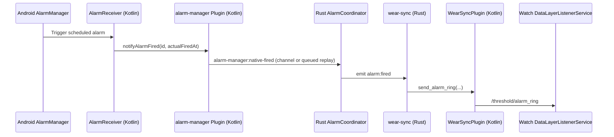

When an alarm fires, coordination should happen in the core runtime, not in the UI.

That sounds obvious, but our previous ringing path still depended on frontend timing in one key place: emitting the lifecycle event that powers watch fan-out (`alarm:fired`). If the UI path did not execute in time, the phone could ring while the watch stayed silent.

This post covers the architecture update that fixes this by moving ownership to native -> Rust bridge callbacks with queue-and-drain reliability.

It builds on the same reliability pattern used in our notification action work: [Fixing Notification Action Reliability on Android](./2026-02-24-notification-action-reliability.md).

## The Problem

Scheduled alarms on Android start from native components:

- `AlarmReceiver` gets the OS trigger
- `AlarmRingingService` starts foreground ringing
- A deep link opens the ringing UI route

Historically, the lifecycle report into Rust (`report_alarm_fired`) depended on UI/event timing. That made UI a coordinator instead of a consumer.

## Design Goal

Use a single canonical event source:

- Native alarm trigger -> Rust core
- Rust emits `alarm:fired`
- Consumers fan out from there (wear-sync, UI listeners, future analytics)

UI stays presentation-only.

## Implementation

### 1) Native alarm callback channel in `alarm-manager`

The Android plugin now supports channel registration for alarm-fired callbacks:

- Kotlin command: `set_alarm_event_handler`
- Rust mobile bridge registers a `Channel`
- Incoming payload is emitted as Tauri event: `alarm-manager:native-fired`

Payload shape:

```json
{ "id": 10, "actualFiredAt": 1772117704311 }
```

### 2) Cold-boot safety with queue-and-drain

Native alarm can fire before the runtime is fully ready. To avoid drops:

- Kotlin queues events into `SharedPreferences` when pipeline is not ready
- Rust/app marks readiness with `mark_alarm_pipeline_ready`
- Kotlin drains queued events after readiness signal

This is the same listener-ready reliability pattern we used for notification actions.

### 3) Core event ownership in app Rust

`apps/threshold/src-tauri/src/lib.rs` now listens for `alarm-manager:native-fired` and calls:

- `AlarmCoordinator.report_alarm_fired(id, actual_fired_at)`

That emits canonical `alarm:fired`, which `wear-sync` already consumes to send `/threshold/alarm_ring` to connected watches.

### 4) UI/deep-link decoupling

Any temporary lifecycle reporting from deep link or ringing UI was removed.

- Deep link still routes screen presentation
- UI still handles stop/snooze interactions
- Lifecycle source-of-truth is now core

## Sequence



## Why this is better

- Reliability: no UI timing dependency for lifecycle emission
- Architecture: hub-and-spoke ownership stays in core
- Extensibility: new consumers can subscribe to `alarm:fired` without UI coupling
- Consistency: same queue-and-drain reliability model across plugins

## Where this pattern now appears

- Notification actions plugin path: listener-ready + replay (documented in the 2026-02-24 post)
- Alarm lifecycle path: native-fired queue + core replay in `alarm-manager`
- Wear message path: queue/replay readiness in `wear-sync`

This has become a standard pattern in Threshold plugin architecture:

1. Native source emits immediately
2. Queue if runtime/listeners are not ready
3. Explicit ready signal
4. Drain queued events
5. Keep core event as canonical fan-out point

## Practical outcome

When the phone alarm fires:

- phone ringing remains native and immediate
- watch ring delivery is driven by the same core lifecycle event every time
- UI appearance policy can evolve independently without breaking event delivery

That separation is what we want long-term: coordination in core, presentation in UI.
