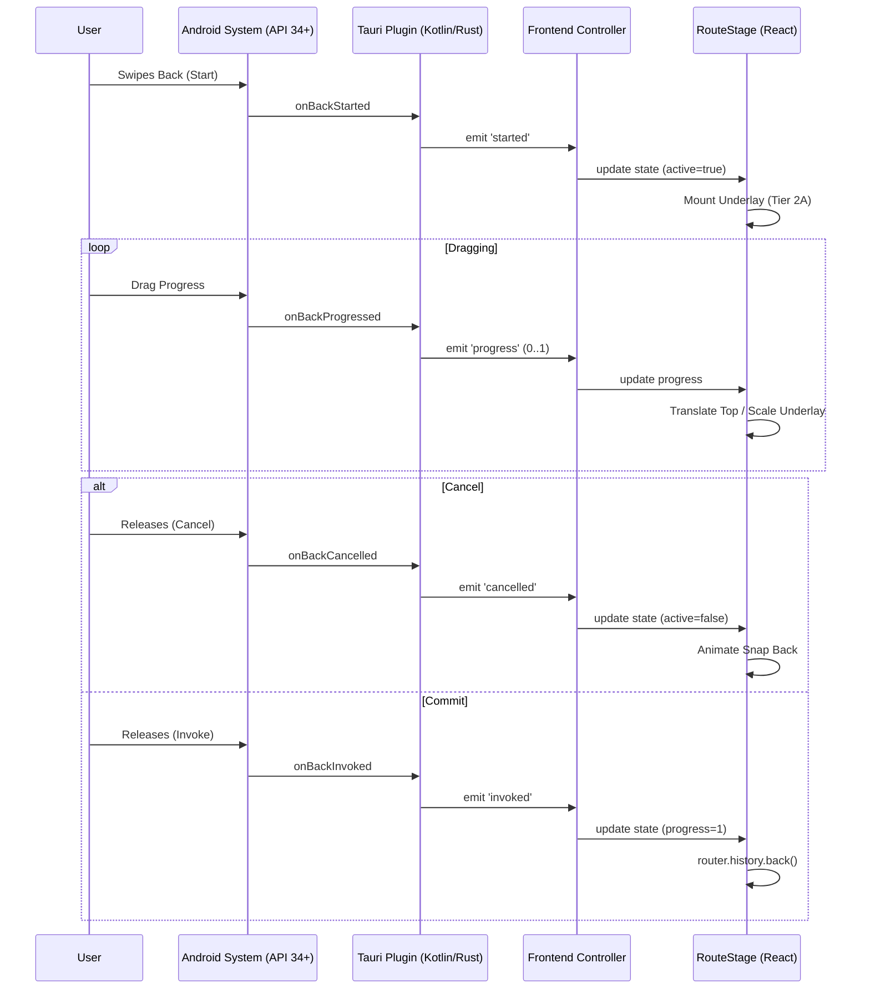

# Android Predictive Back Implementation

This document outlines the implementation of Android's predictive back gesture ("peek") for the Window Alarm app.

## Overview

The implementation bridges Android's `OnBackAnimationCallback` (API 34+) to the webview, allowing the React frontend to render a real-time scrubbable animation.

## Architecture

### 1. Native Plugin (`plugins/predictive-back`)

- **Location**: `plugins/predictive-back` (Rust), `plugins/predictive-back/android` (Kotlin).
- **Responsibilities**:
  - Registers `OnBackAnimationCallback` on Android 14+ (API 34+).
  - Emits events: `started`, `progress`, `cancelled`, `invoked`.
  - Exposes `setCanGoBack(boolean)` to enable/disable the callback interception.

### 2. Frontend Controller (`PredictiveBackController.ts`)

- **Location**: `apps/window-alarm/src/utils/PredictiveBackController.ts`.
- **Responsibilities**:
  - Listens to plugin events.
  - Manages state: `{ active, progress, edge }`.
  - Exposes imperative methods for the UI to subscribe.

### 3. UI Component (`RouteStage.tsx`)

- **Location**: `apps/window-alarm/src/components/RouteStage.tsx`.
- **Responsibilities**:
  - Wraps the `<Outlet />` in the Router.
  - Renders the "Top" layer (current page) and "Underlay" layer (previous page).
  - Applies CSS transforms based on gesture progress.
  - **Tier 2A**: Uses `RouteRegistry` to render the *actual* previous screen component in the underlay.

### 4. Router Integration

- **Location**: `apps/window-alarm/src/router.tsx`.
- The `RootLayout` uses `RouteStage` instead of a plain div.

## Behaviour

- **Android 14+**: Swipe back triggers the "peek" animation. If committed, navigates back. If cancelled, snaps back.
- **Android < 14**: Standard discrete back button behaviour (no swipe).
- **Ringing Screen**: Predictive back is disabled to prevent accidental dismissal.

## Events

The plugin emits the following events (channel: `predictive-back://<event>`):

- `started`: Gesture began. Data: `{ progress: 0, edge: 'left'|'right' }`
- `progress`: Gesture updated. Data: `{ progress: 0..1, edge: 'left'|'right' }`
- `cancelled`: Gesture abandoned.
- `invoked`: Gesture completed (commit).

## Development

- To test on Desktop: The plugin is mocked to no-op.
- To test on Android: Requires an Android 14+ emulator or device.
