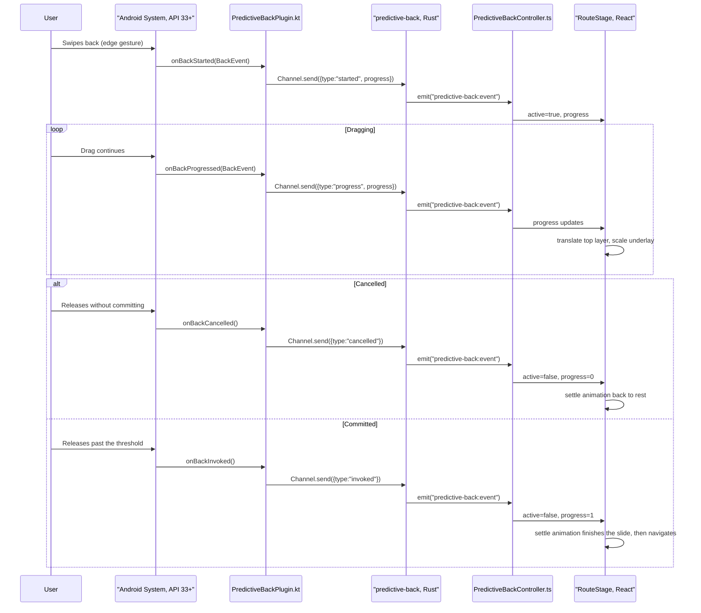

# Android Predictive Back Implementation

Android's predictive-back "peek" gesture (API 33+): swiping back from the edge previews the destination screen live, sliding out with your finger, rather than a discrete back-button press. This document covers how Threshold implements it.

## Overview

`plugins/predictive-back` bridges the platform's `OnBackAnimationCallback` to the webview. `RouteStage` (`apps/threshold/src/components/RouteStage.tsx`) uses that live progress to reveal the _real_ previous screen underneath the current one -- not a placeholder or a static bitmap -- matching how in-app predictive back looks in apps like Gmail or Settings.

## Architecture

```mermaid
sequenceDiagram
    participant User
    participant Android as "Android System, API 33+"
    participant Kotlin as PredictiveBackPlugin.kt
    participant Rust as "predictive-back, Rust"
    participant JS as PredictiveBackController.ts
    participant UI as "RouteStage, React"

    User->>Android: Swipes back (edge gesture)
    Android->>Kotlin: onBackStarted(BackEvent)
    Kotlin->>Rust: Channel.send({type:"started", progress})
    Rust->>JS: emit("predictive-back:event")
    JS->>UI: active=true, progress

    loop Dragging
        User->>Android: Drag continues
        Android->>Kotlin: onBackProgressed(BackEvent)
        Kotlin->>Rust: Channel.send({type:"progress", progress})
        Rust->>JS: emit("predictive-back:event")
        JS->>UI: progress updates
        UI->>UI: translate top layer, scale underlay
    end

    alt Cancelled
        User->>Android: Releases without committing
        Android->>Kotlin: onBackCancelled()
        Kotlin->>Rust: Channel.send({type:"cancelled"})
        Rust->>JS: emit("predictive-back:event")
        JS->>UI: active=false, progress=0
        UI->>UI: settle animation back to rest
    else Committed
        User->>Android: Releases past the threshold
        Android->>Kotlin: onBackInvoked()
        Kotlin->>Rust: Channel.send({type:"invoked"})
        Rust->>JS: emit("predictive-back:event")
        JS->>UI: active=false, progress=1
        UI->>UI: settle animation finishes the slide, then navigates
    end
```

### 1. Native plugin (`plugins/predictive-back`)

- Kotlin (`android/src/main/java/com/plugin/predictiveback/PredictiveBackPlugin.kt`) registers `OnBackAnimationCallback` via `activity.onBackInvokedDispatcher` on API 33 (Tiramisu) and above -- that's when the callback and `BackEvent` classes actually shipped, not 34. Registration is additionally gated on a `canGoBack` flag set from the webview.
- A `Channel`, registered once from Rust at plugin init (mirroring the same pattern `alarm-manager` uses for native→Rust signals), carries `started`/`progress`/`cancelled`/`invoked` frames to Rust, which re-emits them as the `predictive-back:event` Tauri event. No SharedPreferences replay queue is needed here (unlike alarm-manager's channels) -- a back gesture can only happen while the Activity, and this channel, are already live.
- `onResume()` forces a clean re-registration of the callback. The system's dispatcher registration doesn't reliably survive a pause/resume cycle (e.g. screen off then back on) even though the Kotlin `callback` object reference does -- without this, `registerCallback()`'s "already have a callback" guard silently left the gesture dead until the app was restarted.
- `setCanGoBack(bool)` is a normal command (`plugin:predictive-back|set_can_go_back`), wrapped by `tauri-plugin-predictive-back-api`'s `setCanGoBack()`.

### 2. Manifest flag

`android:enableOnBackInvokedCallback="true"` must be present on `<application>` for any of this to activate. `update_android_manifest()` (used by every plugin's `build.rs` for `<uses-permission>` siblings) only inserts new child elements before a closing tag, with no path to an attribute on the tag itself -- so instead, `plugins/predictive-back/android/src/main/AndroidManifest.xml` declares its own `<application android:enableOnBackInvokedCallback="true">`, and Android's own Gradle library-manifest merger folds it into the consuming app's final manifest automatically, the same mechanism `alarm-manager` and `wear-sync` already rely on to register their own receivers and services. No app-shell-level wiring is needed.

### 3. Frontend controller (`PredictiveBackController.ts`)

Listens for `predictive-back:event`, exposes `{ active, progress }` to subscribers, and wraps `setCanGoBack`. Always calls through to native rather than caching the last value sent, since the native registration can't be assumed to stay in sync with whatever was last sent (see the `onResume()` note above).

### 4. Screen cache (`ScreenStack.ts`)

A path-keyed stack mirroring the app's actual navigation history (push forward, pop backward -- same shape as `RouteTransitions`' own stack, and deliberately unbounded rather than capped at 2 entries: Home → Edit → Settings → back-to-Edit must still reveal Home on a further back gesture, which a fixed-depth cache would have already evicted). `RouteStage` records the real rendered element for the current route on every navigation; the entry one level back is what a gesture reveals. `EditAlarm` is the only screen with a route param, threaded explicitly via an `idOverride` prop rather than `useParams()` (which requires being the router's actual active match -- the underlay isn't).

### 5. `RouteStage.tsx`

Replaces the plain `<Outlet/>` wrapper in `router.tsx`'s `RootLayout`. Renders the current route via `<Outlet/>` unchanged (top layer) and, only while a gesture is active or settling, the cached previous screen underneath (underlay), transformed by live progress.

On release, both outcomes drive a "settle" animation (matching native Android's own predictive-back, which finishes the motion regardless of exact release point rather than snapping): cancelled animates `displayProgress` back to 0; committed animates it to 1, finishing the visible slide before the actual navigation fires. Both use a double-`requestAnimationFrame`-style two-step (disable the no-transition class first, change the target value on the next frame) since a CSS transition only animates a property change that happens _after_ a render where the transition was already active, not simultaneously with un-suppressing it. The settle duration is scaled by Android's Developer Options "Animator duration scale" (`AnimationScale.ts`, backed by `os-prefs`'s `get_animator_duration_scale`), kept in sync between a CSS custom property (`--wa-animation-duration`) and a JS-side copy for the timers below.

**A second race, found after the above shipped:** committing calls `router.history.back()`, which is asynchronous -- `location.pathname` doesn't actually change until the browser's `popstate` event fires on a _later_ tick (confirmed ~17ms later via direct device logging). Hiding the underlay and resetting the top layer's transform in the same tick as calling `history.back()` does so while `<Outlet/>` is still rendering the _outgoing_ screen -- with the transition still enabled, that reset visibly animates the outgoing screen snapping back into view, and when the route swap lands ~17ms later mid-animation, the incoming screen inherits that same still-running animation, looking exactly like it's "sliding in" (easily mistaken for the discrete-transition bug above, but confirmed distinct: a monkey-patched `document.startViewTransition` showed zero calls during this whole sequence). The fix: a second effect, keyed on `location.pathname`, defers the underlay-hide/transform-reset until the navigation has actually landed -- by then `<Outlet/>` already shows the real destination, so the reset has nothing to visibly animate between (both the underlay and the real content already show the same thing in the same place). A fallback timeout guards against `location.pathname` never changing (e.g. a blocked navigation), so the underlay can't get stuck visible forever.

## Coordinating with the existing discrete transition system

The app already animates ordinary (tap-driven) navigation with the browser View Transitions API (`RouteTransitions.ts`, `theme/transitions.css`), via a `defaultViewTransition` function configured in `router.tsx`. Committing a predictive-back gesture calls `router.history.back()`, which would otherwise also trigger that system, replaying a second, redundant animation (a browser-default cross-fade ghost, confirmed by direct source inspection of `@tanstack/router-core`) on top of the one the gesture just finished.

**A genuine upstream quirk, discovered while fixing this:** as of `@tanstack/router-core@1.151.0`, `startViewTransition()` only checks whether `defaultViewTransition` is _truthy_ -- it never actually calls it as a function. A function is always truthy, so every navigation gets an untyped `document.startViewTransition()` regardless of what our function would have returned, confirmed empirically (a diagnostic log inside the function never fired across several real navigations). This affects ordinary navigation too, not just predictive-back -- no `<Link>` in this app passes an explicit `viewTransition` prop either, so the `wa-forwards`/`wa-backwards` CSS types this system was designed to compute likely never actually apply anywhere. Fixing that broadly is out of scope here.

The one _documented_ per-navigation override, `viewTransition: false` in `NavigateOptions`, only gets wired up via `commitLocation()` (used by `navigate()`), which `router.history.back()` bypasses entirely -- and switching to `navigate({ to, replace: true })` to reach it would stop `window.history.length` from shrinking on repeated commits, breaking the back-eligibility check this app already relies on elsewhere (App.tsx's hardware back button, and `RouteStage`'s own `canGoBack` effect). So `RouteStage.tsx`'s `skipNextViewTransition()` helper sets the exact internal flag `commitLocation` would have set (`router.shouldViewTransition = false`) directly before calling `router.history.back()`, since `startViewTransition()` reads that flag first and deletes it immediately after reading -- safe to poke for a single call without leaking into unrelated future navigations.

## Behaviour

- **API 33+**: swipe-back triggers the live peek. Commit finishes the slide then navigates; cancel snaps back.
- **Below API 33**: standard discrete back behaviour, unchanged.
- **Home / Ringing**: predictive back is disabled (`canGoBack` is false), so the gesture falls through to the system's own default (app-minimize / cross-task animation).
- **`prefers-reduced-motion`**: `canGoBack` is never set to `true`, so the native callback is never registered and the system's ordinary instant back behaviour applies.
- **Desktop**: the plugin's `set_can_go_back` is a no-op; nothing in this feature runs there.
