# Release TUI — Specification

> Build spec for the redesigned `pnpm version:release` TUI.
> Replaces `scripts/update-release-version.mjs` (~1400 lines) and integrates `scripts/build-release-devcontainer.sh` (~329 lines) into a single unified tool.

---

## Table of Contents

- [Overview](#overview)
- [Problems with the Current TUI](#problems-with-the-current-tui)
- [Design Language](#design-language)
- [Palette](#palette)
- [Colour Roles](#colour-roles)
- [Screen Layout Pattern](#screen-layout-pattern)
- [Screens](#screens)
  - [1. Version Bump](#screen-1--version-bump)
  - [1b. Release Log](#screen-1b--release-log)
  - [1c. Custom Version Input](#screen-1c--custom-version-input)
  - [2. Review + Apply](#screen-2--review--apply)
  - [2 (variant). Redo Review](#screen-2-variant--redo-review)
  - [2 (variant). Detail Panel](#screen-2-variant--detail-panel)
  - [2 (variant). Tag Conflict](#screen-2-variant--tag-conflict)
  - [2.5. Build Offer](#screen-25--build-offer)
  - [2.5. Build Progress](#screen-25--build-progress)
  - [2.5. Build Error](#screen-25--build-error)
  - [2.5. Pre-flight Failure](#screen-25--pre-flight-failure)
  - [3. Done (version only)](#screen-3--done-version-only)
  - [3. Done (full release)](#screen-3--done-full-release)
  - [3. Done (redo)](#screen-3--done-redo)
  - [Help Overlay](#help-overlay)
- [Keybindings](#keybindings)
- [Flow Diagram](#flow-diagram)
- [Build Integration Architecture](#build-integration-architecture)
- [CLI Flags & CI Mode](#cli-flags--ci-mode)
- [Terminal Behaviour](#terminal-behaviour)
- [Migration Table](#migration-table)
- [File Inventory](#file-inventory)

---

## Overview

**Trigger:** `pnpm version:release`
**File:** `scripts/update-release-version.mjs`
**Design reference:** [ScottMorris/smdu](https://github.com/ScottMorris/smdu)

**Interaction model:** Press the key, it happens. No Enter to confirm menu picks. No arrow-key cycling. Enter only used for free-text input and final acknowledgements.

**Scope:** Unified release tool — version bumping, tagging, building (AABs + APKs), and release summary in one TUI. Replaces both `pnpm version:release` and `pnpm build:release` as separate manual steps.

**Happy path (version only):** 2 keypresses — `p` then `a`, Enter to exit.
**Happy path (full release):** 3 keypresses — `p` then `a` then `b` (build), Enter to exit.
**Redo release:** 3 keypresses — `r` then `a` then `b`, Enter to exit.

---

## Problems with the Current TUI

These are the issues identified in the existing `update-release-version.mjs` that motivate this redesign.

### 1. Select Menu UX Doesn't Match the Intent

The bottom prompt renders three lines of redundant instructions:

```
Options: [1/p] patch  [2/m] minor  [3/M] major  [4/c] custom  [h/?] help  [q] quit
Shortcuts: ←/→=cycle bump, Enter=accept, p/m/M/c direct pick, h/?=help, q=quit
? Select option: [Patch]  Minor  Major  Custom  (←/→ to cycle, Enter to accept)
```

The intent was smdu-style "press the key you want" but the implementation stacks: (a) numbered options with letter aliases, (b) a shortcut reminder line, and (c) a cycling inline picker. The user sees the same information three ways and the primary interaction (cycling) contradicts the desired model (direct pick). Case-sensitive `m`/`M` also causes confusion.

**Fix:** smdu-style vertical menu with `p`/`n`/`j`/`c` hotkeys — all lowercase, unambiguous.

### 2. Wasted Screen: Derived Codes Flash

After choosing the tag, the status board briefly renders a "Derived codes" message, then is immediately overwritten. Dead code — the user never sees it.

**Fix:** Remove.

### 3. Tag Step Feels Premature

The tag prompt comes right after version choice, before web sync or commit mode decisions. The tag is almost always `v{version}`.

**Fix:** Auto-derive the tag silently. Only surface a prompt on conflict.

### 4. Web Package Sync Is Extra Work and Defaulted Wrong

Asks every release with default **No**. Not sticky. An inattentive Enter-through leaves versions out of sync, and the TUI then warns about the mismatch it just created.

**Fix:** Always sync. Remove the question. `--no-web-sync` CLI flag for the edge case.

### 5. Auto Commit+Tag Question Is Unnecessary

Asks every time. The "No" path is a legacy manual workflow.

**Fix:** Always auto-commit+tag. `--no-commit` CLI flag for the rare manual case.

### 6. Review Screen Is Dense

Wall of text with file paths, field names, derived version codes, tag operations, and unrelated git changes.

**Fix:** Compact 4-line summary by default. `d` toggles a smdu-style side panel for the full breakdown.

### 7. Double Confirmation for Unrelated Changes

User presses `a` to apply, then must confirm again with `y/n` for unrelated changes. Two confirmations for one action.

**Fix:** Inline warning on the review screen. Single `a` to apply.

### 8. "Back" Restarts Everything

Pressing `b` on review loops all the way to step 1 and re-prompts from scratch.

**Fix:** Back goes to the previous screen with state preserved.

### 9. No Undo Info After Apply

Once applied, no guidance on how to reverse.

**Fix:** Show undo command on the Done screen.

### 10. Tag Conflict UX Is Confusing

"Different tag" loops to the same free-text prompt with no guidance.

**Fix:** Show conflict details (local/remote, creation date, commit). Offer clear options: update, rename, or go back.

### 11. Exit Loses All Context

Alt screen restores and everything vanishes.

**Fix:** Print a one-line summary to the main terminal on exit.

---

## Design Language

Follows [smdu](https://github.com/ScottMorris/smdu) conventions:

- **Dashed dividers** — not box-drawing characters
- **smdu default palette** — already present in the codebase
- **Single-key direct actions** — press the key, it happens
- **Right-side detail panel** — toggled with `d`, uses pipe separator
- **`Key: label` footer pattern** — persistent global keys on the right
- **1-space edge padding** — matches smdu `paddingX={1}`

---

## Palette

The smdu default palette is already in the codebase at `scripts/update-release-version.mjs` lines 39-52.

```
text         #d2d8e1     main body text
selectedText #e6ebf2     highlighted/active item
highlight    #2a3340     selection background (reverse video row)
bar          #2ec66a     green — success, progress bars, "to" values
accent       #5aa2ff     blue — titles, active hotkeys, file paths
muted        #7c8796     grey — secondary info, labels, footer hints
line         #2e3540     divider dashes
red          #ff6b6b     destructive, errors, undo commands
yellow       #ffd166     warnings, tags, caution states
cyan         #7dd3fc     prompts, info highlights, safe commands
magenta      #9aa4b2     app title (smdu muted header style)
```

## Colour Roles

| Element | Colour | Rationale |
|---------|--------|-----------|
| App title "Threshold Release TUI" | `muted` (#9aa4b2) | smdu header style |
| Section titles ("Details", "Build Log") | `muted` bold | smdu StatusPanel labels |
| Divider dashes | `line` (#2e3540) | Consistent throughout |
| Current version values | `text` (#d2d8e1) | Normal readability |
| New/changed version values | `green` (#2ec66a) | Positive change |
| Hotkey letters | `accent` (#5aa2ff) | Actionable keys |
| Preview values (→ 0.1.9) | `cyan` (#7dd3fc) | Informational |
| Warning messages | `yellow` (#ffd166) | Caution |
| Error/destructive | `red` (#ff6b6b) | Danger |
| Footer hints | `muted` | smdu footer style |
| Tag names | `yellow` | Significant artifact |
| Progress bars | `green` filled / `line` empty | smdu bar style |
| Spinners | `cyan` | Activity indicator |
| Build phase labels | `accent` bold | Section headers |
| File sizes | `text` | Data values |
| Timestamps | `muted` | Background info |

---

## Screen Layout Pattern

Every screen follows the smdu skeleton:

```
 {header left}                                        {header right}
{dashed divider}

 {body content}

{dashed divider}
 {footer left}                                        {footer right}
```

- **Header:** left = context/step, right = "Threshold Release TUI"
- **Footer:** left = status label, right = available hotkeys
- **Padding:** 1 space from edges (smdu `paddingX={1}`)

---

## Screens

### Screen 1 — Version Bump

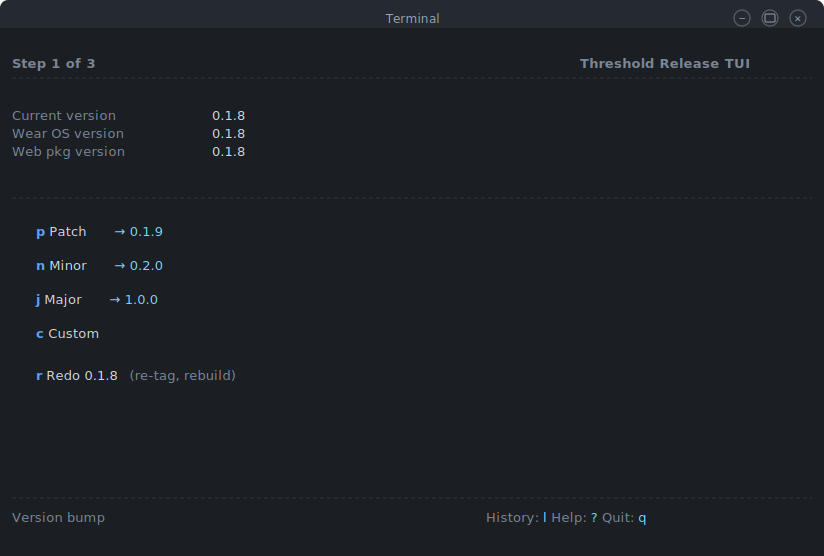

```
 Step 1 of 3                                          Threshold Release TUI
----------------------------------------------------------------------------

 Current version    0.1.8
 Wear OS version    0.1.8
 Web pkg version    0.1.8

----------------------------------------------------------------------------

   p  Patch      → 0.1.9
   n  Minor      → 0.2.0
   j  Major      → 1.0.0
   c  Custom
   r  Redo 0.1.8   (re-tag, rebuild)

----------------------------------------------------------------------------
 Version bump                                  History: l  Help: ?  Quit: q
```

**Behaviour:**
- `p`/`n`/`j`/`c` — single keypress advances to Review
- `r` — **Redo mode**: keeps version at current, goes to Review with "redo" flag. Tag is force-updated, commit message is `chore(release): redo release X.Y.Z`
- `l` — Release log (see below)
- `?` — Help overlay
- `q` — Exit

---

### Screen 1b — Release Log

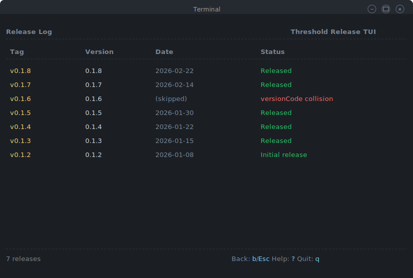

```
 Release Log                                          Threshold Release TUI
----------------------------------------------------------------------------

 Tag           Version    Date              Status
----------------------------------------------------------------------------
 v0.1.8        0.1.8      2026-02-22        Released
 v0.1.7        0.1.7      2026-02-14        Released
 v0.1.6        0.1.6      (skipped)         versionCode collision
 v0.1.5        0.1.5      2026-01-30        Released
 ...

----------------------------------------------------------------------------
 7 releases                                         Back: b/Esc  Help: ?  Quit: q
```

- Pulls from git tags + dates. "Status" from RELEASE_NOTES.md if parseable, otherwise "Tagged".
- `b` or `Esc` returns to Screen 1.
- Informational only — no edits.

---

### Screen 1c — Custom Version Input

```
 Step 1 of 3                                          Threshold Release TUI
----------------------------------------------------------------------------

 Current version    0.1.8
 Wear OS version    0.1.8
 Web pkg version    0.1.8

----------------------------------------------------------------------------

 Enter version: 0.2.0-rc.1█

 Format: X.Y.Z or X.Y.Z-suffix (e.g. 0.2.0, 0.2.0-rc.1)

----------------------------------------------------------------------------
 Custom version                                    Esc: cancel  Enter: confirm
```

---

### Screen 2 — Review + Apply

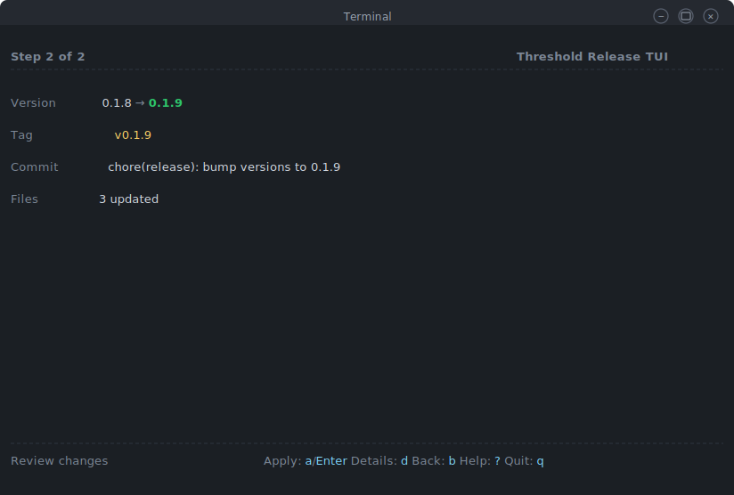

```
 Step 2 of 3                                          Threshold Release TUI
----------------------------------------------------------------------------

 Version        0.1.8 → 0.1.9
 Tag            v0.1.9
 Commit         chore(release): bump versions to 0.1.9
 Files          3 updated
 Build          ready (phone AAB/APK + wear AAB/APK)

----------------------------------------------------------------------------
 Review                    Apply: a/Enter  Details: d  Back: b  Help: ?  Quit: q
```

- `a` or Enter → applies version bump, commits, tags, then offers to build
- `d` — toggles detail panel
- `b` — back to Screen 1
- `q` — exit

**Unrelated changes warning** (non-blocking, inline footer):

```
----------------------------------------------------------------------------
 Warning: 3 unrelated changes in worktree (M src/app.ts, ?? new.txt, +1 more)
 Review                    Apply: a/Enter  Details: d  Back: b  Help: ?  Quit: q
```

---

### Screen 2 (variant) — Redo Review

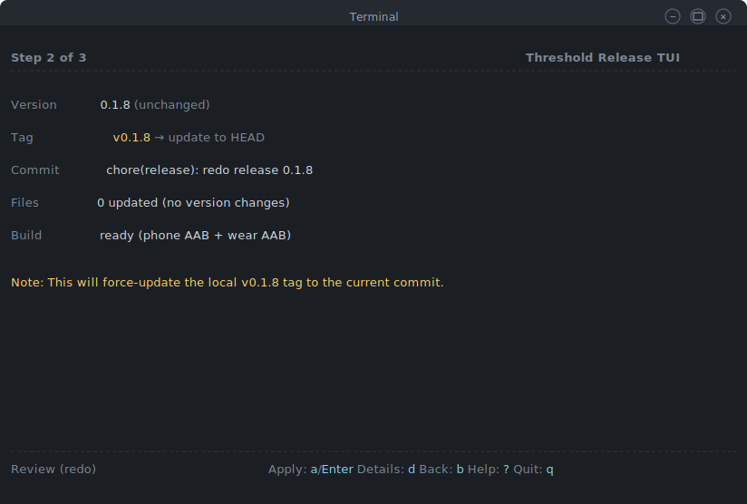

When `r` was pressed on Screen 1:

```
 Step 2 of 3                                          Threshold Release TUI
----------------------------------------------------------------------------

 Version        0.1.8 (unchanged)
 Tag            v0.1.8 → update to HEAD
 Commit         chore(release): redo release 0.1.8
 Files          0 updated (no version changes)
 Build          ready (phone AAB/APK + wear AAB/APK)

 Note: This will force-update the local v0.1.8 tag to the current commit.

----------------------------------------------------------------------------
 Review (redo)             Apply: a/Enter  Details: d  Back: b  Help: ?  Quit: q
```

---

### Screen 2 (variant) — Detail Panel

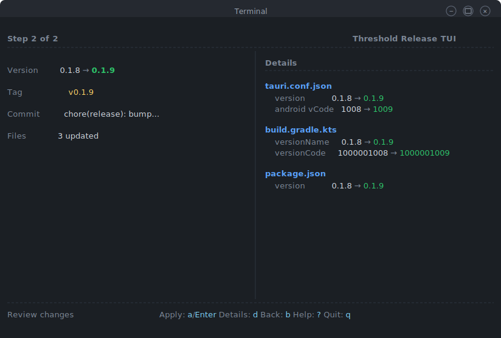

Press `d` to toggle the smdu-style side panel:

```
 Step 2 of 3                                          Threshold Release TUI
----------------------------------------------------------------------------
                                          |
 Version      0.1.8 → 0.1.9              |  Details
 Tag          v0.1.9                      | ----------------------------------------
 Commit       chore(release): bump...     |
 Files        3 updated                   |  tauri.conf.json
 Build        ready                       |    version           0.1.8 → 0.1.9
                                          |    android vCode     1008 → 1009
                                          |
                                          |  build.gradle.kts
                                          |    versionName       0.1.8 → 0.1.9
                                          |    versionCode       1000001008 → 1000001009
                                          |
                                          |  package.json
                                          |    version           0.1.8 → 0.1.9
                                          |
----------------------------------------------------------------------------
 Review              Apply: a/Enter  Details: d  Back: b  Help: ?  Quit: q
```

---

### Screen 2 (variant) — Tag Conflict

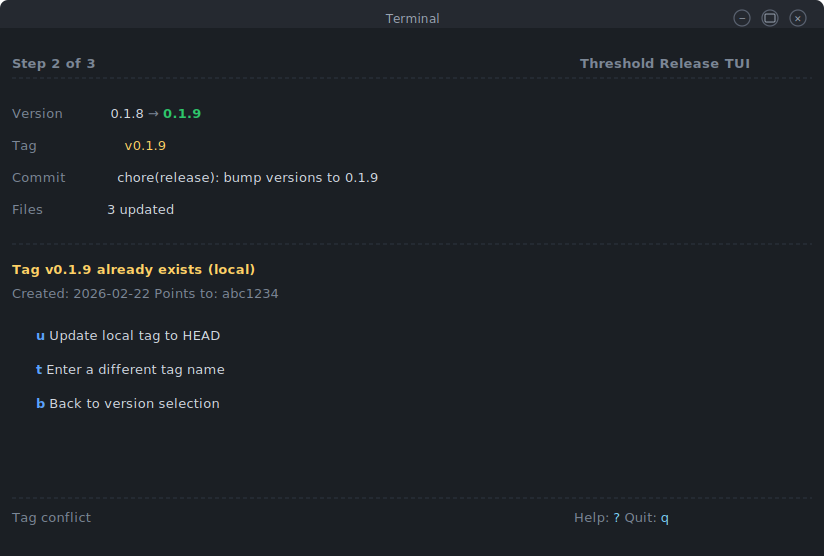

```
 Step 2 of 3                                          Threshold Release TUI
----------------------------------------------------------------------------

 Version        0.1.8 → 0.1.9
 Tag            v0.1.9
 Commit         chore(release): bump versions to 0.1.9
 Files          3 updated

----------------------------------------------------------------------------
 Tag v0.1.9 already exists (local)
 Created: 2026-02-22    Points to: abc1234

   u  Update local tag to HEAD
   t  Enter a different tag name
   b  Back to version selection

----------------------------------------------------------------------------
 Tag conflict                                              Help: ?  Quit: q
```

---

### Screen 2.5 — Build Offer

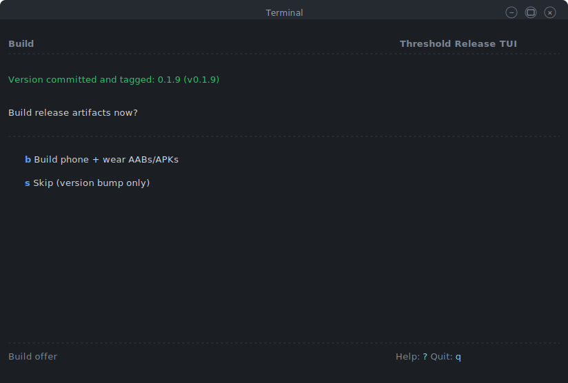

After applying version + commit + tag:

```
 Build                                                Threshold Release TUI
----------------------------------------------------------------------------

 Version committed and tagged: 0.1.9 (v0.1.9)

 Build release artifacts now?

   b  Build phone + wear AABs/APKs
   s  Skip (version bump only)

----------------------------------------------------------------------------
 Build offer                                           Help: ?  Quit: q
```

---

### Screen 2.5 — Build Progress


The build progress screen features an animated Threshold clock (amber sweeping hand, floating particles, pulsing glow) alongside live progress bars and a scrolling build log.

**Phone building:**

```
 Building                                             Threshold Release TUI
----------------------------------------------------------------------------

 ▸ Phone AAB/APK                                            Building...
   ┌────────────────────────────────────────────────┐
   │████████████████████████████░░░░░░░░░░░░░░░░░░░░│  58%
   └────────────────────────────────────────────────┘

   Wear AAB/APK                                             Waiting...

----------------------------------------------------------------------------
 Build log (last 3 lines):

 > pnpm build:android
 > Compiling threshold-lib v0.1.9 (apps/threshold/src-tauri)
 > Bundling app-universal-release.aab

----------------------------------------------------------------------------
 Building phone AAB...                                    Abort: Ctrl+C  Quit: q
```

**Wear building (phone done):**

```
 Building                                             Threshold Release TUI
----------------------------------------------------------------------------

 ✓ Phone AAB                                          36.2 MB  42s
 ✓ Phone APK                                          38.4 MB
   ┌────────────────────────────────────────────────┐
   │████████████████████████████████████████████████│ 100%
   └────────────────────────────────────────────────┘

 ▸ Wear AAB/APK                                           Building...
   ┌────────────────────────────────────────────────┐
   │████████████████████████░░░░░░░░░░░░░░░░░░░░░░░░│  48%
   └────────────────────────────────────────────────┘

----------------------------------------------------------------------------
 Build log (last 3 lines):

 > ./gradlew --project-dir apps/threshold-wear bundleRelease assembleRelease
 > :app:bundleRelease
 > Signing release AAB with upload keystore

----------------------------------------------------------------------------
 Building wear AAB/APK...                                Abort: Ctrl+C  Quit: q
```

**Progress estimation** is approximate, parsed from key log lines:
- Phone: `Compiling` (0-40%), `Linking` (40-60%), `Bundling AAB` (60-75%), `Assembling APK` (75-85%), `Signing` (85-100%)
- Wear: `Compiling` (0-50%), `Bundling AAB` (50-70%), `Assembling APK` (70-85%), `Signing` (85-100%)

APKs are generated alongside AABs using `assembleRelease` in addition to `bundleRelease`. Both Gradle tasks run in the same invocation for efficiency.

---

### Screen 2.5 — Build Error

If a build fails, the screen shows the error inline with recovery options:

```
 Building                                             Threshold Release TUI
----------------------------------------------------------------------------

 ✓ Phone AAB                                               36.2 MB  42s

 ✗ Wear AAB/APK                                            FAILED

----------------------------------------------------------------------------
 Build error (last 8 lines):

 > Execution failed for task ':app:bundleRelease'.
 > A failure occurred while executing
 >   com.android.build.gradle.tasks.PackageBundleTask
 > > java.io.FileNotFoundException: keystore.properties
 > BUILD FAILED in 18s

----------------------------------------------------------------------------
 Wear build failed                     Retry: r  Skip wear: s  Abort: a  Quit: q
```

---

### Screen 2.5 — Pre-flight Failure

If build prerequisites are missing, the TUI shows a clear error instead of dumping shell output:

```
 Pre-flight                                           Threshold Release TUI
----------------------------------------------------------------------------

 Checking build prerequisites...

   ✓  NDK found: /opt/android-sdk/ndk/28.0.12674558
   ✓  Rust targets: aarch64, armv7, i686, x86_64
   ✗  Keystore not found at /keys/keystore.properties

 Setup required:

   1. On your HOST machine, create ~/threshold-keys/keystore.properties:
        keyAlias=google-play-upload
        password=YOUR_KEYSTORE_PASSWORD
        storeFile=/keys/upload-keystore.jks

   2. Ensure .devcontainer/devcontainer.json has the /keys mount

   3. Rebuild your dev container

----------------------------------------------------------------------------
 Build prerequisites failed                           Back: b  Help: ?  Quit: q
```

---

### Screen 3 — Done (version only)

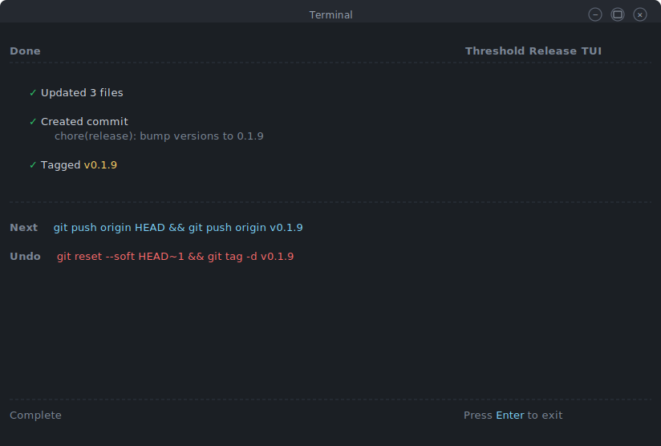

Build was skipped:

```
 Done                                                 Threshold Release TUI
----------------------------------------------------------------------------

   ✓  Updated 3 files
   ✓  Created commit
      chore(release): bump versions to 0.1.9
   ✓  Tagged v0.1.9

----------------------------------------------------------------------------

 Next   git push origin HEAD && git push origin v0.1.9
 Build  pnpm build:release
 Undo   git reset --soft HEAD~1 && git tag -d v0.1.9

----------------------------------------------------------------------------
 Complete                                                   Press Enter to exit
```

---

### Screen 3 — Done (full release)

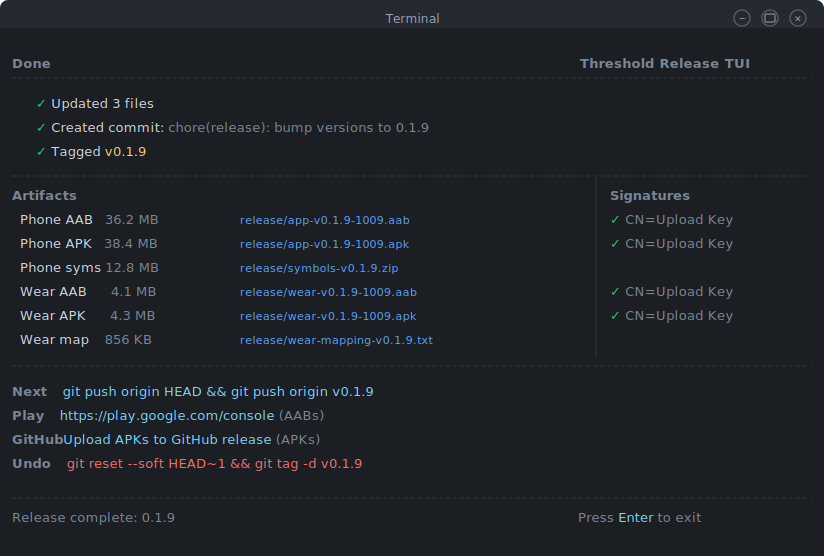

```
 Done                                                 Threshold Release TUI
----------------------------------------------------------------------------

   ✓  Updated 3 files
   ✓  Created commit: chore(release): bump versions to 0.1.9
   ✓  Tagged v0.1.9

 Artifacts                                            |  Signatures
 ---------------------------------------------------- | ----------------------
   Phone AAB   36.2 MB   release/app-v0.1.9-1009.aab |  ✓ CN=Upload Key
   Phone APK   38.4 MB   release/app-v0.1.9-1009.apk |  ✓ CN=Upload Key
   Phone syms  12.8 MB   release/symbols-v0.1.9.zip  |
   Wear AAB     4.1 MB   release/wear-v0.1.9-1009.aab|  ✓ CN=Upload Key
   Wear APK     4.3 MB   release/wear-v0.1.9-1009.apk|  ✓ CN=Upload Key
   Wear map   856.0 KB   release/wear-mapping.txt     |

----------------------------------------------------------------------------

 Next    git push origin HEAD && git push origin v0.1.9
 Play    https://play.google.com/console         (AABs)
 GitHub  Upload APKs to GitHub release            (APKs)
 Undo    git reset --soft HEAD~1 && git tag -d v0.1.9

----------------------------------------------------------------------------
 Release complete: 0.1.9                                    Press Enter to exit
```

---

### Screen 3 — Done (redo)

```
 Done                                                 Threshold Release TUI
----------------------------------------------------------------------------

   ✓  Created commit: chore(release): redo release 0.1.8
   ✓  Updated tag v0.1.8 → HEAD

 Artifacts                                            |  Signatures
 ---------------------------------------------------- | ----------------------
   Phone AAB   36.2 MB   release/app-v0.1.8-1008.aab |  ✓ CN=Upload Key
   Phone APK   38.4 MB   release/app-v0.1.8-1008.apk |  ✓ CN=Upload Key
   Wear AAB     4.1 MB   release/wear-v0.1.8-1008.aab|  ✓ CN=Upload Key
   Wear APK     4.3 MB   release/wear-v0.1.8-1008.apk|  ✓ CN=Upload Key

----------------------------------------------------------------------------

 Next    git push origin HEAD && git push origin v0.1.8 --force
 Play    https://play.google.com/console         (AABs)
 GitHub  Upload APKs to GitHub release            (APKs)
 Undo    git reset --soft HEAD~1

 Note: Remote tag update requires --force. Previous tag commit is preserved
       in reflog for 90 days.

----------------------------------------------------------------------------
 Redo complete: 0.1.8                                       Press Enter to exit
```

---

### Help Overlay

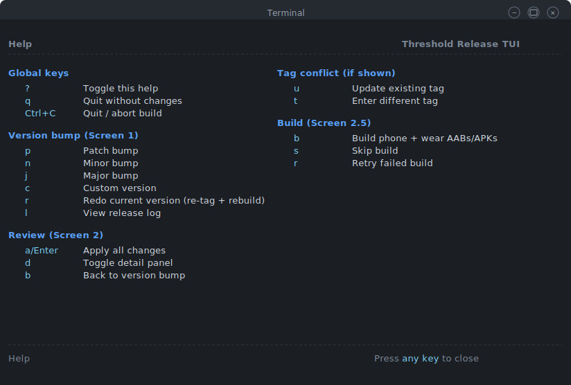

```
 Help                                                 Threshold Release TUI
----------------------------------------------------------------------------

 Global keys                          | Tag conflict (if shown)
   ?          Toggle this help        |   u          Update existing tag
   q          Quit without changes    |   t          Enter different tag
   Ctrl+C     Quit / abort build      |
                                      | Build (Screen 2.5)
 Version bump (Screen 1)             |   b          Build phone + wear AABs/APKs
   p          Patch bump              |   s          Skip build
   n          Minor bump              |   r          Retry failed build
   j          Major bump              |
   c          Custom version          |
   r          Redo current version    |
   l          View release log        |
                                      |
 Review (Screen 2)                   |
   a/Enter    Apply all changes       |
   d          Toggle detail panel     |
   b          Back to version bump    |

----------------------------------------------------------------------------
 Help                                                 Press any key to close
```

---

## Keybindings

### Global

| Key | Action |
|-----|--------|
| `?` | Toggle help overlay |
| `q` | Quit without changes |
| `Ctrl+C` | Quit / abort build |

### Screen 1 — Version Bump

| Key | Action |
|-----|--------|
| `p` | Patch bump (→ X.Y.Z+1) |
| `n` | Minor bump (→ X.Y+1.0) |
| `j` | Major bump (→ X+1.0.0) |
| `c` | Custom version (free-text input) |
| `r` | Redo current version (re-tag + rebuild) |
| `l` | View release log |

### Screen 2 — Review

| Key | Action |
|-----|--------|
| `a` / `Enter` | Apply all changes (commit + tag) |
| `d` | Toggle detail panel |
| `b` | Back to version bump |

### Tag Conflict

| Key | Action |
|-----|--------|
| `u` | Update existing tag to HEAD |
| `t` | Enter a different tag name |
| `b` | Back to version selection |

### Screen 2.5 — Build

| Key | Action |
|-----|--------|
| `b` | Build phone + wear AABs/APKs |
| `s` | Skip build |
| `r` | Retry failed build |

---

## Flow Diagram

```
launch
  │
  ▼
┌──────────────────────────┐
│  Screen 1                 │ ◄── p/n/j/c (single key)
│  Version Bump             │ ◄── r redo, l release log
│                           │ ◄── ? help, q quit
└───────────┬──────────────┘
            │
    ┌───────┴────────┐
    │ press l?       │
    ▼                │
┌──────────────┐     │
│ Release Log  │─────┘ (b = back)
└──────────────┘
            │
            ▼
┌──────────────────────────┐
│  Screen 2                 │ ◄── a/Enter apply
│  Review + Apply           │ ◄── d toggle details
│                           │ ◄── b back to Screen 1
│  (tag conflict?)          │ ◄── u update / t rename
│  (unrelated changes?)     │     (warning, non-blocking)
└───────────┬──────────────┘
            │ apply (commit + tag)
            ▼
┌──────────────────────────┐
│  Build Offer              │ ◄── b build
│  (Screen 2.5)             │ ◄── s skip
└───────────┬──────────────┘
            │
     ┌──────┴──────┐
     │ build?      │ skip?
     ▼             │
┌──────────────┐   │
│ Pre-flight   │   │
│ Build Phone  │   │
│ Build Wear   │   │
│ Verify       │   │
└──────┬───────┘   │
       │           │
       ▼           ▼
┌──────────────────────────┐
│  Screen 3                 │
│  Done / Release Summary   │ ◄── Enter to exit
│  + artifacts table        │
│  + next/undo/upload cmds  │
└───────────┬──────────────┘
            │
            ▼
  exit alt screen
  print one-liner to main terminal
```

---

## Build Integration Architecture

The TUI doesn't shell out to `build-release-devcontainer.sh` — it runs the same commands directly, giving it control over progress reporting:

```
Phase 1: Pre-flight checks
  - Verify keystore.properties at /keys mount
  - Verify NDK_HOME
  - Verify Rust Android targets
  - Symlink keystore.properties into both projects

Phase 2: Phone AAB + APK
  - pnpm build:android  (Tauri wraps Cargo + Gradle)
  - Parse stdout for progress phase detection
  - Copy AAB + debug symbols to release/
  - Extract APK from AAB via bundletool, or run assembleRelease
  - Sign APK with upload keystore (apksigner)
  - Copy APK to release/

Phase 3: Wear AAB + APK
  - ./gradlew --project-dir apps/threshold-wear bundleRelease assembleRelease
  - Parse stdout for progress phase detection
  - Copy AAB + R8 mapping to release/
  - Copy APK to release/

Phase 4: Verification
  - jarsigner -verify on all AABs
  - apksigner verify on all APKs
  - Report signer CN for each artifact

Phase 5: Cleanup
  - Remove keystore symlinks (trap on exit)
```

### Artifact Output

All artifacts go to the `release/` directory with versioned filenames:

| Artifact | Filename Pattern | Destination |
|----------|-----------------|-------------|
| Phone AAB | `release/app-v{ver}-{vCode}.aab` | Google Play |
| Phone APK | `release/app-v{ver}-{vCode}.apk` | GitHub / F-Droid |
| Phone symbols | `release/symbols-v{ver}.zip` | Play Console |
| Wear AAB | `release/wear-v{ver}-{vCode}.aab` | Google Play |
| Wear APK | `release/wear-v{ver}-{vCode}.apk` | GitHub / F-Droid |
| Wear mapping | `release/wear-mapping-v{ver}.txt` | Play Console |

---

## CLI Flags & CI Mode

| Flag | Description |
|------|-------------|
| `--ci` | Non-interactive mode, requires `--bump` or `--redo` |
| `--bump <patch\|minor\|major\|X.Y.Z>` | Version bump type or exact version |
| `--redo` | Redo current version (re-tag, no version change) |
| `--build` | Run release build after version bump |
| `--no-commit` | Apply file changes only, don't commit or tag |
| `--no-web-sync` | Don't update apps/threshold/package.json |
| `--dry-run` | Show what would change without writing files |

### CI Usage

```bash
# Version bump only
pnpm version:release -- --ci --bump patch

# Version bump + build
pnpm version:release -- --ci --bump patch --build

# Redo current version + build
pnpm version:release -- --ci --redo --build
```

CI output is plain text, no alt screen, no colours (respects `NO_COLOR`):

```
Threshold Release TUI (non-interactive)
Version: 0.1.8 → 0.1.9
Updated: tauri.conf.json, build.gradle.kts, package.json
Commit: chore(release): bump versions to 0.1.9
Tag: v0.1.9
Build: phone AAB (36.2 MB), phone APK (38.4 MB), wear AAB (4.1 MB), wear APK (4.3 MB)
Done.
```

---

## Terminal Behaviour

| Aspect | Behaviour |
|--------|-----------|
| Alt screen | Enter on launch, leave on exit |
| Cursor | Hidden except during free-text input |
| Mouse | Keep SGR mouse support (click = Enter, right-click = back, scroll = cycle on Screen 1) |
| Resize | Redraw on SIGWINCH |
| Min width | 60 cols (truncate detail panel first, then file names) |
| Wide terminals | Detail panel gets extra width |
| Non-TTY | Auto-detect → non-interactive mode |
| `NO_COLOR` | Respect env variable, strip ANSI codes |
| Build output | Captured and displayed in a scrolling log region (last N lines) |
| Build child process | Spawned with `stdio: ['ignore', 'pipe', 'pipe']`, output parsed for progress |

---

## Migration Table

| Old | New |
|-----|-----|
| Two separate commands (`version:release` + `build:release`) | One unified TUI |
| 3-line redundant menu with cycling picker | Single-key vertical menu |
| Tag name free-text prompt (every time) | Auto-derive, only prompt on conflict |
| "Update web package.json?" prompt | Always sync (removed) |
| "Auto commit+tag?" prompt | Always auto (removed) |
| Derived codes flash screen | Removed (dead code) |
| Dense review with file::field format | Compact summary + toggleable detail panel |
| Double confirmation for unrelated changes | Inline warning, single `a` to apply |
| Back restarts from scratch | Back goes to previous screen |
| Silent exit losing all context | One-liner printed to main terminal |
| No undo guidance | Undo command on Done screen |
| `m` vs `M` case-sensitive hotkeys | `p/n/j/c` — all lowercase |
| No redo capability | `r` for re-release same version |
| No release history view | `l` for release log |
| Manual build with separate script | Integrated build with progress bars |
| No build error recovery | Inline retry/skip on failure |
| No artifact summary | Table with sizes + signature verification |
| AAB-only builds | AAB + APK for Play Store and GitHub/F-Droid |
| No pre-flight checks in TUI | Clear prerequisite reporting |
| No CI/non-interactive mode | `--ci` flag with plain text output |
| No dry-run | `--dry-run` flag |

---

## File Inventory

### Spec & Mockups

| File | Description |
|------|-------------|
| [`docs/ui-mockups/SPEC.md`](SPEC.md) | This specification |
| [`docs/ui-mockups/release-tui-01-version-bump.svg`](release-tui-01-version-bump.svg) | Screen 1: Version bump |
| [`docs/ui-mockups/release-tui-02-review-compact.svg`](release-tui-02-review-compact.svg) | Screen 2: Review (compact) |
| [`docs/ui-mockups/release-tui-03-review-details.svg`](release-tui-03-review-details.svg) | Screen 2: Review (detail panel) |
| [`docs/ui-mockups/release-tui-04-done.svg`](release-tui-04-done.svg) | Screen 3: Done (version only) |
| [`docs/ui-mockups/release-tui-04a-build-offer.svg`](release-tui-04a-build-offer.svg) | Screen 2.5: Build offer |
| [`docs/ui-mockups/release-tui-05-build-progress.svg`](release-tui-05-build-progress.svg) | Screen 2.5: Build progress (animated) |
| [`docs/ui-mockups/release-tui-06-done-full.svg`](release-tui-06-done-full.svg) | Screen 3: Done (full release) |
| [`docs/ui-mockups/release-tui-07-release-log.svg`](release-tui-07-release-log.svg) | Screen 1b: Release log |
| [`docs/ui-mockups/release-tui-08-redo-review.svg`](release-tui-08-redo-review.svg) | Screen 2: Review (redo mode) |
| [`docs/ui-mockups/release-tui-09-tag-conflict.svg`](release-tui-09-tag-conflict.svg) | Screen 2: Tag conflict |
| [`docs/ui-mockups/release-tui-10-help.svg`](release-tui-10-help.svg) | Help overlay |

### Implementation Files (to modify)

| File | Description |
|------|-------------|
| `scripts/update-release-version.mjs` | Main TUI script (~1400 lines, full rewrite) |
| `scripts/build-release-devcontainer.sh` | Build script (to be absorbed into TUI) |

### Version Files (read/written by the TUI)

| File | Fields |
|------|--------|
| `apps/threshold/src-tauri/tauri.conf.json` | `version`, `android.versionCode` |
| `apps/threshold-wear/build.gradle.kts` | `versionName`, `versionCode` |
| `apps/threshold/package.json` | `version` |
