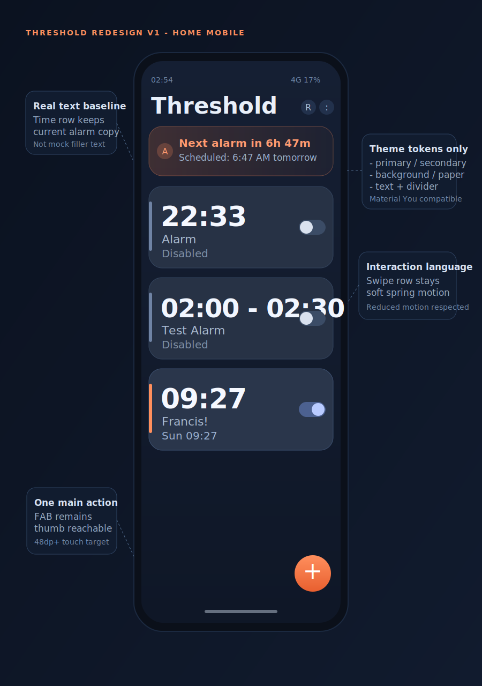
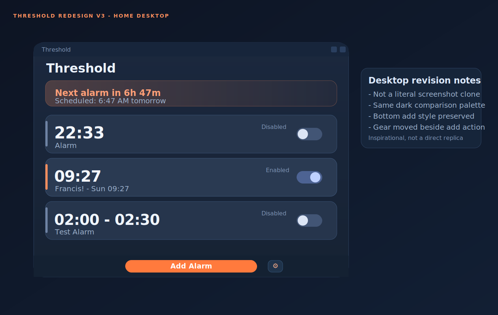
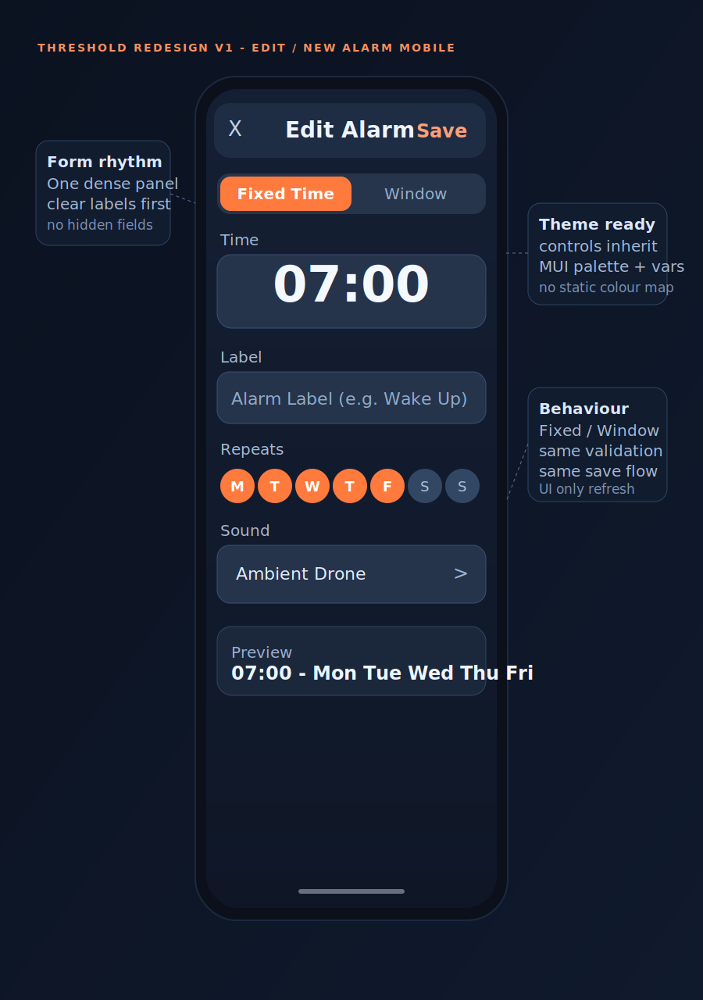
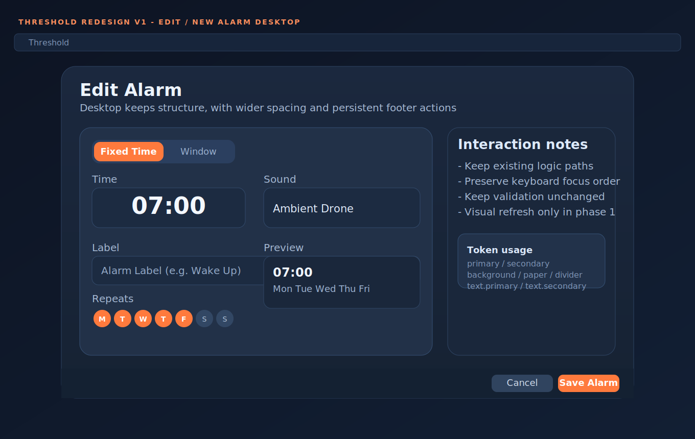
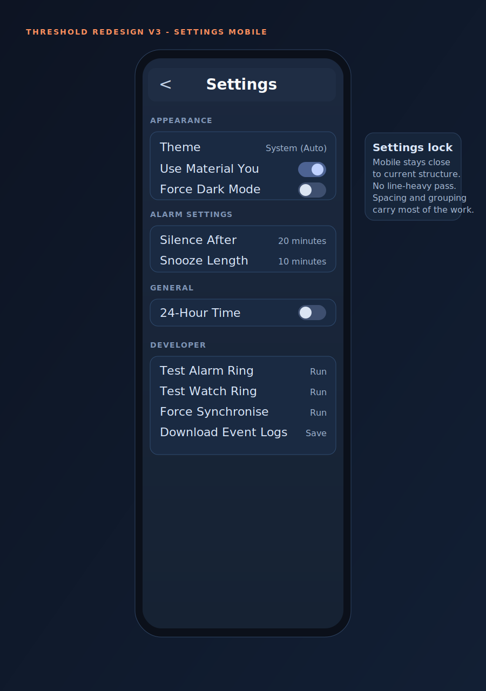
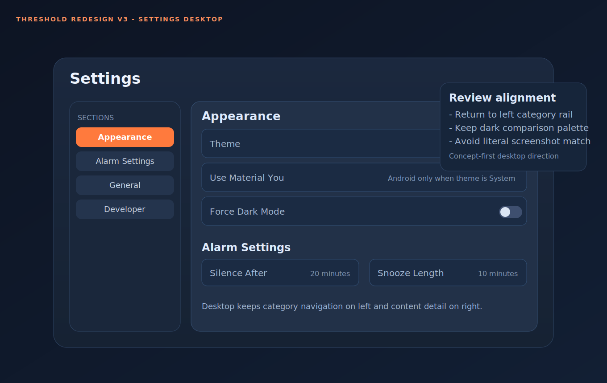

# Threshold Screen Redesign Update Plan (Draft)

Date: 2026-03-08
Scope: `Home`, `Edit/New Alarm`, and `Settings` screens only (no `Ringing` changes)
Status: Review and refine before implementation

## 1) What I reviewed

- Redesign exploration assets in `docs/ui-mockups/temp-screen-redesigns/`:
  - `threshold-01-transitions.svg`
  - `threshold-02-bubbles.svg`
  - `threshold-03-colours.svg`
  - `threshold-04-cognitive.svg`
  - `threshold-b-alarm-list.svg`
  - `threshold-b-alarm-list-description.txt`
  - `threshold-x-y-descriptions.txt`
  - `screenshot-sample-alarm-page-from-phone.png`
- Current app screens and components:
  - `apps/threshold/src/screens/Home.tsx`
  - `apps/threshold/src/screens/EditAlarm.tsx`
  - `apps/threshold/src/screens/Settings.tsx`
  - `apps/threshold/src/components/AlarmItem.tsx`
  - `apps/threshold/src/components/SwipeToDeleteRow.tsx`
  - `apps/threshold/src/components/MobileToolbar.tsx`
- Theming system and platform behaviour:
  - `apps/threshold/src/contexts/ThemeContext.tsx`
  - `apps/threshold/src/theme/themes.ts`
  - `apps/threshold/src/services/SettingsService.ts`
  - `apps/threshold/src/router.tsx`
- Product philosophy/docs/site language:
  - `README.md`
  - `docs/ui/ui-task.md`
  - `docs/architecture/architecture.md`
  - `apps/site/index.html` ("About, not at", calm/glanceable/gradient framing)

## 2) Design direction we should keep

- Calm, glanceable, low cognitive load.
- "About, not at" behaviour should feel present in the UI, not just in copy.
- Soft cards, subtle depth, no harsh shadows.
- One clear primary action per screen.
- Existing app theming system stays authoritative:
  - Theme presets
  - System theme
  - Material You (Android only, not desktop)

## 3) Content baseline decisions

Use current alarm text patterns as source of truth (not mock filler text):

- Time row: `22:33`, `02:00 - 02:30`, `09:27`
- Label row: `Alarm`, `Test Alarm`, `Francis!`
- State row: `Disabled` or next trigger preview (for example `Sun 09:27`)

## 4) New mockups for review

Current review set: `proposed-v3` (latest iteration)

### Home

### Edit / New Alarm

### Settings

## 5) What changes by screen

### Home

- Keep current information hierarchy, but strengthen glanceability:
  - Title row
  - Next alarm banner (actual scheduled time)
  - Alarm cards with status accent rail
  - Primary add action
- Preserve swipe-to-delete behaviour and spring feel on mobile.
- Keep desktop bottom add button style and placement as implemented today.
- Move the desktop Settings gear into the same bottom action zone, positioned to the right of the add button.

### Edit/New Alarm

- Keep current flow and validation, reorganise visual rhythm:
  - Mode selector first
  - Time controls
  - Label
  - Repeats
  - Sound
  - Preview
- Keep mobile top-right save and desktop fixed bottom actions.
- No logic rewrite in phase 1; visual system refresh first.

### Settings

- Mobile Settings is locked to remain close to current structure and behaviour.
- Improve spacing and grouping clarity without introducing line-heavy or bubble-heavy visual noise.
- Keep Android conditional Material You toggle behaviour.
- Explicitly document that desktop never uses Material You extraction.
- Keep Developer tools present, but visually scoped as advanced controls.
- Desktop Settings uses left-side categories with right-side detail panels.

## 6) Theming integration plan (critical)

Every refreshed component should consume existing theme primitives, not hardcoded hex values:

- Background/surface: `palette.background.default`, `palette.background.paper`
- Text hierarchy: `palette.text.primary`, `palette.text.secondary`
- Dividers/borders: `palette.divider` and existing border tokens
- Primary/secondary actions: existing palette + CSS vars from `ThemeContext`
- State accents (enabled/disabled rails): derived from theme palette, not fixed orange/blue

Material You support remains automatic through existing `ThemeContext` and settings flow on Android only.

## 7) Mobile vs desktop behaviour

- Mobile remains primary target:
  - Gesture-first list interactions
  - Thumb-friendly primary action placement
  - Compact grouped settings layout
- Desktop keeps:
  - Borderless window with custom in-app title bar (no native window manager chrome)
  - Wider centred content rhythm
  - Existing bottom desktop button style, with Settings gear aligned to its right on Home

## 8) Proposed implementation phases

1. Foundation pass
- Create shared screen-level spacing, card, and typography tokens based on current theme system.
- Add reusable style helpers for accent rail, grouped section cards, and banner treatment.

2. Home redesign
- Update `Home.tsx` and `AlarmItem.tsx` styling to match new card language.
- Keep existing data, toggles, delete, and navigation behaviour.

3. Edit/New redesign
- Update `EditAlarm.tsx` layout/styling only, preserve control logic.

4. Settings redesign
- Keep mobile close to current settings structure.
- Improve spacing and grouping clarity.
- Avoid bubble-heavy and line-heavy presentation treatments.
- Apply left-category/right-panel composition for desktop concepts.

5. Desktop polish pass
- Validate desktop spacing, fixed action bars, and title bar interaction fit.

6. QA and accessibility pass
- Contrast checks under all themes (including Material You)
- Reduced motion sanity checks
- Touch target checks (mobile)
- Keyboard/focus checks (desktop)

## 9) Risks and mitigations

- Risk: visual regressions across theme variants.
  - Mitigation: token-only styling and screenshot checks under `system`, `deep-night`, and one custom theme.
- Risk: desktop action bars colliding with content.
  - Mitigation: explicit container bottom padding where fixed footers exist.
- Risk: cognitive load increase from dense settings lists.
  - Mitigation: stronger section grouping and spacing rhythm, no added setting complexity.

## 10) Versioning Policy For Redesign Assets

- Keep redesign SVG churn tracked in git as part of project chronology.
- Do not add ignore rules for iterative redesign SVG updates in this workflow.
- Treat the evolution of mockups and notes as first-class historical artefacts.

## 11) Questions to settle before implementation

1. On mobile `Home`, should we keep both refresh and overflow menu in the header exactly as now, or simplify to one action and move refresh into overflow?
2. In `Settings`, should the `Developer` section be always expanded (current behaviour) or collapsed behind a single row by default?

---

If this direction looks right, the next step is a phase-by-phase implementation PR plan with explicit file-level change sets and acceptance checks per screen.
