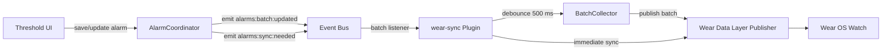
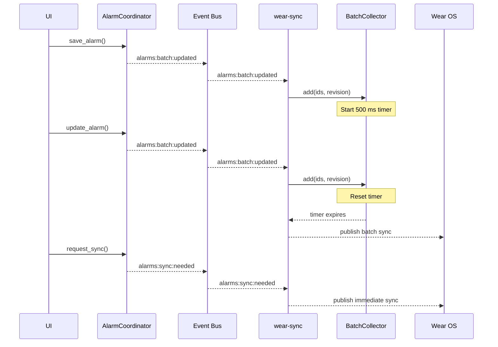

# Tauri Plugin Wear Sync

Wear OS sync integration for Threshold.

This plugin listens for alarm batch events and coordinates debounced sync signals for the Wear Data Layer.

## Android Permissions

This plugin currently requires no Android permissions.

- **Purpose:** The current scaffolding only listens for events and schedules sync work.
- **Manifest Injection:** The plugin implements the Threshold manifest injection pattern and injects an empty permission block for future use.

## Setup

1. Add the plugin to your `Cargo.toml`:

```toml
[dependencies]
tauri-plugin-wear-sync = { path = "../../../plugins/wear-sync" }
```

2. Enable the capability in your app capability file:

```json
"permissions": [
  "wear-sync:default"
]
```

## Behaviour

- `alarms:batch:updated` events are debounced for 500 ms before triggering a sync publish.
- `alarms:sync:needed` events trigger an immediate sync publish.

## Diagrams

### Event Flow



### Debounce Timing


