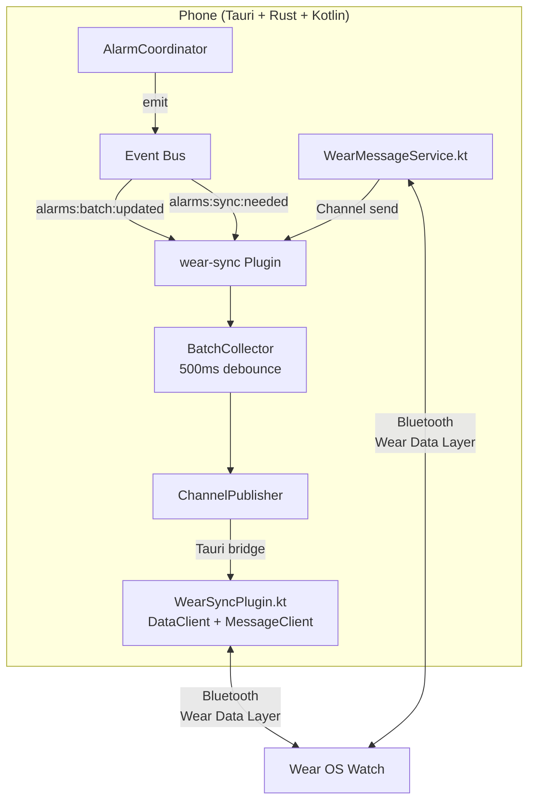
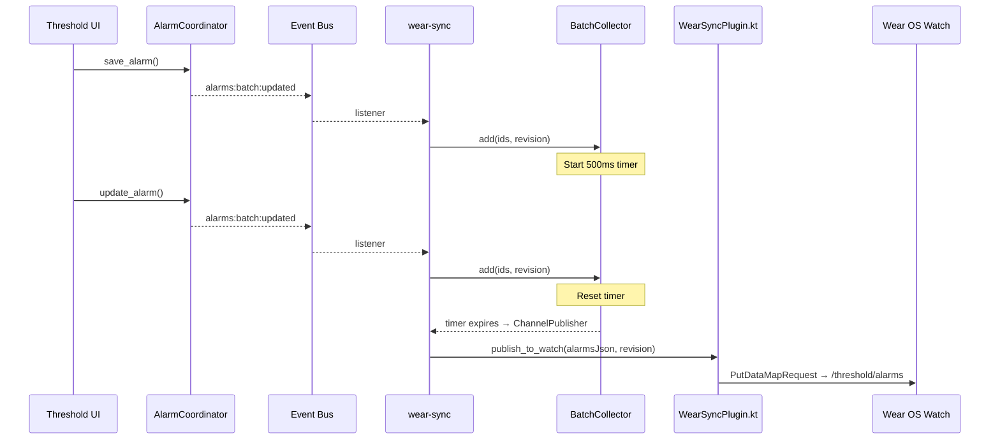
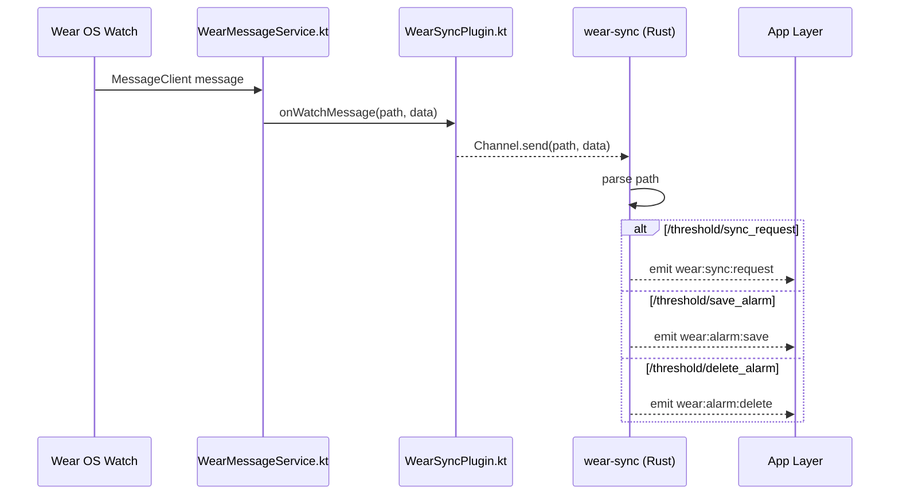

# @liminal-hq/plugin-wear-sync

Synchronises alarm data between the Threshold phone app and a Wear OS companion watch via the Wear Data Layer API.

Implements an incremental sync protocol with revision-based conflict detection, batched publishing (500ms debounce), and bidirectional message routing.

## Installation

### Rust

```toml
[dependencies]
tauri-plugin-wear-sync = { path = "../../../plugins/wear-sync" }
```

### Capabilities

```json
"permissions": [
  "wear-sync:default"
]
```

## Usage

### Rust

```rust
fn main() {
    tauri::Builder::default()
        .plugin(tauri_plugin_wear_sync::init())
        .run(tauri::generate_context!())
        .expect("error while running tauri application");
}
```

The plugin is event-driven — it listens for alarm events and publishes changes automatically. No manual API calls are required from the frontend.

## Architecture



### Outgoing (Phone → Watch)



### Incoming (Watch → Phone)



## Sync Protocol

Revision-based protocol where the watch sends its `lastSyncRevision` and the phone determines the response:

| Revision Gap | Response | Description |
|--------------|----------|-------------|
| 0 | `UpToDate` | No changes needed |
| 1–100 | `Incremental` | Send only changed/deleted alarms |
| >100 | `FullSync` | Send all alarms |
| Negative (watch ahead) | `FullSync` | Anomaly — phone wins |

## Conflict Detection

Watch edits are validated before applying:

- **`validate_watch_revision()`**: Rejects if watch revision is behind phone
- **`validate_alarm_update()`**: Rejects if alarm was modified after watch last synced

On rejection, the watch receives a conflict error and should trigger a full sync before retrying.

## Permissions

This plugin requires these permissions:

- `allow-publish-to-watch`: Grants access to `publish_to_watch`
- `allow-request-sync-from-watch`: Grants access to `request_sync_from_watch`
- `allow-set-watch-message-handler`: Registers Kotlin → Rust Channel handler
- `allow-mark-watch-pipeline-ready`: Marks watch pipeline readiness before queue drain

### Naming Conventions

- Command identifiers use `snake_case` (for example, `publish_to_watch`).
- Generated permission identifiers use `allow-`/`deny-` prefixes with dash-cased command names (for example, `allow-publish-to-watch`).
- Custom non-command permissions keep plugin-specific names (for example, `allow-event-listeners`).

## Android Permissions

This plugin currently requires no Android permissions. The manifest injection mechanism is in place for future use.

## Events

### Listened

| Event | Source | Purpose |
|-------|--------|---------|
| `alarms:batch:updated` | AlarmCoordinator | Batched alarm changes |
| `alarms:sync:needed` | AlarmCoordinator | Force immediate sync |
| `wear:message:received` | WearSyncPlugin.kt | Incoming watch messages |

### Emitted

| Event | Target | Purpose |
|-------|--------|---------|
| `wear:sync:request` | App layer | Watch wants sync data |
| `wear:alarm:save` | App layer | Watch wants to toggle alarm |
| `wear:alarm:delete` | App layer | Watch wants to delete alarm |

## Tests

31 tests across all modules. Run with:

```bash
cargo test -p tauri-plugin-wear-sync
```

## Platform Support

| Platform | Support Level | Notes |
|----------|---------------|-------|
| Linux | Desktop stubs | No-op (no Wear Data Layer) |
| Windows | Desktop stubs | No-op |
| macOS | Desktop stubs | No-op |
| Android | Full | Wear Data Layer via Google Play Services |
| iOS | None | Not implemented |

## Licence

Apache-2.0 OR MIT
